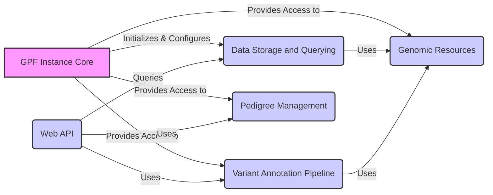

# GPF Project Overview

GPF (Genomic Prediction Framework) is a comprehensive platform designed for the analysis and management of genomic data. It provides tools for storing, querying, annotating, and analyzing genetic variants, with a focus on family-based studies and rare disease research. GPF integrates various genomic resources and supports multiple data storage backends, offering a flexible and scalable solution for genomic data analysis.

## Data Flow Diagram

## Component Descriptions

**GPF Instance Core:** This component serves as the central point of access to all other components within the GPF framework. It initializes and configures the data storage, genomic resources, annotation pipelines, and pedigree management components, providing a unified interface for interacting with the system. It relates to all other components by initializing and providing access to them.

**Data Storage and Querying:** This component is responsible for storing and querying variant data. It supports multiple storage backends (e.g., Impala, GCP, DuckDB) and provides an abstract interface for querying variants. It uses Genomic Resources to interpret the data and is queried by the Web API to provide data to the user.

**Genomic Resources:** This component manages and provides access to genomic resources such as reference genomes, gene models, and annotation scores. It allows other components, such as the Variant Annotation Pipeline and Data Storage, to retrieve and utilize these resources for annotation and analysis. It is used by both the Data Storage and Querying component and the Variant Annotation Pipeline.

**Variant Annotation Pipeline:** This component annotates genetic variants with functional effects and other relevant information. It uses configurable annotation pipelines to integrate data from various sources, including Genomic Resources. It is used by the Web API to provide annotated data to the user.

**Pedigree Management:** This component loads, represents, and manipulates pedigree data, providing family relationships and individual characteristics. It is used for family-based analysis and variant filtering. It is used by the Web API for family-based queries and analysis.

**Web API:** This component provides API endpoints for accessing and querying data, generating reports, and managing users. It serves as the interface between the backend and the frontend, enabling data exploration and analysis. It queries the Data Storage component, uses Pedigree Management for family information, and uses the Variant Annotation Pipeline for annotated data.