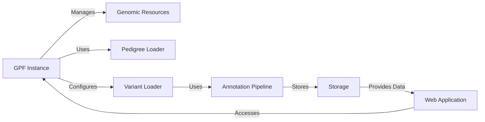

## GPF Data Flow Overview

GPF (Genomic Prediction Framework) is a system designed for managing, analyzing, and storing genomic data. It provides tools for loading variant data, annotating variants with functional information, and storing the data in scalable storage solutions. The system also includes a web application for accessing and exploring the data.

### Component Descriptions

**GPF Instance:** This is the central component that manages the configuration and data resources for the project. It initializes and provides access to other components like Genomic Resources, Pedigree Loader, and Variant Loader. The Web Application accesses the GPF Instance to retrieve data and configuration information.

**Genomic Resources:** This component manages access to genomic resources like reference genomes and gene models. The GPF Instance uses it to load and manage these resources. The Variant Loader and Annotation Pipeline may use genomic resources for variant processing.

**Pedigree Loader:** This component loads and manages pedigree data, representing family relationships and individual attributes. The GPF Instance uses it to load pedigree information. The Variant Loader uses pedigree information to match samples to families.

**Variant Loader:** This component loads variant data from VCF files. It uses the Pedigree Loader to match samples to families and prepares variant data for annotation. The Annotation Pipeline receives the loaded variant data for annotation.

**Annotation Pipeline:** This component annotates variants with functional and genomic information. It receives variant data from the Variant Loader and enriches it with annotations. The annotated data is then sent to the Storage component.

**Storage:** This component stores variant and pedigree data in a persistent storage solution. It receives annotated data from the Annotation Pipeline and makes it available to the Web Application.

**Web Application:** This component provides a user interface for accessing and analyzing the data. It accesses the GPF Instance for configuration and data, and retrieves data from the Storage component for display and analysis.
