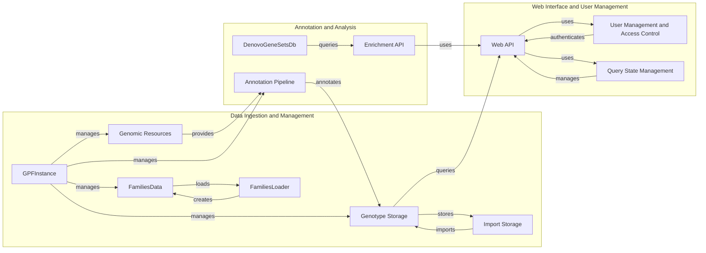

Okay, I will generate an onboarding document for the `gpf` project based on the provided information.

**1. Project Description**

The `gpf` project is a comprehensive platform for managing, analyzing, and exploring genomic data. It provides tools for variant annotation, storage, querying, and visualization, enabling researchers to gain insights from large-scale genomic datasets. The platform supports various data storage backends, genomic resources, and web-based APIs for seamless integration and accessibility. It also incorporates user management and access control features to ensure data security and privacy.

**2. Flow Diagram (Mermaid Format)**

**3. Component Descriptions**

*   **Genomic Resources:** This component manages access to essential genomic data, including reference genomes, gene models, and annotation files. It provides the necessary data for variant interpretation and annotation.
*   **FamiliesData:** This component represents families and individuals, including their relationships and attributes. It stores pedigree information used in variant analysis and filtering.
*   **FamiliesLoader:** This component loads family data from various file formats into a `FamiliesData` object. It handles the parsing and validation of pedigree information.
*   **GPFInstance:** This is the central component that manages the overall context of the application. It provides access to genomic resources, datasets, and application configuration.
*   **Genotype Storage:** This component abstracts access to variant data stored in different backends, such as Google BigQuery, Impala, and Parquet. It provides a unified query interface for retrieving variant information.
*   **Import Storage:** This component handles the import of data into different storage systems. It manages the process of loading and transforming data into the appropriate format for each storage backend.
*   **Annotation Pipeline:** This component orchestrates the process of annotating genetic variants with functional and contextual information. It uses various annotators to add information about gene effects, conservation scores, and other relevant data.
*   **DenovoGeneSetsDb:** This component provides access to denovo gene sets for enrichment analysis. It stores and manages information about genes that are frequently mutated in specific disease cohorts.
*   **Enrichment API:** This component provides API endpoints for performing enrichment analysis. It allows users to identify gene sets that are significantly enriched in a set of variants.
*   **Web API:** This component provides RESTful endpoints for accessing data and functionality, including variant queries, phenotype data, and user management. It serves as the interface between the backend and the user interface.
*   **User Management and Access Control:** This component handles user authentication, authorization, and management of dataset permissions. It ensures that only authorized users can access sensitive data.
*   **Query State Management:** This component handles saving, loading, and deleting query states, allowing users to persist and retrieve their search configurations. It improves user experience by allowing users to resume their work later.