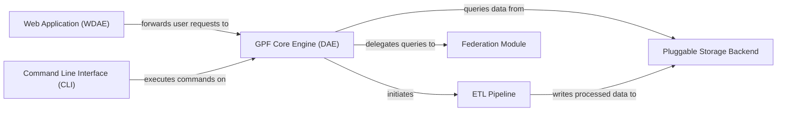

## Details

One paragraph explaining the functionality which is represented by this graph. What the main flow is and what is its purpose.

### Web Application (WDAE) [[Expand]](./Web_Application_WDAE_.md)
The primary user-facing entry point, built on Django. It serves the web interface and exposes a complete REST API for programmatic access. This component is responsible for handling all web-specific concerns, including user authentication, request routing, and presenting data to the client.

**Related Classes/Methods**:

- `gpf/wdae/`
- `gpf/wdae/wdae/datasets_api/`
- `gpf/wdae/wdae/users_api/`

### GPF Core Engine (DAE) [[Expand]](./GPF_Core_Engine_DAE_.md)
The central, web-agnostic brain of the platform. It provides a unified, programmatic interface for accessing and querying genotype and phenotype data. It orchestrates all major functionalities, including data querying, annotation, and federation, without any knowledge of web-specific concepts.

**Related Classes/Methods**:

- `gpf/dae/dae/gpf_instance/gpf_instance.py`

### ETL Pipeline [[Expand]](./ETL_Pipeline.md)
A consolidated pipeline responsible for all data ingestion and processing. It handles the extraction of data from various formats (e.g., VCF, DAE), followed by a multi-step annotation process that enriches the data with functional scores, gene information, and effect types before it is loaded into storage.

**Related Classes/Methods**:

- `gpf/dae/dae/variants_loaders/`
- `gpf/dae/dae/annotation/annotation_pipeline.py`
- `gpf/dae/tools/`

### Pluggable Storage Backend
A storage abstraction layer that provides a uniform API for storing and retrieving genotype data. Its plugin-based design allows the platform to support multiple, interchangeable storage backends (e.g., Impala, Filesystem, In-Memory), providing flexibility for different deployment environments.

**Related Classes/Methods**:

- `gpf/dae/dae/genotype_storage/`

### Federation Module [[Expand]](./Federation_Module.md)
Enables the platform to act as a data federation hub. This component allows the Core Engine to query and analyze data from multiple remote GPF instances as if they were a single, unified dataset, abstracting the complexity of distributed queries.

**Related Classes/Methods**:

- `gpf/federation/`

### Command Line Interface (CLI)
A set of command-line tools for direct, script-based interaction with the GPF Core Engine. It is primarily used by data administrators and bioinformaticians for offline tasks like data import, annotation, and other system management functions.

**Related Classes/Methods**:

- `gpf/dae/tools/`

### [FAQ](https://github.com/CodeBoarding/GeneratedOnBoardings/tree/main?tab=readme-ov-file#faq)