```mermaid
graph LR
    Data_Ingestion_Transformation["Data Ingestion & Transformation"]
    Storage_Abstraction_Layer["Storage Abstraction Layer"]
    Query_Analysis_Engine["Query & Analysis Engine"]
    Genomic_Resources_Management["Genomic Resources Management"]
    API_Web_Services_WDAE_["API & Web Services (WDAE)"]
    Federation_Integration["Federation & Integration"]
    Data_Ingestion_Transformation -- "Feeds data to" --> Storage_Abstraction_Layer
    Data_Ingestion_Transformation -- "Leverages" --> Genomic_Resources_Management
    Storage_Abstraction_Layer -- "Provides data to" --> Query_Analysis_Engine
    Query_Analysis_Engine -- "Queries data from" --> Storage_Abstraction_Layer
    Query_Analysis_Engine -- "Utilizes" --> Genomic_Resources_Management
    Query_Analysis_Engine -- "Delivers results to" --> API_Web_Services_WDAE_
    Genomic_Resources_Management -- "Supplies resources to" --> Query_Analysis_Engine
    Genomic_Resources_Management -- "Provides metadata to" --> API_Web_Services_WDAE_
    API_Web_Services_WDAE_ -- "Orchestrates requests to" --> Query_Analysis_Engine
    API_Web_Services_WDAE_ -- "Accesses" --> Genomic_Resources_Management
    API_Web_Services_WDAE_ -- "Integrates with" --> Federation_Integration
    Federation_Integration -- "Facilitates remote data access for" --> API_Web_Services_WDAE_
```

## Details

One paragraph explaining the functionality which is represented by this graph. What the main flow is and what is its purpose.

### Data Ingestion & Transformation
Manages the entire lifecycle of raw genomic and phenotypic data import, including parsing, validation, and transformation into a structured, query-optimized format (primarily Parquet). It orchestrates complex, multi-step import processes using task graphs.

**Related Classes/Methods**:

- <a href="https://github.com/iossifovlab/gpf/blob/master/impala_storage/impala_storage/tools/vcf2parquet.py#L15-L15" target="_blank" rel="noopener noreferrer">`impala_storage/impala_storage/tools/vcf2parquet.py` (15:15)</a>
- <a href="https://github.com/iossifovlab/gpf/blob/master/impala_storage/impala_storage/tools/denovo2parquet.py#L15-L15" target="_blank" rel="noopener noreferrer">`impala_storage/impala_storage/tools/denovo2parquet.py` (15:15)</a>
- <a href="https://github.com/iossifovlab/gpf/blob/master/impala_storage/impala_storage/tools/ped2parquet.py" target="_blank" rel="noopener noreferrer">`impala_storage/impala_storage/tools/ped2parquet.py`</a>
- <a href="https://github.com/iossifovlab/gpf/blob/master/dae/dae/import_tools/import_tools.py#L9-L9" target="_blank" rel="noopener noreferrer">`dae/dae/import_tools/import_tools.py` (9:9)</a>
- <a href="https://github.com/iossifovlab/gpf/blob/master/dae/dae/task_graph/graph.py#L4-L4" target="_blank" rel="noopener noreferrer">`dae/dae/task_graph/graph.py` (4:4)</a>

### Storage Abstraction Layer
Provides a unified, pluggable interface for interacting with various underlying genotype and phenotype data storage backends (e.g., Apache Impala, Google BigQuery, DuckDB, local Parquet files), abstracting away storage-specific details.

**Related Classes/Methods**:

- <a href="https://github.com/iossifovlab/gpf/blob/master/dae/dae/genotype_storage/genotype_storage.py" target="_blank" rel="noopener noreferrer">`dae/dae/genotype_storage/genotype_storage.py`</a>
- <a href="https://github.com/iossifovlab/gpf/blob/master/dae/dae/genotype_storage/genotype_storage_registry.py#L55-L55" target="_blank" rel="noopener noreferrer">`dae/dae/genotype_storage/genotype_storage_registry.py` (55:55)</a>
- <a href="https://github.com/iossifovlab/gpf/blob/master/impala_storage/impala_storage/schema1/impala_genotype_storage.py#L305-L305" target="_blank" rel="noopener noreferrer">`impala_storage/impala_storage/schema1/impala_genotype_storage.py` (305:305)</a>
- <a href="https://github.com/iossifovlab/gpf/blob/master/gcp_storage/gcp_storage/gcp_genotype_storage.py#L4-L4" target="_blank" rel="noopener noreferrer">`gcp_storage/gcp_storage/gcp_genotype_storage.py` (4:4)</a>
- <a href="https://github.com/iossifovlab/gpf/blob/master/dae/dae/duckdb_storage/duckdb_genotype_storage.py" target="_blank" rel="noopener noreferrer">`dae/dae/duckdb_storage/duckdb_genotype_storage.py`</a>
- <a href="https://github.com/iossifovlab/gpf/blob/master/dae/dae/inmemory_storage/inmemory_genotype_storage.py#L58-L58" target="_blank" rel="noopener noreferrer">`dae/dae/inmemory_storage/inmemory_genotype_storage.py` (58:58)</a>

### Query & Analysis Engine
The central computational powerhouse for processing complex queries and performing bioinformatics analyses on genomic and phenotypic data, including variant annotation, gene scoring, and enrichment analysis.

**Related Classes/Methods**:

- <a href="https://github.com/iossifovlab/gpf/blob/master/dae/dae/query_variants/sql/schema2/sql_query_builder.py#L8-L8" target="_blank" rel="noopener noreferrer">`dae/dae/query_variants/sql/schema2/sql_query_builder.py` (8:8)</a>
- <a href="https://github.com/iossifovlab/gpf/blob/master/dae/dae/annotation/annotation_pipeline.py#L212-L212" target="_blank" rel="noopener noreferrer">`dae/dae/annotation/annotation_pipeline.py` (212:212)</a>
- <a href="https://github.com/iossifovlab/gpf/blob/master/dae/dae/enrichment_tool/enrichment_utils.py" target="_blank" rel="noopener noreferrer">`dae/dae/enrichment_tool/enrichment_utils.py`</a>
- <a href="https://github.com/iossifovlab/gpf/blob/master/dae/dae/gene_scores/gene_scores.py#L9-L9" target="_blank" rel="noopener noreferrer">`dae/dae/gene_scores/gene_scores.py` (9:9)</a>
- <a href="https://github.com/iossifovlab/gpf/blob/master/dae/dae/pheno_tool/tool.py#L5-L5" target="_blank" rel="noopener noreferrer">`dae/dae/pheno_tool/tool.py` (5:5)</a>

### Genomic Resources Management
Manages and provides standardized access to a comprehensive collection of genomic reference data, including reference genomes, gene models, genomic scores, and gene sets, which are fundamental for accurate variant annotation and bioinformatics analyses.

**Related Classes/Methods**:

- <a href="https://github.com/iossifovlab/gpf/blob/master/dae/dae/genomic_resources/reference_genome.py#L150-L150" target="_blank" rel="noopener noreferrer">`dae/dae/genomic_resources/reference_genome.py` (150:150)</a>
- <a href="https://github.com/iossifovlab/gpf/blob/master/dae/dae/genomic_resources/gene_models/gene_models.py#L64-L64" target="_blank" rel="noopener noreferrer">`dae/dae/genomic_resources/gene_models/gene_models.py` (64:64)</a>
- <a href="https://github.com/iossifovlab/gpf/blob/master/dae/dae/genomic_resources/genomic_scores.py#L4-L4" target="_blank" rel="noopener noreferrer">`dae/dae/genomic_resources/genomic_scores.py` (4:4)</a>
- <a href="https://github.com/iossifovlab/gpf/blob/master/dae/dae/gene_sets/gene_sets_db.py#L9-L9" target="_blank" rel="noopener noreferrer">`dae/dae/gene_sets/gene_sets_db.py` (9:9)</a>
- <a href="https://github.com/iossifovlab/gpf/blob/master/dae/dae/genomic_resources/repository.py" target="_blank" rel="noopener noreferrer">`dae/dae/genomic_resources/repository.py`</a>

### API & Web Services (WDAE)
Serves as the primary interface for external clients and the interactive web-based user interface (WDAE), exposing core functionalities through a RESTful API, handling user authentication, authorization, and orchestrating interactions with underlying business logic and data layers.

**Related Classes/Methods**:

- <a href="https://github.com/iossifovlab/gpf/blob/master/wdae/wdae/wdae/urls.py" target="_blank" rel="noopener noreferrer">`wdae/wdae/wdae/urls.py`</a>
- <a href="https://github.com/iossifovlab/gpf/blob/master/wdae/wdae/users_api/views.py#L83-L83" target="_blank" rel="noopener noreferrer">`wdae/wdae/users_api/views.py` (83:83)</a>
- <a href="https://github.com/iossifovlab/gpf/blob/master/wdae/wdae/datasets_api/views.py#L38-L38" target="_blank" rel="noopener noreferrer">`wdae/wdae/datasets_api/views.py` (38:38)</a>
- <a href="https://github.com/iossifovlab/gpf/blob/master/wdae/wdae/genotype_browser/views.py#L102-L102" target="_blank" rel="noopener noreferrer">`wdae/wdae/genotype_browser/views.py` (102:102)</a>
- <a href="https://github.com/iossifovlab/gpf/blob/master/wdae/wdae/gene_profiles_api/views.py" target="_blank" rel="noopener noreferrer">`wdae/wdae/gene_profiles_api/views.py`</a>
- <a href="https://github.com/iossifovlab/gpf/blob/master/wdae/wdae/enrichment_api/views.py" target="_blank" rel="noopener noreferrer">`wdae/wdae/enrichment_api/views.py`</a>

### Federation & Integration
Enables the application to interact with and query data from remote GPF instances or other external data sources, facilitating federated data access and distributed analysis.

**Related Classes/Methods**:

- <a href="https://github.com/iossifovlab/gpf/blob/master/federation/federation/rest_api_client.py#L22-L22" target="_blank" rel="noopener noreferrer">`federation/federation/rest_api_client.py` (22:22)</a>
- <a href="https://github.com/iossifovlab/gpf/blob/master/federation/federation/remote_study.py#L129-L129" target="_blank" rel="noopener noreferrer">`federation/federation/remote_study.py` (129:129)</a>
- <a href="https://github.com/iossifovlab/gpf/blob/master/federation/federation/remote_variant.py#L3-L3" target="_blank" rel="noopener noreferrer">`federation/federation/remote_variant.py` (3:3)</a>
- <a href="https://github.com/iossifovlab/gpf/blob/master/federation/federation/remote_phenotype_data.py#L28-L28" target="_blank" rel="noopener noreferrer">`federation/federation/remote_phenotype_data.py` (28:28)</a>
- <a href="https://github.com/iossifovlab/gpf/blob/master/federation/federation/remote_extension.py#L194-L194" target="_blank" rel="noopener noreferrer">`federation/federation/remote_extension.py` (194:194)</a>

### [FAQ](https://github.com/CodeBoarding/GeneratedOnBoardings/tree/main?tab=readme-ov-file#faq)