```mermaid
graph LR
    GPF_Core_Management["GPF Core Management"]
    Genomic_Resources_Management["Genomic Resources Management"]
    Data_Processing_and_Annotation["Data Processing and Annotation"]
    Data_Storage_and_Import["Data Storage and Import"]
    Variant_Querying_and_Retrieval["Variant Querying and Retrieval"]
    Web_API["Web API"]
    Phenotype_Data_Management["Phenotype Data Management"]
    Task_Management["Task Management"]
    GPF_Core_Management -- "uses" --> Genomic_Resources_Management
    GPF_Core_Management -- "uses" --> Data_Processing_and_Annotation
    GPF_Core_Management -- "uses" --> Data_Storage_and_Import
    GPF_Core_Management -- "uses" --> Variant_Querying_and_Retrieval
    GPF_Core_Management -- "uses" --> Phenotype_Data_Management
    Data_Processing_and_Annotation -- "uses" --> Genomic_Resources_Management
    Data_Storage_and_Import -- "uses" --> Data_Processing_and_Annotation
    Variant_Querying_and_Retrieval -- "uses" --> Data_Storage_and_Import
    Web_API -- "uses" --> GPF_Core_Management
    Web_API -- "uses" --> Variant_Querying_and_Retrieval
    Web_API -- "uses" --> Phenotype_Data_Management
    Phenotype_Data_Management -- "uses" --> Genomic_Resources_Management
    Data_Storage_and_Import -- "uses" --> Task_Management
    click GPF_Core_Management href "https://github.com/CodeBoarding/GeneratedOnBoardings/blob/main/gpf/GPF Core Management.md" "Details"
    click Genomic_Resources_Management href "https://github.com/CodeBoarding/GeneratedOnBoardings/blob/main/gpf/Genomic Resources Management.md" "Details"
    click Data_Processing_and_Annotation href "https://github.com/CodeBoarding/GeneratedOnBoardings/blob/main/gpf/Data Processing and Annotation.md" "Details"
    click Data_Storage_and_Import href "https://github.com/CodeBoarding/GeneratedOnBoardings/blob/main/gpf/Data Storage and Import.md" "Details"
    click Variant_Querying_and_Retrieval href "https://github.com/CodeBoarding/GeneratedOnBoardings/blob/main/gpf/Variant Querying and Retrieval.md" "Details"
    click Web_API href "https://github.com/CodeBoarding/GeneratedOnBoardings/blob/main/gpf/Web API.md" "Details"
    click Phenotype_Data_Management href "https://github.com/CodeBoarding/GeneratedOnBoardings/blob/main/gpf/Phenotype Data Management.md" "Details"
    click Task_Management href "https://github.com/CodeBoarding/GeneratedOnBoardings/blob/main/gpf/Task Management.md" "Details"
```

## Component Details

The GPF system facilitates the management, annotation, storage, querying, and web-based access to genomic data. It revolves around a central GPF Instance Manager that orchestrates access to genomic resources, data annotation pipelines, data import/storage functionalities, and variant querying services. The Web API provides a user interface for interacting with the system, while phenotype data management and task management systems support comprehensive data analysis and efficient processing.

### GPF Core Management
This component is responsible for managing the overall configuration and context of a GPF instance. It handles loading and managing various databases, genomic resources, and storage configurations. It also provides access to genotype data, phenotype data, gene sets, and annotation pipelines. It acts as a central hub for accessing various functionalities within GPF.
- **Related Classes/Methods**: `gpf.dae.dae.gpf_instance.gpf_instance.GPFInstance`

### Genomic Resources Management
This component deals with managing and accessing genomic resources such as reference genomes, gene models, and genomic scores. It provides functionalities for loading, caching, and querying these resources, as well as building histograms and statistics. This service is crucial for annotation and variant analysis.
- **Related Classes/Methods**: `gpf.dae.dae.genomic_resources.reference_genome.ReferenceGenome`, `gpf.dae.dae.genomic_resources.gene_models.gene_models.GeneModels`, `gpf.dae.dae.genomic_resources.genomic_scores.GenomicScore`, `gpf.dae.dae.genomic_resources.genomic_context.GenomicContext`

### Data Processing and Annotation
This component is responsible for annotating genomic variants with various information, such as genomic scores, functional effects, and allele frequencies. It includes tools for building annotation pipelines, running annotation tasks, and managing annotation configurations. This engine enriches variant data with relevant annotations for downstream analysis.
- **Related Classes/Methods**: `gpf.dae.dae.annotation.annotation_pipeline.AnnotationPipeline`, `gpf.dae.dae.annotation.annotator_base.AnnotatorBase`, `gpf.dae.dae.annotation.annotation_factory`, `gpf.dae.dae.annotation.score_annotator`, `gpf.dae.dae.annotation.effect_annotator`

### Data Storage and Import
This component handles the import of genomic data from various formats (VCF, DAE, CNV) into a genotype storage. It builds import pipelines, manages data partitions, and writes data to Parquet files, supporting storage backends like Impala, GCP, and DuckDB. This system is responsible for efficiently storing and organizing genomic data.
- **Related Classes/Methods**: `gpf.dae.dae.import_tools.import_tools.ImportProject`, `gpf.dae.dae.parquet_storage.storage.ParquetGenotypeStorage`, `gpf.dae.dae.parquet.parquet_writer`, `gpf.dae.dae.variants_loaders`, `gpf.dae.dae.schema2_storage.schema2_import_storage.Schema2ImportStorage`, `gpf.impala_storage.impala_storage.schema1.impala_schema1.ImpalaSchema1ImportStorage`, `gpf.gcp_storage.gcp_storage.gcp_import_storage.GcpImportStorage`, `gpf.dae.dae.duckdb_storage.duckdb_import_storage`

### Variant Querying and Retrieval
This component provides functionalities for querying genomic variants from the genotype storage. It builds SQL queries, transforms query parameters, and runs queries against different storage backends, supporting both summary and family variants. This service enables efficient retrieval of variant data based on specific criteria.
- **Related Classes/Methods**: `gpf.dae.dae.query_variants`, `gpf.dae.dae.variants.family_variant`, `gpf.dae.dae.duckdb_storage.duckdb_variants`, `gpf.impala_storage.impala_storage.schema1.impala_variants.ImpalaVariants`, `gpf.impala2_storage.impala2_storage.schema2.impala_variants.ImpalaVariants`

### Web API
This component implements the web interface for accessing and visualizing genomic data. It manages datasets, queries variants, explores gene sets, performs enrichment analysis, and handles user authentication and authorization. This API provides a user-friendly interface for interacting with GPF functionalities.
- **Related Classes/Methods**: `gpf.wdae.wdae.datasets_api`, `gpf.wdae.wdae.genotype_browser`, `gpf.wdae.wdae.gene_sets`, `gpf.wdae.wdae.enrichment_api`, `gpf.wdae.wdae.users_api`, `gpf.wdae.wdae.gpf_instance`, `gpf.wdae.wdae.wdae.wgpf`

### Phenotype Data Management
This component handles the management and analysis of phenotype data. It imports phenotype data, builds phenotype browsers, and performs pheno tool analysis. This manager integrates phenotype data with genomic data for comprehensive analysis.
- **Related Classes/Methods**: `gpf.dae.dae.pheno`, `gpf.dae.dae.pheno_tool`, `gpf.dae.dae.pheno_browser`

### Task Management
This component provides a framework for managing and executing complex tasks with dependencies. It creates task graphs, schedules tasks, and caches task results, supporting execution backends like sequential execution and Dask execution. This system optimizes the execution of data processing pipelines.
- **Related Classes/Methods**: `gpf.dae.dae.task_graph`