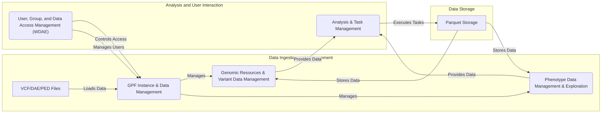

# GPF Project Onboarding Document

## Project Description

The Genomic Prediction Framework (GPF) is a comprehensive platform designed for managing, analyzing, and exploring large-scale genomic and phenotypic data. It provides tools for variant annotation, enrichment analysis, and data integration, enabling researchers to identify genetic factors associated with complex traits and diseases. GPF integrates with the Web-based Data Analysis Environment (WDAE) to provide a user-friendly interface for data exploration and analysis.

## Data Flow Diagram

## Component Descriptions

*   **GPF Instance & Data Management:** This component initializes and manages the GPF instance, serving as the central hub for accessing genomic resources, variant data, and phenotype data. It handles configuration parsing, data loading, and integration with the WDAE framework, also managing user access to datasets.

*   **Genomic Resources & Variant Data Management:** This component manages genomic resources (reference genomes, gene models, etc.) and handles variant data. It builds repositories for genomic resources and provides interfaces for loading, storing, querying, and annotating variant data from various sources, providing data for analysis components.

*   **Phenotype Data Management & Exploration:** This component is responsible for loading, storing, querying, and exploring phenotype data. It includes building phenotype browsers and managing person set collections, integrating with the GPF Instance to access dataset configurations and providing data for statistical analysis and visualization.

*   **Analysis & Task Management:** This component provides tools for performing enrichment analysis and manages the execution of complex data processing tasks through task graphs. It includes building background models, running enrichment tests, and defining/executing task graphs for import and annotation processes, depending on the GPF Instance and Genomic Resources for data and context.

*   **User, Group, and Data Access Management (WDAE):** This component handles user authentication, authorization, group management, and data access control within the WDAE framework. It provides secure access to data and resources through APIs and command-line tools, interacting with the GPF Instance to manage dataset permissions and relying on the Data Export/Import component for data migration.

*   **Parquet Storage:** This component provides efficient storage for genomic and phenotypic data in Parquet format, enabling fast querying and analysis. It is used by the Variant Data Management and Phenotype Data Management components to store and retrieve data.
