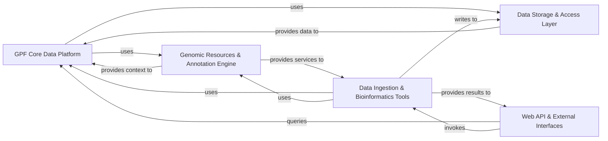

## Details

The `gpf` project is architected as a modular, layered bioinformatics data platform, emphasizing clear separation of concerns, robust data pipelines, and an API-first approach. The core of the system manages genomic and phenotypic data, supported by a flexible storage abstraction layer and a comprehensive annotation engine. Data ingestion is handled by dedicated ETL pipelines, while various bioinformatics tools provide analytical capabilities. A web-based API and user interface serve as the primary interaction point, with federation capabilities extending access across distributed instances.

### GPF Core Data Platform [[Expand]](./GPF_Core_Data_Platform.md)
The central nervous system of GPF, responsible for managing genomic studies, variant data, pedigrees, and providing fundamental query capabilities. It orchestrates data access and integrates various data types, acting as the primary data hub.

**Related Classes/Methods**:

- `dae.gpf_instance` (1:1)
- `dae.studies` (1:1)
- `dae.variants_loaders` (1:1)
- `dae.pedigrees` (1:1)
- `dae.query_variants` (1:1)

### Data Storage & Access Layer [[Expand]](./Data_Storage_Access_Layer.md)
Provides a unified abstraction for various genotype and phenotype data storage backends (e.g., Impala, BigQuery, DuckDB, Parquet, In-Memory). It standardizes interactions with underlying storage technologies, allowing the GPF Core to remain agnostic to the specific database or file format.

**Related Classes/Methods**:

- `dae.genotype_storage` (1:1)
- `gcp_storage` (1:1)
- `impala_storage` (1:1)
- `impala2_storage` (1:1)
- `duckdb_storage` (1:1)
- `parquet_storage` (1:1)
- `inmemory_storage` (1:1)

### Genomic Resources & Annotation Engine [[Expand]](./Genomic_Resources_Annotation_Engine.md)
Manages and provides access to a wide array of genomic resources (e.g., reference genomes, gene models, genomic scores, gene sets) and applies various genomic annotations (e.g., effect prediction, external annotators) to variants. It supports configurable annotation pipelines.

**Related Classes/Methods**:

- `dae.genomic_resources` (1:1)
- `dae.gene_sets` (1:1)
- `dae.gene_scores` (1:1)
- `dae.annotation` (1:1)
- <a href="https://github.com/iossifovlab/gpf/spliceai_annotator/spliceai_annotator/spliceai_annotator.py#L1-L1" target="_blank" rel="noopener noreferrer">`spliceai_annotator` (1:1)</a>
- `external_vep_annotator` (1:1)
- `external_demo_annotator` (1:1)
- `dae.pheno` (1:1)

### Data Ingestion & Bioinformatics Tools [[Expand]](./Data_Ingestion_Bioinformatics_Tools.md)
Encompasses the end-to-end process of loading, transforming, validating, and integrating raw genomic and phenotype data into the platform. It also includes a suite of statistical and analytical tools (e.g., enrichment analysis, gene profiling, common reports) that operate on the managed data.

**Related Classes/Methods**:

- `dae.import_tools` (1:1)
- <a href="https://github.com/iossifovlab/gpf/dae/dae/schema2_storage/schema2_import_storage.py#L1-L1" target="_blank" rel="noopener noreferrer">`dae.schema2_storage.schema2_import_storage` (1:1)</a>
- <a href="https://github.com/iossifovlab/gpf/gcp_storage/gcp_storage/gcp_import_storage.py#L1-L1" target="_blank" rel="noopener noreferrer">`gcp_storage.gcp_import_storage` (1:1)</a>
- `dae.enrichment_tool` (1:1)
- `dae.gene_profile` (1:1)
- `dae.common_reports` (1:1)

### Web API & External Interfaces [[Expand]](./Web_API_External_Interfaces.md)
The primary user-facing component, offering a comprehensive set of REST API endpoints and a web interface for data querying, visualization, user management, and dataset permissions. It also integrates the federation service for seamless access to distributed GPF deployments and provides command-line utilities for administrative tasks.

**Related Classes/Methods**:

- <a href="https://github.com/iossifovlab/gpf/wdae/wdae/gpf_instance/views.py#L1-L1" target="_blank" rel="noopener noreferrer">`wdae.wdae.gpf_instance.views` (1:1)</a>
- <a href="https://github.com/iossifovlab/gpf/wdae/wdae/datasets_api/views.py#L1-L1" target="_blank" rel="noopener noreferrer">`wdae.wdae.datasets_api.views` (1:1)</a>
- <a href="https://github.com/iossifovlab/gpf/wdae/wdae/users_api/views.py#L1-L1" target="_blank" rel="noopener noreferrer">`wdae.wdae.users_api.views` (1:1)</a>
- `wdae.wdae.query_base` (1:1)
- <a href="https://github.com/iossifovlab/gpf/wdae/wdae/studies/study_wrapper.py#L1-L1" target="_blank" rel="noopener noreferrer">`wdae.wdae.studies.study_wrapper` (1:1)</a>
- `wdae.wdae.enrichment_api` (1:1)
- `wdae.wdae.gene_profiles_api` (1:1)
- `wdae.wdae.gene_scores` (1:1)
- `wdae.wdae.gene_sets` (1:1)
- `wdae.wdae.genomes_api` (1:1)
- `wdae.wdae.genomic_scores_api` (1:1)
- `wdae.wdae.genotype_browser` (1:1)
- `wdae.wdae.measures_api` (1:1)
- `wdae.wdae.person_sets_api` (1:1)
- `wdae.wdae.pheno_browser_api` (1:1)
- `wdae.wdae.pheno_tool_api` (1:1)
- `wdae.wdae.common_reports_api` (1:1)
- `wdae.wdae.family_api` (1:1)
- `federation` (1:1)
- `dae.tools` (1:1)
- `dae.task_graph` (1:1)
- `dae.utils` (1:1)
- `dae.configuration` (1:1)
- <a href="https://github.com/iossifovlab/gpf/rest_client/rest_client/rest_client.py#L1-L1" target="_blank" rel="noopener noreferrer">`rest_client` (1:1)</a>

### [FAQ](https://github.com/CodeBoarding/GeneratedOnBoardings/tree/main?tab=readme-ov-file#faq)