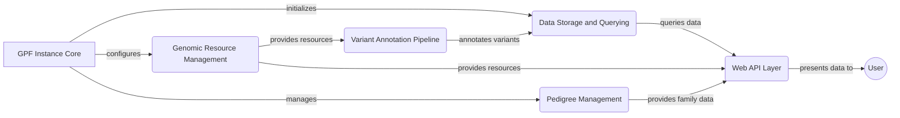

```markdown
## GPF: Genomic Data Analysis Platform

GPF (Genomic Data Analysis Platform) is a comprehensive platform designed for storing, querying, and analyzing large-scale genomic data. It provides tools for variant annotation, pedigree management, and genomic resource management, enabling researchers to gain insights from complex genetic datasets.

## Data Flow Diagram



## Component Descriptions

**GPF Instance Core:** This component represents the heart of the GPF application. It is responsible for initializing and configuring all other components, managing the application context, and providing access to the various functionalities of the platform. It initializes the Data Storage and Querying component and configures the Genomic Resource Management component.

**Data Storage and Querying:** This component handles the storage, indexing, and querying of variant data. It supports multiple storage backends (e.g., Impala, GCP, DuckDB) and provides an abstract interface for querying variants. It receives annotated variants from the Variant Annotation Pipeline and provides data to the Web API Layer.

**Genomic Resource Management:** This component manages and provides access to genomic resources such as reference genomes, gene models, and annotation scores. It allows other components to retrieve and utilize these resources for annotation and analysis. It provides resources to both the Variant Annotation Pipeline and the Web API Layer.

**Variant Annotation Pipeline:** This component annotates genetic variants with functional effects and other relevant information. It uses configurable annotation pipelines to integrate data from various sources. It utilizes resources from the Genomic Resource Management component and sends the annotated variants to the Data Storage and Querying component.

**Pedigree Management:** This component loads, represents, and manipulates pedigree data, which describes family relationships and individual characteristics. It provides functionalities to access and query family structures. It provides family data to the Web API Layer.

**Web API Layer:** This component provides RESTful API endpoints for accessing data and functionalities. It serves as the interface between the backend and the frontend, handling requests for datasets, gene views, and reports. It queries data from the Data Storage and Querying component, utilizes resources from the Genomic Resource Management component, and retrieves family data from the Pedigree Management component. Finally, it presents the data to the user.
```