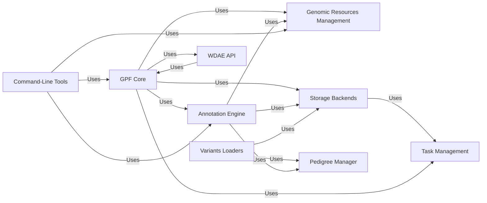

## Component Details

### GPF Core
The GPF Core component serves as the central hub for managing genomic data and resources within the GPF ecosystem. It is responsible for configuration loading, genomic resource management, and providing data access interfaces. This component initializes and manages the GPF instance, offering access to genomic resources, annotation pipelines, and storage backends. It also integrates with WDAE components to provide data and functionalities for web-based analysis, ensuring a cohesive and efficient data management system.
- **Related Classes/Methods**: `dae.gpf_instance.gpf_instance.GPFInstance`, `dae.configuration.gpf_config_parser.GPFConfigParser`, `dae.genomic_resources.repository_factory.build_genomic_resource_repository`

### Genomic Resources Management
The Genomic Resources Management component is dedicated to the storage, retrieval, and caching of genomic resources, including reference genomes, gene models, and annotation scores. It offers functionalities for building, accessing, and managing these resources, ensuring efficient access to essential genomic data for annotation and analysis pipelines. This component supports various storage protocols, such as local filesystems and cloud-based storage, providing flexibility and scalability in resource management.
- **Related Classes/Methods**: `dae.genomic_resources.reference_genome.ReferenceGenome`, `dae.genomic_resources.gene_models.gene_models.GeneModels`, `dae.genomic_resources.repository.GenomicResourceRepo`, `dae.genomic_resources.fsspec_protocol.FsspecReadOnlyProtocol`, `dae.genomic_resources.fsspec_protocol.FsspecReadWriteProtocol`

### Annotation Engine
The Annotation Engine component is responsible for defining and executing annotation pipelines for genomic variants. It includes modules for configuring, building, and running annotation processes, as well as handling different annotation sources and effects. This component integrates with genomic resources and effect annotation components to provide comprehensive variant annotation capabilities. It is utilized by both command-line tools and WDAE for annotating genomic data, ensuring consistent and reliable annotation across different platforms.
- **Related Classes/Methods**: `dae.annotation.annotation_pipeline.AnnotationPipeline`, `dae.annotation.annotation_factory.build_annotation_pipeline`, `dae.annotation.annotator_base.AnnotatorBase`, `dae.annotation.effect.EffectTypesMixin`, `dae.effect_annotation.effect.AnnotationEffect`, `dae.effect_annotation.effect.EffectTranscript`, `dae.effect_annotation.effect.EffectGene`, `dae.effect_annotation.annotator.EffectAnnotator`

### Storage Backends
The Storage Backends component provides functionalities for storing and querying genomic data in various formats, including Parquet, Impala, GCP (BigQuery), and DuckDB. It includes modules for writing, reading, and managing data in these storage systems, as well as defining schemas and query interfaces. This component supports different storage layouts and query optimization techniques to ensure efficient data access and analysis, catering to diverse storage needs and performance requirements.
- **Related Classes/Methods**: `dae.parquet.parquet_writer.ParquetWriter`, `dae.variants_loaders.parquet.loader.ParquetLoader`, `dae.schema2_storage.schema2_layout.Schema2DatasetLayout`, `dae.parquet.schema2.serializers.AlleleParquetSerializer`, `impala_storage.schema1.impala_genotype_storage.ImpalaGenotypeStorage`, `impala_storage.schema1.impala_variants.ImpalaVariants`, `impala_storage.helpers.impala_query_runner.ImpalaQueryRunner`, `impala_storage.schema1.summary_variants_query_builder.SummaryVariantsQueryBuilder`, `impala_storage.schema1.family_variants_query_builder.FamilyVariantsQueryBuilder`, `gcp_storage.gcp_genotype_storage.GcpGenotypeStorage`, `gcp_storage.bigquery_variants.BigQueryVariants`, `gcp_storage.bigquery_query_runner.BigQueryQueryRunner`, `dae.duckdb_storage.duckdb_genotype_storage.DuckDbStorage`, `dae.duckdb_storage.duckdb2_variants.DuckDb2Variants`, `dae.duckdb_storage.duckdb2_variants.DuckDb2Runner`

### Variants Loaders
The Variants Loaders component provides functionalities for loading genomic variants from different file formats, such as VCF, DAE, and CNV. It includes modules for parsing and transforming variant data into a common format, as well as handling pedigree information. This component integrates with the Pedigree Manager component to ensure accurate family structures and variant annotations, facilitating seamless data integration and analysis.
- **Related Classes/Methods**: `dae.variants_loaders.vcf.loader.VcfLoader`, `dae.variants_loaders.dae.loader.DenovoLoader`, `dae.variants_loaders.dae.loader.DaeTransmittedLoader`, `dae.variants_loaders.cnv.loader.CNVLoader`, `dae.variants_loaders.raw.loader.VariantsLoader`

### Pedigree Manager
The Pedigree Manager component is responsible for handling the loading, processing, and management of pedigree data. It includes modules for loading pedigree files, building family structures, and tagging families based on various criteria. This component is utilized by the Variants Loaders component to ensure accurate family structures and variant annotations, contributing to the overall data quality and reliability.
- **Related Classes/Methods**: `dae.pedigrees.loader.FamiliesLoader`, `dae.pedigrees.family.Family`, `dae.pedigrees.families_data.FamiliesData`, `dae.pedigrees.family_tag_builder.FamilyTagsBuilder`

### WDAE API
The WDAE API component provides the API endpoints and functionalities for managing and accessing datasets, users, and analysis tools within the WDAE. It includes modules for handling dataset permissions, retrieving dataset configurations, managing users and groups, and providing access to gene view, phenotype browser, and enrichment analysis functionalities. This component relies on the GPF Core component for data access and analysis capabilities, enabling a comprehensive web-based data analysis environment.
- **Related Classes/Methods**: `wdae.wdae.datasets_api.views.DatasetView`, `wdae.wdae.datasets_api.permissions.IsDatasetAllowed`, `wdae.wdae.datasets_api.permissions.user_has_permission`, `wdae.wdae.users_api.views.UserViewSet`, `wdae.wdae.users_api.models.WdaeUser`, `wdae.wdae.users_api.serializers.UserSerializer`, `wdae.wdae.gene_view.views.ConfigView`, `wdae.wdae.gene_view.views.QueryVariantsView`, `wdae.wdae.studies.study_wrapper.StudyWrapper.get_gene_view_summary_variants`, `wdae.wdae.pheno_browser_api.views.PhenoConfigView`, `wdae.wdae.pheno_browser_api.views.PhenoMeasuresView`, `wdae.wdae.pheno_browser_api.views.PhenoMeasureValues`, `wdae.wdae.enrichment_api.views.EnrichmentModelsView`, `wdae.wdae.enrichment_api.views.EnrichmentTestView`

### Task Management
The Task Management component provides functionalities for defining and executing task graphs, which are used to orchestrate complex data processing pipelines. It includes modules for creating tasks, defining dependencies, and running task graphs in different execution environments. This component is used by various components, such as the Annotation Engine and Storage Backends, to manage data processing workflows, ensuring efficient and scalable data processing.
- **Related Classes/Methods**: `dae.task_graph.graph.TaskGraph`, `dae.task_graph.executor.SequentialExecutor`, `dae.task_graph.executor.DaskExecutor`, `dae.task_graph.cli_tools.TaskGraphCli`

### Command-Line Tools
The Command-Line Tools component provides command-line interfaces for managing GPF instances, re-annotating data, and generating denovo gene sets. It relies on the GPF Core, Annotation Engine, and Genomic Resources components to perform these tasks. This component offers a convenient way to manage and process genomic data from the command line, providing flexibility and control over data processing workflows.
- **Related Classes/Methods**: `wdae.wdae.wdae.wgpf.cli`, `dae.annotation.reannotate_instance.ReannotateInstanceTool`, `dae.tools.generate_denovo_gene_sets.main`