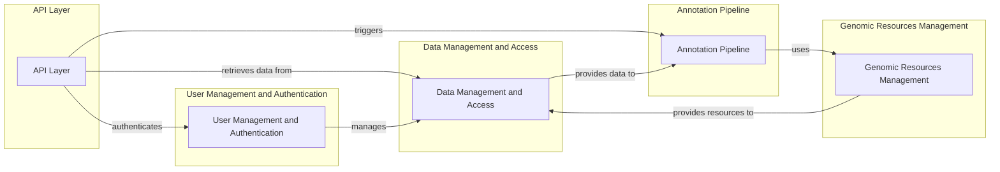

```markdown
# GPF Project Onboarding Document

## Project Description

The GPF (Genomic Prediction Framework) project is a comprehensive platform designed for the analysis and management of genomic data. It provides tools for variant annotation, phenotype analysis, gene set enrichment, and user management, all accessible through a well-defined API layer. GPF aims to facilitate research in genetics and genomics by providing a robust and scalable environment for data exploration and analysis.

## Project Flow Diagram



## Component Descriptions

### Data Management and Access

This component is the foundation of the GPF project, responsible for storing, retrieving, and transforming various data types. It handles genomic variants, phenotype data, gene sets, and user-related information, providing a unified interface for accessing data from different sources. This ensures data consistency and integrity across the entire platform.

### API Layer

The API Layer serves as the entry point for external clients to interact with the GPF system. It defines API endpoints for accessing various functionalities, including data retrieval, analysis, and management. This component handles incoming HTTP requests, processes them, and returns structured responses, providing a clear and consistent interface for developers and researchers.

### Annotation Pipeline

The Annotation Pipeline orchestrates the annotation of genomic variants using various data sources. It manages different annotator types, including those for genomic scores, gene sets, and functional effects. This component ensures the consistent and accurate annotation of variants, which is crucial for downstream analysis and interpretation.

### User Management and Authentication

This component is responsible for managing user accounts, authentication, and authorization. It handles user creation, modification, and deletion, as well as password resets and authentication logging. By managing user permissions, this component ensures secure access to the system and protects sensitive data.

### Genomic Resources Management

The Genomic Resources Management component provides access to essential genomic resources such as reference genomes, gene models, and genomic scores. It handles resource retrieval, caching, and versioning, ensuring efficient access to the genomic data required for annotation and analysis. This component is critical for maintaining data quality and consistency across the platform.
```