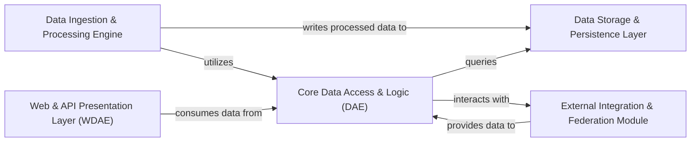

## Details

Overview of the GPF platform components and their relationships.

### Data Storage & Persistence Layer
This foundational component is responsible for the persistent storage and efficient retrieval of all genomic and phenotypic data. It abstracts various backend technologies, including Impala, Google Cloud Platform (GCP), and DuckDB, ensuring data integrity and accessibility.

**Related Classes/Methods**:

- `dae.duckdb_storage` (1:1)
- `dae.parquet_storage` (1:1)
- `dae.inmemory_storage` (1:1)
- `dae.genotype_storage` (1:1)
- `dae.schema2_storage` (1:1)

### Data Ingestion & Processing Engine
This component orchestrates the complex workflows involved in loading, transforming, and annotating raw genomic and phenotypic data into the GPF's internal, standardized format. It encompasses functionalities for variant loading, executing annotation pipelines, and managing computational tasks.

**Related Classes/Methods**:

- `dae.import_tools` (1:1)
- `dae.annotation` (1:1)
- `dae.variants_loaders` (1:1)
- <a href="https://github.com/iossifovlab/gpf/blob/master/dae/dae/parquet/schema2/processing_pipeline.py#L1-L1" target="_blank" rel="noopener noreferrer">`dae.parquet.schema2.processing_pipeline` (1:1)</a>

### Core Data Access & Logic (DAE)
Serving as the central brain of the GPF platform, this component provides the core logic for querying and filtering genomic and phenotypic data. It acts as the primary interface for other components to access and manipulate data, orchestrating interactions with underlying data models and storage, and managing essential genomic resources like reference genomes, gene sets, and phenotypic data.

**Related Classes/Methods**:

- <a href="https://github.com/iossifovlab/gpf/blob/master/dae/dae/gpf_instance/gpf_instance.py#L1-L1" target="_blank" rel="noopener noreferrer">`dae.gpf_instance.gpf_instance` (1:1)</a>
- <a href="https://github.com/iossifovlab/gpf/blob/master/dae/dae/studies/study.py#L1-L1" target="_blank" rel="noopener noreferrer">`dae.studies.study` (1:1)</a>
- `dae.query_variants` (1:1)
- `dae.genomic_resources` (1:1)

### Web & API Presentation Layer (WDAE)
This component provides the user-facing web interface and a comprehensive set of RESTful APIs, enabling external applications and users to interact with the GPF platform. It handles data browsing, analysis requests, and user management functionalities.

**Related Classes/Methods**:

- `wdae` (1:1)
- `wdae.gpf_instance_wdae` (1:1)

### External Integration & Federation Module
This component facilitates communication and data exchange with external GPF instances or other remote services. It enables the platform to federate data from distributed sources and interact with external systems, enhancing collaborative research capabilities.

**Related Classes/Methods**:

- `dae.genotype_storage.remote` (1:1)
- `dae.studies.remote_study` (1:1)
- `dae.genomic_resources.remote_repository` (1:1)

### [FAQ](https://github.com/CodeBoarding/GeneratedOnBoardings/tree/main?tab=readme-ov-file#faq)