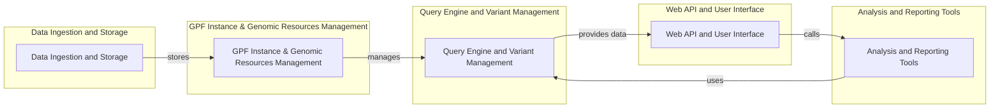

# GPF Project Onboarding Document

## Project Description

The GPF (Genomic Prediction Framework) project is a comprehensive platform designed for managing, analyzing, and exploring genomic data. It provides tools for data ingestion, storage, querying, and reporting, with a focus on variant analysis and phenotype association studies. GPF aims to facilitate research in genetics and genomics by offering a user-friendly interface and a powerful backend for handling large-scale datasets.

## Data Flow Diagram



## Component Descriptions

### Data Ingestion and Storage

This component is responsible for loading genomic data from various sources (VCF, denovo, CNV, etc.) and storing it in an efficient and scalable manner. It converts the data into Parquet format and utilizes storage backends like Impala and Google Cloud Storage. This component *stores* data that is then used by the GPF Instance & Genomic Resources Management component.

### GPF Instance & Genomic Resources Management

This component manages the GPF instance, including loading datasets and handling genomic resources such as reference genomes and gene models. It provides access to data IDs and genomic annotations. This component *manages* the data for the Query Engine and Variant Management component.

### Query Engine and Variant Management

This component handles variant querying, transformation, and response formatting. It provides query builders and SQL dialect implementations for different storage backends. The Query Engine *provides data* to the Web API and User Interface component and *uses* data from the Analysis and Reporting Tools component.

### Web API and User Interface

This component provides the web interface and API endpoints for accessing and interacting with the GPF data. It includes views, serializers, and permission management for datasets, users, and groups. The Web API *calls* the Analysis and Reporting Tools component to perform specific analyses.

### Analysis and Reporting Tools

This component provides tools for enrichment analysis, phenotype browsing, gene profile management, and common report generation. It includes functionalities for defining enrichment models, running tests, managing background models, and generating reports for studies. This component *uses* the Query Engine and Variant Management component to retrieve data for analysis.
```
