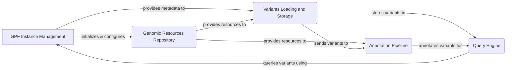

## GPF Project Overview

The Genomic Prediction Framework (GPF) is a comprehensive toolkit designed for managing, analyzing, and querying large-scale genomic data. It provides functionalities for data loading, storage, annotation, and querying, with a focus on variant analysis and web-based exploration.

## Data Flow Diagram

## Component Descriptions

**GPF Instance Management:** This component initializes and configures the GPF instance, acting as a central hub. It provides metadata to the Variants Loading and Storage component and is used by the Query Engine for querying variants. It also initializes the Genomic Resources Repository.

**Genomic Resources Repository (GRR):** This component manages genomic resources like reference genomes and gene models. It provides these resources to both the Variants Loading and Storage component and the Annotation Pipeline. It is initialized by the GPF Instance Management component.

**Variants Loading and Storage:** This component loads variant data from various sources and stores it in a genotype storage. It receives metadata from the GPF Instance Management component and genomic resources from the GRR. It sends variants to the Annotation Pipeline and stores them for the Query Engine.

**Query Engine:** This component provides functionalities for querying genetic variants. It uses the stored variants from the Variants Loading and Storage component and annotations from the Annotation Pipeline. It relies on the GPF Instance Management component for configuration and context.

**Annotation Pipeline:** This component annotates genetic variants with their potential effects. It receives variant data from the Variants Loading and Storage component and genomic resources from the GRR. The annotated variants are then used by the Query Engine.