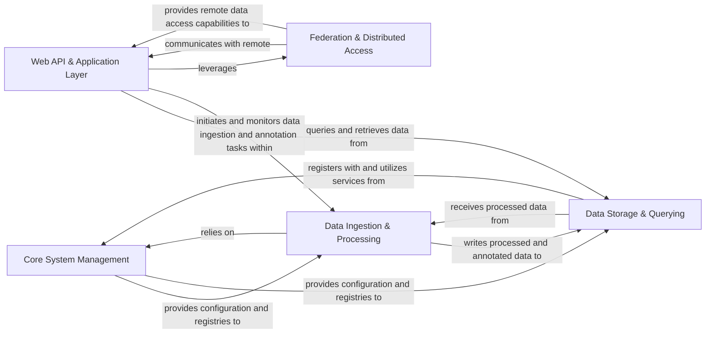

## Details

Abstract Components Overview of the GPF system.

### Core System Management
The central control plane for the GPF system, responsible for global configuration, managing the singleton GPF instance, and providing access to core registries (genotype storage, phenotype data, genomic resources, scores, gene sets).

**Related Classes/Methods**:

- `gpf.gpf_instance`
- `gpf.registry`
- `gpf.common`

### Data Ingestion & Processing
Manages the entire pipeline for loading, transforming, and enriching raw genomic and phenotypic data. This includes parsing diverse input formats, transforming data into internal representations, and applying bioinformatics annotations (e.g., functional effects, genomic scores, gene sets).

**Related Classes/Methods**:

- `gpf.fss`
- `gpf.to_gpf`
- `gpf.variant_annotation`
- `gpf.genotype_browser`

### Data Storage & Querying
Provides a unified, pluggable interface for persistent storage and efficient retrieval of both genotype and phenotype data. It abstracts underlying storage technologies (Impala, BigQuery, DuckDB, in-memory) and offers a consistent API for building and executing complex queries on genomic variants and phenotypic measures.

**Related Classes/Methods**:

- `gpf.variants`
- `gpf.pheno`
- `gpf.backends`

### Web API & Application Layer
Serves as the primary interface for external clients and the web-based user interface (WDAE). It exposes core GPF functionalities through a comprehensive set of RESTful APIs, enabling users to browse data, perform complex queries, run analyses, manage datasets, and handle user authentication and permissions.

**Related Classes/Methods**:

- `wdae`
- `dae`
- `dae.gpf_connector`
- `dae.studies_manager`
- `dae.query_manager`

### Federation & Distributed Access
Enables the GPF system to interact with and query remote GPF instances or other compatible data sources. This component facilitates distributed data access, allowing for federated studies and analyses across geographically dispersed datasets.

**Related Classes/Methods**:

- `gpf.remote`

### [FAQ](https://github.com/CodeBoarding/GeneratedOnBoardings/tree/main?tab=readme-ov-file#faq)