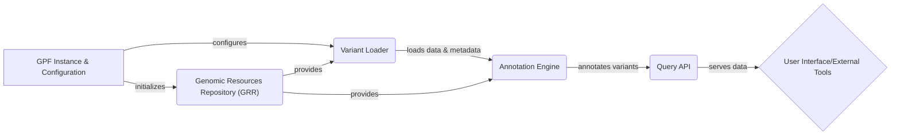

## GPF Project: Data Flow Overview

GPF (Genomic Prediction Framework) is a comprehensive platform designed for storing, querying, and analyzing large-scale genomic data. It provides tools for variant annotation, enrichment analysis, and phenotype association studies, enabling researchers to gain insights into the genetic basis of diseases.

## Component Descriptions

**GPF Instance & Configuration:** This component is the entry point of the GPF system. It initializes the GPF instance by loading configurations, datasets, and genomic resources. It provides access to study configurations and handles user permissions. It initializes the Genomic Resources Repository and configures the Variant Loader.

**Genomic Resources Repository (GRR):** The GRR manages and provides access to genomic resources such as reference genomes, gene models, and annotation scores. It is initialized by the GPF Instance & Configuration component and provides essential data to the Variant Loader and Annotation Engine.

**Variant Loader:** This component loads variant data from various formats (VCF, DAE) and transforms them into a common internal representation. It uses genomic resources from the GRR to correctly interpret and load the variant data. The loaded data is then passed to the Annotation Engine.

**Annotation Engine:** The Annotation Engine performs variant annotation using a configurable pipeline of annotators. It uses genomic resources from the GRR and the output of the Variant Loader to produce annotated variants. The annotated variants are then made available through the Query API.

**Query API:** This component provides the API and logic for querying and accessing variant data. It receives queries from the User Interface/External Tools, retrieves data from the storage backend, and returns the results. The Query API uses the annotated variants produced by the Annotation Engine.
