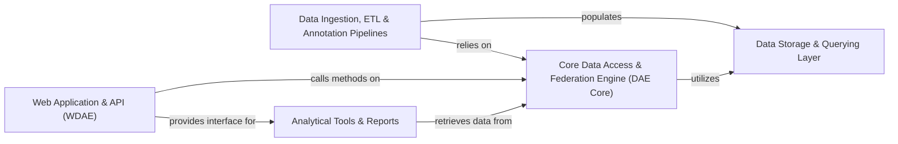

## Details

The `gpf` project is a sophisticated, backend-heavy, and data-intensive application designed as a specialized data management system for genomics and bioinformatics, offering robust analytical capabilities.

### Core Data Access & Federation Engine (DAE Core)
Acts as the central hub for managing and accessing all genomic data, configurations, and registries. It defines the fundamental data models and provides a unified interface for interacting with various data sources, including local storage and remote GPF instances, orchestrating data retrieval and processing across federated environments.

**Related Classes/Methods**:

- <a href="https://github.com/iossifovlab/gpf/blob/master/dae/dae/gpf_instance/gpf_instance.py#L52-L623" target="_blank" rel="noopener noreferrer">`gpf.dae.dae.gpf_instance.gpf_instance.GPFInstance` (52:623)</a>
- <a href="https://github.com/iossifovlab/gpf/blob/master/dae/dae/configuration/gpf_config_parser.py#L82-L340" target="_blank" rel="noopener noreferrer">`gpf.dae.dae.configuration.gpf_config_parser.GPFConfigParser` (82:340)</a>
- <a href="https://github.com/iossifovlab/gpf/blob/master/dae/dae/variants/variant.py#L592-L850" target="_blank" rel="noopener noreferrer">`gpf.dae.dae.variants.variant.SummaryVariant` (592:850)</a>
- <a href="https://github.com/iossifovlab/gpf/blob/master/dae/dae/pedigrees/families_data.py#L115-L364" target="_blank" rel="noopener noreferrer">`gpf.dae.dae.pedigrees.families_data.FamiliesData` (115:364)</a>
- <a href="https://github.com/iossifovlab/gpf/blob/master/dae/dae/pheno/pheno_data.py#L240-L748" target="_blank" rel="noopener noreferrer">`gpf.dae.dae.pheno.pheno_data.PhenotypeData` (240:748)</a>
- <a href="https://github.com/iossifovlab/gpf/blob/master/dae/dae/genomic_resources/genomic_context.py#L29-L79" target="_blank" rel="noopener noreferrer">`gpf.dae.dae.genomic_resources.genomic_context.GenomicContext` (29:79)</a>
- <a href="https://github.com/iossifovlab/gpf/blob/master/dae/dae/gene_sets/gene_sets_db.py#L275-L342" target="_blank" rel="noopener noreferrer">`gpf.dae.dae.gene_sets.gene_sets_db.GeneSetsDb` (275:342)</a>
- <a href="https://github.com/iossifovlab/gpf/blob/master/dae/dae/genomic_scores/scores.py#L176-L260" target="_blank" rel="noopener noreferrer">`gpf.dae.dae.genomic_scores.scores.GenomicScoresRegistry` (176:260)</a>
- <a href="https://github.com/iossifovlab/gpf/blob/master/federation/federation/remote_study.py#L21-L213" target="_blank" rel="noopener noreferrer">`gpf.federation.federation.remote_study.RemoteGenotypeData` (21:213)</a>
- <a href="https://github.com/iossifovlab/gpf/blob/master/federation/federation/rest_api_client.py#L21-L653" target="_blank" rel="noopener noreferrer">`gpf.federation.federation.rest_api_client.RESTClient` (21:653)</a>
- <a href="https://github.com/iossifovlab/gpf/blob/master/federation/federation/remote_enrichment_tool.py#L12-L28" target="_blank" rel="noopener noreferrer">`gpf.federation.federation.remote_enrichment_tool.RemoteEnrichmentHelper` (12:28)</a>

### Data Storage & Querying Layer
Manages the persistence and retrieval of genomic data across diverse backend technologies like Apache Impala, Google BigQuery, DuckDB, and in-memory storage. It provides a unified interface for querying variants and other genomic data, abstracting the underlying storage mechanism from the DAE Core.

**Related Classes/Methods**:

- <a href="https://github.com/iossifovlab/gpf/blob/master/impala_storage/impala_storage/schema1/impala_genotype_storage.py#L28-L479" target="_blank" rel="noopener noreferrer">`gpf.impala_storage.impala_storage.schema1.impala_genotype_storage.ImpalaGenotypeStorage` (28:479)</a>
- <a href="https://github.com/iossifovlab/gpf/blob/master/gcp_storage/gcp_storage/gcp_genotype_storage.py#L19-L316" target="_blank" rel="noopener noreferrer">`gpf.gcp_storage.gcp_storage.gcp_genotype_storage.GcpGenotypeStorage` (19:316)</a>
- <a href="https://github.com/iossifovlab/gpf/blob/master/dae/dae/duckdb_storage/duckdb_genotype_storage.py#L37-L95" target="_blank" rel="noopener noreferrer">`gpf.dae.dae.duckdb_storage.duckdb_genotype_storage.AbstractDuckDbStorage` (37:95)</a>
- <a href="https://github.com/iossifovlab/gpf/blob/master/dae/dae/inmemory_storage/inmemory_genotype_storage.py#L28-L151" target="_blank" rel="noopener noreferrer">`gpf.dae.dae.inmemory_storage.inmemory_genotype_storage.InmemoryGenotypeStorage` (28:151)</a>
- <a href="https://github.com/iossifovlab/gpf/blob/master/dae/dae/parquet_storage/storage.py#L204-L274" target="_blank" rel="noopener noreferrer">`gpf.dae.dae.parquet_storage.storage.ParquetGenotypeStorage` (204:274)</a>
- <a href="https://github.com/iossifovlab/gpf/blob/master/dae/dae/query_variants/base_query_variants.py#L26-L186" target="_blank" rel="noopener noreferrer">`gpf.dae.dae.query_variants.base_query_variants.QueryVariants` (26:186)</a>
- <a href="https://github.com/iossifovlab/gpf/blob/master/dae/dae/query_variants/query_runners.py#L14-L121" target="_blank" rel="noopener noreferrer">`gpf.dae.dae.query_variants.query_runners.QueryRunner` (14:121)</a>

### Data Ingestion, ETL & Annotation Pipelines
Handles the end-to-end process of loading raw genomic data (e.g., VCF, DAE, CNV formats) into the system. This includes data transformation, validation, and storage into the chosen backend format. It also orchestrates complex import tasks, manages the task graph for data processing, and applies various annotations to genomic variants as part of the ingestion workflow.

**Related Classes/Methods**:

- <a href="https://github.com/iossifovlab/gpf/blob/master/impala_storage/impala_storage/schema1/import_commons.py#L367-L905" target="_blank" rel="noopener noreferrer">`gpf.impala_storage.impala_storage.schema1.import_commons.BatchImporter` (367:905)</a>
- <a href="https://github.com/iossifovlab/gpf/blob/master/dae/dae/variants_loaders/raw/loader.py#L266-L354" target="_blank" rel="noopener noreferrer">`gpf.dae.dae.variants_loaders.raw.loader.VariantsLoader` (266:354)</a>
- <a href="https://github.com/iossifovlab/gpf/blob/master/dae/dae/pedigrees/loader.py#L42-L626" target="_blank" rel="noopener noreferrer">`gpf.dae.dae.pedigrees.loader.FamiliesLoader` (42:626)</a>
- <a href="https://github.com/iossifovlab/gpf/blob/master/dae/dae/import_tools/import_tools.py#L69-L713" target="_blank" rel="noopener noreferrer">`gpf.dae.dae.import_tools.import_tools.ImportProject` (69:713)</a>
- <a href="https://github.com/iossifovlab/gpf/blob/master/dae/dae/schema2_storage/schema2_import_storage.py#L71-L419" target="_blank" rel="noopener noreferrer">`gpf.dae.dae.schema2_storage.schema2_import_storage.Schema2ImportStorage` (71:419)</a>
- <a href="https://github.com/iossifovlab/gpf/blob/master/dae/dae/task_graph/graph.py#L27-L97" target="_blank" rel="noopener noreferrer">`gpf.dae.dae.task_graph.graph.TaskGraph` (27:97)</a>
- <a href="https://github.com/iossifovlab/gpf/blob/master/dae/dae/annotation/annotation_pipeline.py#L96-L237" target="_blank" rel="noopener noreferrer">`gpf.dae.dae.annotation.annotation_pipeline.AnnotationPipeline` (96:237)</a>
- <a href="https://github.com/iossifovlab/gpf/blob/master/dae/dae/annotation/annotator_base.py#L15-L84" target="_blank" rel="noopener noreferrer">`gpf.dae.dae.annotation.annotator_base.AnnotatorBase` (15:84)</a>
- <a href="https://github.com/iossifovlab/gpf/blob/master/dae/dae/annotation/effect_annotator.py#L38-L242" target="_blank" rel="noopener noreferrer">`gpf.dae.dae.annotation.effect_annotator.EffectAnnotatorAdapter` (38:242)</a>
- <a href="https://github.com/iossifovlab/gpf/blob/master/spliceai_annotator/spliceai_annotator/spliceai_annotator.py#L67-L537" target="_blank" rel="noopener noreferrer">`gpf.spliceai_annotator.spliceai_annotator.spliceai_annotator.SpliceAIAnnotator` (67:537)</a>
- <a href="https://github.com/iossifovlab/gpf/blob/master/external_vep_annotator/vep_annotator/vep_annotator.py#L267-L350" target="_blank" rel="noopener noreferrer">`gpf.external_vep_annotator.vep_annotator.vep_annotator.VEPCacheAnnotator` (267:350)</a>

### Web Application & API (WDAE)
Provides the RESTful API and serves the web user interface, enabling users to interact with the GPF system. This component also encompasses user authentication, authorization, and the management of dataset access permissions, ensuring data security and controlled access.

**Related Classes/Methods**:

- <a href="https://github.com/iossifovlab/gpf/blob/master/wdae/wdae/gpf_instance/gpf_instance.py#L83-L338" target="_blank" rel="noopener noreferrer">`gpf.wdae.wdae.gpf_instance.gpf_instance.WGPFInstance` (83:338)</a>
- <a href="https://github.com/iossifovlab/gpf/blob/master/wdae/wdae/studies/study_wrapper.py#L359-L1076" target="_blank" rel="noopener noreferrer">`gpf.wdae.wdae.studies.study_wrapper.WDAEStudy` (359:1076)</a>
- <a href="https://github.com/iossifovlab/gpf/blob/master/wdae/wdae/gene_profiles_api/views.py#L23-L72" target="_blank" rel="noopener noreferrer">`gpf.wdae.wdae.gene_profiles_api.views.ProfileView` (23:72)</a>
- <a href="https://github.com/iossifovlab/gpf/blob/master/wdae/wdae/enrichment_api/views.py#L41-L110" target="_blank" rel="noopener noreferrer">`gpf.wdae.wdae.enrichment_api.views.EnrichmentTestView` (41:110)</a>
- <a href="https://github.com/iossifovlab/gpf/blob/master/wdae/wdae/pheno_tool_api/views.py#L29-L99" target="_blank" rel="noopener noreferrer">`gpf.wdae.wdae.pheno_tool_api.views.PhenoToolView` (29:99)</a>
- <a href="https://github.com/iossifovlab/gpf/blob/master/wdae/wdae/datasets_api/views.py#L79-L185" target="_blank" rel="noopener noreferrer">`gpf.wdae.wdae.datasets_api.views.DatasetView` (79:185)</a>
- <a href="https://github.com/iossifovlab/gpf/blob/master/wdae/wdae/users_api/models.py#L28-L79" target="_blank" rel="noopener noreferrer">`gpf.wdae.wdae.users_api.models.WdaeUserManager` (28:79)</a>
- <a href="https://github.com/iossifovlab/gpf/blob/master/wdae/wdae/users_api/views.py#L390-L419" target="_blank" rel="noopener noreferrer">`gpf.wdae.wdae.users_api.views.RESTLoginView` (390:419)</a>
- <a href="https://github.com/iossifovlab/gpf/blob/master/wdae/wdae/datasets_api/permissions.py#L44-L269" target="_blank" rel="noopener noreferrer">`gpf.wdae.wdae.datasets_api.permissions.IsDatasetAllowed` (44:269)</a>

### Analytical Tools & Reports
Provides specialized tools and generates comprehensive reports for genomic data analysis, including gene set enrichment, phenotype correlation, and common variant reports. These tools leverage the DAE Core for data retrieval and computation, offering advanced analytical capabilities to users.

**Related Classes/Methods**:

- <a href="https://github.com/iossifovlab/gpf/blob/master/wdae/wdae/enrichment_api/enrichment_helper.py#L46-L289" target="_blank" rel="noopener noreferrer">`gpf.wdae.wdae.enrichment_api.enrichment_helper.EnrichmentHelper` (46:289)</a>
- <a href="https://github.com/iossifovlab/gpf/blob/master/wdae/wdae/pheno_tool_api/adapter.py#L35-L228" target="_blank" rel="noopener noreferrer">`gpf.wdae.wdae.pheno_tool_api.adapter.PhenoToolAdapter` (35:228)</a>
- <a href="https://github.com/iossifovlab/gpf/blob/master/dae/dae/enrichment_tool/genotype_helper.py#L29-L83" target="_blank" rel="noopener noreferrer">`gpf.dae.dae.enrichment_tool.genotype_helper.GenotypeHelper` (29:83)</a>
- <a href="https://github.com/iossifovlab/gpf/blob/master/dae/dae/common_reports/common_report.py#L14-L74" target="_blank" rel="noopener noreferrer">`gpf.dae.dae.common_reports.common_report.CommonReport` (14:74)</a>

### [FAQ](https://github.com/CodeBoarding/GeneratedOnBoardings/tree/main?tab=readme-ov-file#faq)