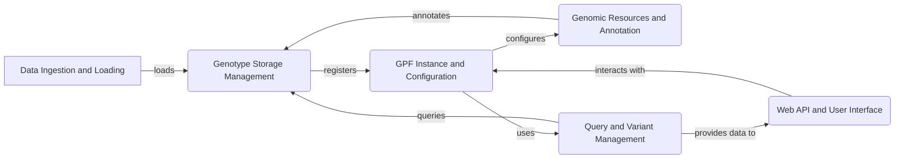

Okay, I will generate an onboarding document for the `gpf` project based on the identified components.

**1. Project Description:**

GPF (Genomic Population Finder) is a comprehensive platform designed for the analysis and exploration of genomic data. It provides tools for managing, querying, and annotating genetic variants, with a focus on facilitating research in population genetics and related fields. GPF supports various data formats and storage backends, offering a flexible and scalable solution for genomic data analysis. The platform includes a web-based user interface and API for easy access and integration with other systems.

**2. Data Flow Diagram (Mermaid):**

**3. Component Descriptions:**

*   **Data Ingestion and Loading:** This component is responsible for ingesting raw genomic data from various sources like VCF, denovo, and DAE files. It transforms and loads this data into a standardized format suitable for storage and analysis. It *loads* data into the Genotype Storage Management component.

*   **Genotype Storage Management:** This component manages the storage and retrieval of genotype data using different storage backends (e.g., Impala, GCS, DuckDB). It provides an abstraction layer for querying variant data. It *registers* available datasets to the GPF Instance and Configuration component and is *annotated* by the Genomic Resources and Annotation component. The Query and Variant Management component *queries* this component for data.

*   **GPF Instance and Configuration:** This component acts as the central hub for the GPF system. It manages the GPF instance, including loading configurations, managing datasets, and providing access to various GPF resources. It *configures* the Genomic Resources and Annotation component and *uses* the Query and Variant Management component. The Web API and User Interface *interacts with* this component to access data and functionalities.

*   **Genomic Resources and Annotation:** This component manages genomic resources like reference genomes and gene models, and provides annotation capabilities for genetic variants. It *annotates* the Genotype Storage Management component with functional information. It is *configured* by the GPF Instance and Configuration component.

*   **Query and Variant Management:** This component provides the functionality to construct and execute queries against the stored variant data. It includes query builders, query runners, and result processing. It *queries* the Genotype Storage Management component for data and *provides data to* the Web API and User Interface.

*   **Web API and User Interface:** This component exposes the GPF functionalities through a web API and provides a user interface for interacting with the system. It handles user authentication, authorization, data access control, and visualization of results. It *interacts with* the GPF Instance and Configuration component to access data and functionalities.