```mermaid
graph LR
    GPF_Core_Orchestration["GPF Core Orchestration"]
    Data_Management_Query["Data Management & Query"]
    Data_Ingestion_Annotation["Data Ingestion & Annotation"]
    Web_Application_User_Services["Web Application & User Services"]
    Advanced_Analysis_Federation["Advanced Analysis & Federation"]
    Data_Persistence_Layer["Data Persistence Layer"]
    GPF_Core_Orchestration -- "provides data to" --> Web_Application_User_Services
    GPF_Core_Orchestration -- "orchestrates" --> Data_Management_Query
    Data_Management_Query -- "uses" --> Data_Persistence_Layer
    Data_Management_Query -- "provides data to" --> Web_Application_User_Services
    Data_Ingestion_Annotation -- "uses" --> Data_Persistence_Layer
    Data_Ingestion_Annotation -- "populates" --> Data_Management_Query
    Web_Application_User_Services -- "uses" --> GPF_Core_Orchestration
    Web_Application_User_Services -- "retrieves data from" --> Data_Management_Query
    Advanced_Analysis_Federation -- "uses" --> Data_Management_Query
    Advanced_Analysis_Federation -- "provides results to" --> Web_Application_User_Services
    Data_Persistence_Layer -- "supports" --> Data_Management_Query
    Data_Persistence_Layer -- "supports" --> Data_Ingestion_Annotation
    click GPF_Core_Orchestration href "https://github.com/CodeBoarding/GeneratedOnBoardings/blob/main//gpf/GPF_Core_Orchestration.md" "Details"
    click Data_Management_Query href "https://github.com/CodeBoarding/GeneratedOnBoardings/blob/main//gpf/Data_Management_Query.md" "Details"
    click Data_Ingestion_Annotation href "https://github.com/CodeBoarding/GeneratedOnBoardings/blob/main//gpf/Data_Ingestion_Annotation.md" "Details"
    click Web_Application_User_Services href "https://github.com/CodeBoarding/GeneratedOnBoardings/blob/main//gpf/Web_Application_User_Services.md" "Details"
    click Advanced_Analysis_Federation href "https://github.com/CodeBoarding/GeneratedOnBoardings/blob/main//gpf/Advanced_Analysis_Federation.md" "Details"
    click Data_Persistence_Layer href "https://github.com/CodeBoarding/GeneratedOnBoardings/blob/main//gpf/Data_Persistence_Layer.md" "Details"
```

## Component Details

The `gpf` project's architecture is designed around a core data management system for genomic and phenotypic data, exposed through a web application, and supported by robust data ingestion, annotation, and persistence layers. Advanced analytical capabilities and federation features extend its functionality.

### GPF Core Orchestration
This is the central hub of the GPF system, responsible for overall configuration, managing access to all genomic and phenotypic data, and orchestrating interactions between various components. It acts as the single source of truth for the system's data and services.

**Related Classes/Methods**:

- <a href="https://github.com/iossifovlab/gpf/blob/master/dae/dae/gpf_instance/gpf_instance.py#L62-L723" target="_blank" rel="noopener noreferrer">`gpf.dae.dae.gpf_instance.gpf_instance.GPFInstance` (62:723)</a>

### Data Management & Query
Manages the organization, storage, and retrieval of all core genomic data, including genotype studies, variants, pedigree information, and phenotype data. It provides a unified interface for querying these diverse datasets, abstracting the underlying storage mechanisms.

**Related Classes/Methods**:

- <a href="https://github.com/iossifovlab/gpf/blob/master/dae/dae/studies/variants_db.py#L237-L591" target="_blank" rel="noopener noreferrer">`gpf.dae.dae.studies.variants_db.VariantsDb` (237:591)</a>
- <a href="https://github.com/iossifovlab/gpf/blob/master/dae/dae/query_variants/base_query_variants.py#L184-L239" target="_blank" rel="noopener noreferrer">`gpf.dae.dae.query_variants.base_query_variants.QueryVariantsBase` (184:239)</a>
- <a href="https://github.com/iossifovlab/gpf/blob/master/dae/dae/pedigrees/loader.py#L42-L619" target="_blank" rel="noopener noreferrer">`gpf.dae.dae.pedigrees.loader.FamiliesLoader` (42:619)</a>
- <a href="https://github.com/iossifovlab/gpf/blob/master/dae/dae/pheno/registry.py#L15-L208" target="_blank" rel="noopener noreferrer">`gpf.dae.dae.pheno.registry.PhenoRegistry` (15:208)</a>
- `gpf.dae.dae.pheno.phenotype_data.PhenotypeData` (0:0)

### Data Ingestion & Annotation
Handles the process of importing raw genetic and pedigree data into the GPF system, converting it into optimized storage formats. It also defines and executes pipelines for annotating genetic variants with functional and clinical information using various genomic resources (e.g., reference genomes, gene models).

**Related Classes/Methods**:

- <a href="https://github.com/iossifovlab/gpf/blob/master/dae/dae/import_tools/import_tools.py#L66-L698" target="_blank" rel="noopener noreferrer">`gpf.dae.dae.import_tools.import_tools.ImportProject` (66:698)</a>
- <a href="https://github.com/iossifovlab/gpf/blob/master/dae/dae/variants_loaders/vcf/loader.py#L607-L986" target="_blank" rel="noopener noreferrer">`gpf.dae.dae.variants_loaders.vcf.loader.VcfLoader` (607:986)</a>
- <a href="https://github.com/iossifovlab/gpf/blob/master/dae/dae/variants_loaders/parquet/loader.py#L139-L422" target="_blank" rel="noopener noreferrer">`gpf.dae.dae.variants_loaders.parquet.loader.ParquetLoader` (139:422)</a>
- <a href="https://github.com/iossifovlab/gpf/blob/master/dae/dae/annotation/annotation_pipeline.py#L96-L237" target="_blank" rel="noopener noreferrer">`gpf.dae.dae.annotation.annotation_pipeline.AnnotationPipeline` (96:237)</a>
- <a href="https://github.com/iossifovlab/gpf/blob/master/dae/dae/genomic_resources/genomic_context.py#L244-L247" target="_blank" rel="noopener noreferrer">`gpf.dae.dae.genomic_resources.genomic_context.get_genomic_context` (244:247)</a>
- <a href="https://github.com/iossifovlab/gpf/blob/master/dae/dae/genomic_resources/reference_genome.py#L23-L268" target="_blank" rel="noopener noreferrer">`dae.genomic_resources.reference_genome.ReferenceGenome` (23:268)</a>
- <a href="https://github.com/iossifovlab/gpf/blob/master/dae/dae/genomic_resources/gene_models/gene_models.py#L420-L573" target="_blank" rel="noopener noreferrer">`dae.genomic_resources.gene_models.GeneModels` (420:573)</a>

### Web Application & User Services
Provides the web-based user interface and API endpoints for interacting with the GPF system. It manages user authentication, authorization, user groups, and dataset-level permissions, ensuring secure and controlled access to data and functionalities.

**Related Classes/Methods**:

- <a href="https://github.com/iossifovlab/gpf/blob/master/wdae/wdae/gpf_instance/gpf_instance.py#L78-L311" target="_blank" rel="noopener noreferrer">`gpf.wdae.wdae.gpf_instance.gpf_instance.WGPFInstance` (78:311)</a>
- <a href="https://github.com/iossifovlab/gpf/blob/master/wdae/wdae/datasets_api/views.py#L79-L186" target="_blank" rel="noopener noreferrer">`gpf.wdae.wdae.datasets_api.views.DatasetView` (79:186)</a>
- <a href="https://github.com/iossifovlab/gpf/blob/master/wdae/wdae/users_api/views.py#L83-L203" target="_blank" rel="noopener noreferrer">`gpf.wdae.wdae.users_api.views.UserViewSet` (83:203)</a>
- <a href="https://github.com/iossifovlab/gpf/blob/master/wdae/wdae/genotype_browser/views.py#L25-L214" target="_blank" rel="noopener noreferrer">`gpf.wdae.wdae.genotype_browser.views.GenotypeBrowserQueryView` (25:214)</a>

### Advanced Analysis & Federation
Encompasses higher-level genomic analyses, including gene set and enrichment analysis, gene profiling, and genomic scoring. It also facilitates federated queries and data access across distributed GPF instances and provides a framework for executing complex computational tasks.

**Related Classes/Methods**:

- <a href="https://github.com/iossifovlab/gpf/blob/master/dae/dae/enrichment_tool/enrichment_helper.py#L36-L285" target="_blank" rel="noopener noreferrer">`gpf.dae.dae.enrichment_tool.enrichment_helper.EnrichmentHelper` (36:285)</a>
- <a href="https://github.com/iossifovlab/gpf/blob/master/dae/dae/gene_scores/gene_scores.py#L386-L459" target="_blank" rel="noopener noreferrer">`gpf.dae.dae.gene_scores.gene_scores.GeneScoresDb` (386:459)</a>
- `gpf.dae.dae.gene_profile.gene_profile_db.GeneProfileDB` (0:0)
- <a href="https://github.com/iossifovlab/gpf/blob/master/dae/dae/gene_sets/gene_sets_db.py#L274-L341" target="_blank" rel="noopener noreferrer">`gpf.dae.dae.gene_sets.gene_sets_db.GeneSetsDb` (274:341)</a>
- `gpf.dae.dae.denovo_gene_sets.denovo_gene_sets_db.DenovoGeneSetsDb` (0:0)
- <a href="https://github.com/iossifovlab/gpf/blob/master/federation/federation/remote_extension.py#L48-L134" target="_blank" rel="noopener noreferrer">`gpf.federation.federation.remote_extension.load_extension` (48:134)</a>

### Data Persistence Layer
The foundational layer responsible for abstracting and implementing various storage technologies (e.g., Google BigQuery, Impala, DuckDB, Parquet). It provides the mechanisms for efficient and scalable storage and retrieval of all genomic and phenotypic data, ensuring data integrity and performance.

**Related Classes/Methods**:

- <a href="https://github.com/iossifovlab/gpf/blob/master/gcp_storage/gcp_storage/bigquery_variants.py#L50-L160" target="_blank" rel="noopener noreferrer">`gpf.gcp_storage.gcp_storage.bigquery_variants.BigQueryVariants` (50:160)</a>
- <a href="https://github.com/iossifovlab/gpf/blob/master/impala_storage/impala_storage/schema1/impala_variants.py#L39-L570" target="_blank" rel="noopener noreferrer">`gpf.impala_storage.impala_storage.schema1.impala_variants.ImpalaVariants` (39:570)</a>
- <a href="https://github.com/iossifovlab/gpf/blob/master/impala2_storage/impala2_storage/schema2/impala_variants.py#L31-L140" target="_blank" rel="noopener noreferrer">`gpf.impala2_storage.impala2_storage.schema2.impala_variants.ImpalaVariants` (31:140)</a>
- <a href="https://github.com/iossifovlab/gpf/blob/master/dae/dae/duckdb_storage/duckdb2_variants.py#L111-L538" target="_blank" rel="noopener noreferrer">`gpf.dae.dae.duckdb_storage.duckdb2_variants.DuckDb2Variants` (111:538)</a>

### [FAQ](https://github.com/CodeBoarding/GeneratedOnBoardings/tree/main?tab=readme-ov-file#faq)