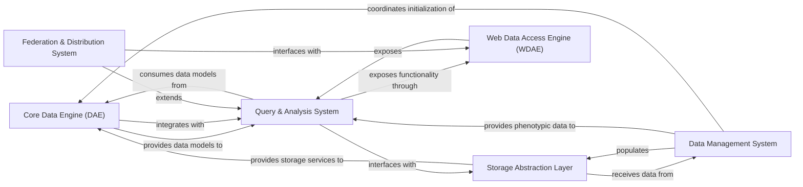

## Details

The GPF (Genotype and Phenotype in Families) platform is a comprehensive bioinformatics system designed for managing, analyzing, and interpreting genomic and phenotypic data. The architecture follows a modular design with six core components that work together to provide a complete genomic research solution. The Data Management System handles data import and configuration, feeding genomic data into the Storage Abstraction Layer which supports multiple backends (Impala, BigQuery, DuckDB). The Core Data Engine provides fundamental data models for genomic variants and family structures, which are utilized by the Query & Analysis System to perform specialized genomic analyses. The Web Data Access Engine exposes these capabilities through HTTP endpoints, while the Federation & Distribution System enables distributed queries across multiple GPF instances. This architecture enables flexible, scalable genomic research with support for various deployment scenarios and research requirements.

### Core Data Engine (DAE)
Provides the foundational data model and processing capabilities for genomic variants, family structures, and study data.

**Related Classes/Methods**:

- `dae.variants.variant`
- `dae.variants.family_variant`
- `dae.pedigrees.families_data`
- `dae.studies.study`
- `dae.effect_annotation.annotator`
- `dae.effect_annotation.effect`

### Storage Abstraction Layer [[Expand]](./Storage_Abstraction_Layer.md)
Abstracts storage implementation details, enabling the platform to work with multiple backend technologies through a unified interface.

**Related Classes/Methods**:

- `dae.genotype_storage.genotype_storage`
- `gpf.impala_storage.impala_storage`
- `gpf.gcp_storage.gcp_storage`
- `gpf.duckdb_storage.duckdb_genotype_storage`
- `dae.inmemory_storage.inmemory_genotype_storage`

### Query & Analysis System [[Expand]](./Query_Analysis_System.md)
Translates high-level queries into storage-specific operations and provides specialized analysis tools for genomic data.

**Related Classes/Methods**:

- `dae.query_variants.base_query_variants`
- `dae.enrichment_tool`
- `dae.pheno_tool.tool`
- `dae.gene_profile`
- `dae.annotation.annotation_pipeline`

### Web Data Access Engine (WDAE) [[Expand]](./Web_Data_Access_Engine_WDAE_.md)
Provides HTTP endpoints and web interfaces for accessing genomic data and analysis tools.

**Related Classes/Methods**:

- `gpf.wdae.wdae.gene_view.views`
- `gpf.wdae.wdae.genotype_browser.views`
- `gpf.wdae.wdae.datasets_api.views`
- `gpf.wdae.wdae.users_api.models`
- `gpf.wdae.wdae.pheno_browser_api.views`

### Federation & Distribution System [[Expand]](./Federation_Distribution_System.md)
Enables distributed queries across multiple GPF instances, allowing the platform to operate in a federated manner.

**Related Classes/Methods**:

- `gpf.federation.federation.rest_api_client`
- `gpf.federation.federation.remote_study`
- `gpf.federation.federation.remote_variant`
- `gpf.federation.federation.remote_enrichment_tool`

### Data Management System
Handles data import, phenotype management, and instance configuration.

**Related Classes/Methods**:

- `dae.import_tools.import_tools`
- `dae.variants_loaders`
- `dae.pheno.pheno_data`
- `dae.gpf_instance.gpf_instance`
- `dae.configuration.gpf_config_parser`

### [FAQ](https://github.com/CodeBoarding/GeneratedOnBoardings/tree/main?tab=readme-ov-file#faq)