```markdown
# GPF Project Overview

GPF (Genomic Prediction Framework) is a comprehensive framework designed for managing, analyzing, and querying large-scale genomic data. It provides tools for importing, storing, annotating, and querying genetic variants, supporting a wide range of research applications from rare disease studies to population genetics.

## Data Flow Diagram

```mermaid
graph LR
    A[Data Import & Conversion] -- prepares & loads --> B(GPF Instance & Configuration)
    B -- configures & provides access to --> C(Genomic Resources Repository)
    B -- configures --> D(Genotype Storage Abstraction)
    C -- annotates variants using --> E(Annotation Engine)
    D -- queries variants from --> E
    E -- enriches variants --> D

click A href "https://github.com/CodeBoarding/GeneratedOnBoardings/blob/main/gpf//Data%20Import%20&%20Conversion.md"
click B href "https://github.com/CodeBoarding/GeneratedOnBoardings/blob/main/gpf//GPF%20Instance%20&%20Configuration.md"
click C href "https://github.com/CodeBoarding/GeneratedOnBoardings/blob/main/gpf//Genomic%20Resources%20Repository.md"
click D href "https://github.com/CodeBoarding/GeneratedOnBoardings/blob/main/gpf//Genotype%20Storage%20Abstraction.md"
click E href "https://github.com/CodeBoarding/GeneratedOnBoardings/blob/main/gpf//Annotation%20Engine.md"
```



## Component Descriptions

**A. Data Import & Conversion**

*   **Description**: This component handles the ingestion of raw data from various formats (VCF, DAE, etc.) and converts it into a standardized format suitable for GPF. It ensures data quality and prepares it for subsequent storage and analysis.
*   **Interaction**: It prepares and loads data into the GPF Instance & Configuration component.

**B. GPF Instance & Configuration**

*   **Description**: This is the central component that manages the GPF instance, loading configurations, and providing access to genomic resources and genotype data. It acts as a central registry and access point for other components.
*   **Interaction**: It configures and provides access to the Genomic Resources Repository and configures the Genotype Storage Abstraction.

**C. Genomic Resources Repository**

*   **Description**: This component provides access to essential genomic resources such as reference genomes, gene models, and annotation scores. It manages the loading, caching, and retrieval of these resources, enabling efficient annotation and analysis.
*   **Interaction**: It annotates variants using the Annotation Engine.

**D. Genotype Storage Abstraction**

*   **Description**: This component abstracts the underlying storage of genotype data, providing a unified interface for querying variants. It supports multiple storage backends, allowing GPF to work with different data storage solutions.
*   **Interaction**: It queries variants from the Annotation Engine and enriches variants.

**E. Annotation Engine**

*   **Description**: This component orchestrates the annotation of genomic variants using configurable annotation pipelines. It manages the execution of annotators and the flow of data through the pipeline, enriching variants with relevant annotations.
*   **Interaction**: It annotates variants using Genomic Resources Repository and is queried by Genotype Storage Abstraction.
```