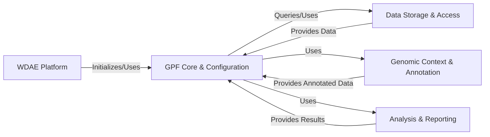

# Project Overview: GPF (Genomic data and Phenotype data Federation)

GPF is a platform designed for managing, querying, and analyzing large-scale genomic and phenotype data, particularly focusing on rare genetic variants and their association with phenotypes. It provides tools for data import, storage (supporting various backends), variant annotation, querying, and various analyses like enrichment and gene profiling. The platform includes a web-based interface (WDAE) for browsing and interacting with the data and analysis results.

# High-Level Data Flow Diagram

# Component Descriptions

*   **WDAE Platform**: This is the web application layer and the primary interface for users. It handles user requests, manages user authentication and permissions, transforms data for the web interface, and orchestrates interactions with the core GPF components, primarily by initializing and using the `GPF Core & Configuration` and interacting with other components via the core.

*   **GPF Core & Configuration**: This is the central hub of the GPF system. It is responsible for loading the system configuration, managing the core GPF instance, and acting as an orchestrator. It receives requests from the `WDAE Platform` and directs them to the appropriate downstream components (`Data Storage & Access`, `Genomic Context & Annotation`, `Analysis & Reporting`), consolidating results before returning them.

*   **Data Storage & Access**: This component is responsible for the persistence, retrieval, and querying of genotype and phenotype data. It provides interfaces for accessing variant, family, and phenotype data, supporting various storage backends. It receives queries from the `GPF Core & Configuration` and provides the requested data back to the core, which may then be used by other components like `Genomic Context & Annotation` or `Analysis & Reporting`.

*   **Genomic Context & Annotation**: This component manages genomic resources such as reference genomes, gene models, and genomic scores. It is also responsible for the process of annotating genetic variants with information from these resources using a configurable pipeline. It is used by the `GPF Core & Configuration` to provide genomic context and annotated data, often receiving variant data from `Data Storage & Access` via the core for annotation.

*   **Analysis & Reporting**: This component provides tools and libraries for performing various analyses on the genomic and phenotype data, including enrichment analysis and gene profiling, and manages gene set collections. It is utilized by the `GPF Core & Configuration` to execute analysis tasks, often requiring data from `Data Storage & Access` (potentially via the core) to perform its computations and provide analysis results back to the core.