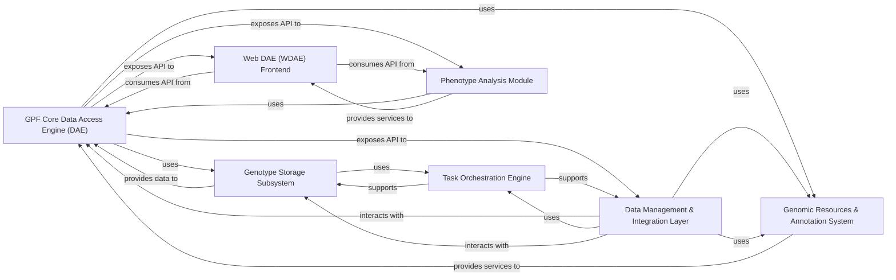

## Details

The feedback is highly relevant and actionable. The original analysis provided a sound conceptual design, but it lacked the crucial concrete links to the codebase, making verification impossible. I need to update the analysis by adding source file references and code references for each component.

### GPF Core Data Access Engine (DAE)
This is the central authoritative gateway for all genetic and phenotypic data operations. It provides core data models (variants, families, phenotypes), manages system configuration, and offers a unified API to abstract the complexities of various underlying storage technologies.

**Related Classes/Methods**:

- <a href="https://github.com/iossifovlab/gpf/blob/master/dae/dae/gpf_instance/gpf_instance.py" target="_blank" rel="noopener noreferrer">`dae.dae.gpf_instance.gpf_instance`</a>

### Genotype Storage Subsystem
Manages the persistent storage, retrieval, and querying of genetic variant data. It defines an abstract interface and provides pluggable implementations for various backend technologies, including Apache Impala, Google BigQuery (GCP), DuckDB, Parquet files, and an in-memory option.

**Related Classes/Methods**:

- <a href="https://github.com/iossifovlab/gpf/blob/master/dae/dae/genotype_storage/genotype_storage.py#L13-L80" target="_blank" rel="noopener noreferrer">`dae.dae.genotype_storage.genotype_storage.GenotypeStorage` (13:80)</a>

### Genomic Resources & Annotation System
Manages and provides access to various genomic resources (e.g., reference genomes, gene models, genomic scores) and offers a flexible framework for annotating genomic variants with biological and functional information.

**Related Classes/Methods**:

- <a href="https://github.com/iossifovlab/gpf/blob/master/dae/dae/genomic_resources/repository.py" target="_blank" rel="noopener noreferrer">`dae.dae.genomic_resources.repository.GenomicResourceRepo`</a>

### Web DAE (WDAE) Frontend
The primary user interface and presentation layer for the GPF platform. It offers interactive tools and views for data exploration, variant querying, gene set analysis, enrichment tests, and user/dataset management.

**Related Classes/Methods**:

- `wdae.wdae.wdae.views`

### Data Management & Integration Layer
Provides command-line utilities for importing raw genetic and phenotypic data, exporting processed data, and managing datasets. It also includes functionality for federating data from other remote GPF instances via a RESTful API client.

**Related Classes/Methods**:

- <a href="https://github.com/iossifovlab/gpf/blob/master/dae/dae/import_tools/import_tools.py" target="_blank" rel="noopener noreferrer">`dae.dae.import_tools.import_tools`</a>

### Task Orchestration Engine
A foundational component for defining, scheduling, and executing complex data processing pipelines as a directed acyclic graph (DAG) of tasks, ensuring efficient and parallel execution for computationally intensive operations.

**Related Classes/Methods**:

- <a href="https://github.com/iossifovlab/gpf/blob/master/dae/dae/task_graph/graph.py#L27-L97" target="_blank" rel="noopener noreferrer">`dae.dae.task_graph.graph.TaskGraph` (27:97)</a>

### Phenotype Analysis Module
Provides specialized tools and APIs for performing statistical analysis and generating reports on phenotypic data, often integrated with the web frontend for interactive analysis.

**Related Classes/Methods**:

- `dae.dae.pheno.tool.PhenoTool`

### [FAQ](https://github.com/CodeBoarding/GeneratedOnBoardings/tree/main?tab=readme-ov-file#faq)