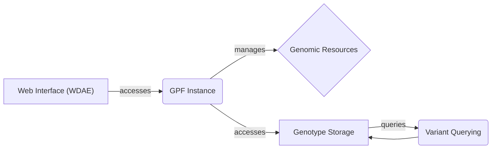

## GPF: Genomic Data Analysis Platform

GPF (Genomic Data Analysis Platform) is a comprehensive system designed for managing, querying, and analyzing genomic data. It provides tools for storing and accessing variant data, genomic resources, and pedigree information, with a web interface for user interaction.

## Data Flow Diagram

## Component Descriptions

**Web Interface (WDAE):** This component provides the user interface for interacting with the GPF system. It allows users to access datasets, run queries, and manage genomic resources. It accesses the GPF Instance to retrieve and manipulate data.

**GPF Instance:** This component manages the overall GPF instance, providing access to datasets, genomic resources, and configurations. It serves as a central point for accessing and managing data within the GPF system. It manages Genomic Resources and accesses Genotype Storage.

**Genomic Resources:** This component handles the management of genomic resources, including repositories, reference genomes, and gene models. It provides functionalities to build and access genomic resources. It is managed by the GPF Instance.

**Genotype Storage:** This component deals with genotype storage and management, supporting different storage backends. It provides an abstraction layer for accessing variant data from various storage systems. It is accessed by the GPF Instance and queried by the Variant Querying component.

**Variant Querying:** This component provides functionalities for querying variants, including building SQL queries and running query runners. It enables users to efficiently search and retrieve variant data based on specific criteria. It queries the Genotype Storage to retrieve variant data.
