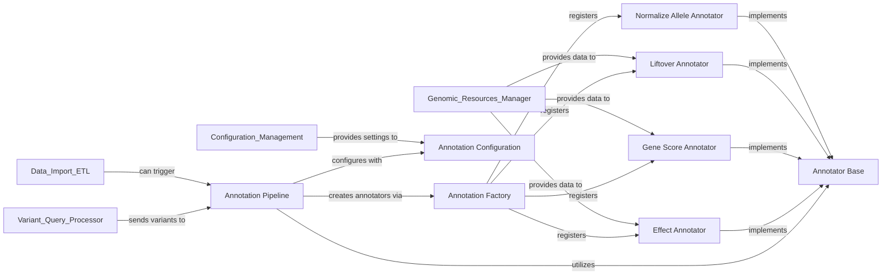

## Details

The `Annotation Pipeline` is the core "Annotation Engine" responsible for applying a sequence of annotators to genetic variants. It provides a flexible and configurable framework to orchestrate various annotation steps, allowing for complex and customizable annotation workflows.

### Annotation Pipeline [[Expand]](./Annotation_Pipeline.md)
The central orchestrator of the annotation process. It takes a configuration and a stream of genetic variants, applies a sequence of annotators in a defined order, and outputs the variants enriched with annotation data. It manages the overall flow and coordination of annotation tasks.

**Related Classes/Methods**:

- <a href="https://github.com/iossifovlab/gpf/dae/dae/annotation/annotation_pipeline.py#L1-L1" target="_blank" rel="noopener noreferrer">`dae/annotation/annotation_pipeline.py` (1:1)</a>

### Annotator Base
Defines the abstract interface and common functionalities that all specific annotators must implement. This promotes a standardized, plugin-like architecture, allowing for easy integration of new annotation types without modifying the core pipeline logic.

**Related Classes/Methods**:

- <a href="https://github.com/iossifovlab/gpf/dae/dae/annotation/annotator_base.py#L1-L1" target="_blank" rel="noopener noreferrer">`dae/annotation/annotator_base.py` (1:1)</a>

### Annotation Factory
Responsible for dynamically creating instances of specific annotators based on the provided configuration. It acts as a registry, mapping annotator names or types to their respective classes and handling their instantiation, potentially resolving any dependencies or loading required resources.

**Related Classes/Methods**:

- <a href="https://github.com/iossifovlab/gpf/dae/dae/annotation/annotation_factory.py#L1-L1" target="_blank" rel="noopener noreferrer">`dae/annotation/annotation_factory.py` (1:1)</a>

### Annotation Configuration
Manages and parses the configuration settings for the entire annotation pipeline. This includes defining the sequence of annotators to apply, their specific parameters, and any global settings relevant to the annotation process. It typically reads structured configuration data (e.g., from YAML or JSON files).

**Related Classes/Methods**:

- <a href="https://github.com/iossifovlab/gpf/dae/dae/annotation/annotation_config.py#L1-L1" target="_blank" rel="noopener noreferrer">`dae/annotation/annotation_config.py` (1:1)</a>

### Effect Annotator
A concrete implementation of an annotator that determines the predicted functional consequence of genetic variants (e.g., missense, silent, frameshift, splice site). It typically relies on gene models, transcript information, and sequence data to predict the impact of a variant on a protein.

**Related Classes/Methods**:

- <a href="https://github.com/iossifovlab/gpf/dae/dae/annotation/effect_annotator.py#L1-L1" target="_blank" rel="noopener noreferrer">`dae/annotation/effect_annotator.py` (1:1)</a>

### Gene Score Annotator
A concrete annotator that adds gene-level scores (e.g., constraint scores, pathogenicity scores, expression levels) to variants based on the genes they affect. These scores provide quantitative measures of a gene's tolerance to variation or its relevance to specific biological processes.

**Related Classes/Methods**:

- <a href="https://github.com/iossifovlab/gpf/dae/dae/annotation/gene_score_annotator.py#L1-L1" target="_blank" rel="noopener noreferrer">`dae/annotation/gene_score_annotator.py` (1:1)</a>

### Liftover Annotator
A concrete annotator responsible for converting genomic coordinates between different reference genome assemblies (e.g., from hg19 to hg38). This is essential when integrating data from various sources that may have been aligned to different reference versions.

**Related Classes/Methods**:

- <a href="https://github.com/iossifovlab/gpf/dae/dae/annotation/liftover_annotator.py#L1-L1" target="_blank" rel="noopener noreferrer">`dae/annotation/liftover_annotator.py` (1:1)</a>

### Normalize Allele Annotator
A concrete annotator that normalizes variant representations to a canonical form. This involves standardizing how insertions, deletions, and complex variants are represented, which is crucial for consistent downstream analysis, database storage, and comparison across different datasets.

**Related Classes/Methods**:

- <a href="https://github.com/iossifovlab/gpf/dae/dae/annotation/normalize_allele_annotator.py#L1-L1" target="_blank" rel="noopener noreferrer">`dae/annotation/normalize_allele_annotator.py` (1:1)</a>

### [FAQ](https://github.com/CodeBoarding/GeneratedOnBoardings/tree/main?tab=readme-ov-file#faq)