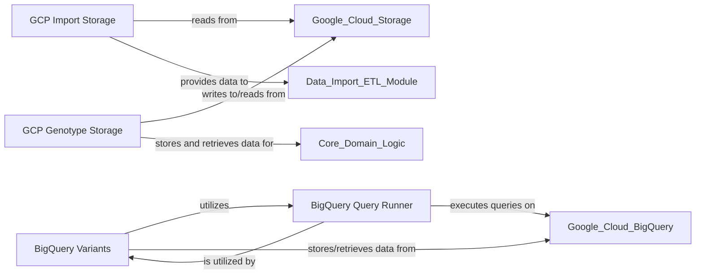

## Details

This component provides the necessary interfaces and logic for interacting with cloud-based storage solutions, specifically Google Cloud Platform (GCP). It enables the platform to seamlessly read raw input files from and write processed data to cloud storage, facilitating scalable and distributed data pipelines. It specifically handles data import and genotype storage operations using GCP services like BigQuery.

### GCP Import Storage
This component is responsible for handling the ingestion of raw input files from Google Cloud Storage into the platform. It provides the necessary logic to read and prepare data for further processing within the ETL pipelines.

**Related Classes/Methods**:

- <a href="https://github.com/iossifovlab/gpf/gcp_storage/gcp_storage/gcp_import_storage.py#L0-L0" target="_blank" rel="noopener noreferrer">`gcp_storage/gcp_import_storage.py` (0:0)</a>

### GCP Genotype Storage
This component manages the persistent storage and efficient retrieval of processed genotype data within Google Cloud Platform. It ensures that genomic variant information is securely stored and readily accessible for analysis.

**Related Classes/Methods**:

- <a href="https://github.com/iossifovlab/gpf/gcp_storage/gcp_storage/gcp_genotype_storage.py#L0-L0" target="_blank" rel="noopener noreferrer">`gcp_storage/gcp_genotype_storage.py` (0:0)</a>

### BigQuery Variants
This component specifically handles the storage, querying, and management of genomic variant data within Google BigQuery. It provides a specialized interface for interacting with BigQuery tables that contain detailed variant information, enabling complex analytical queries.

**Related Classes/Methods**:

- <a href="https://github.com/iossifovlab/gpf/gcp_storage/gcp_storage/bigquery_variants.py#L0-L0" target="_blank" rel="noopener noreferrer">`gcp_storage/bigquery_variants.py` (0:0)</a>

### BigQuery Query Runner
This foundational component provides the core capabilities for executing queries against Google BigQuery. It abstracts the complexities of the BigQuery API, offering a streamlined interface for other components to perform data retrieval and manipulation operations.

**Related Classes/Methods**:

- <a href="https://github.com/iossifovlab/gpf/gcp_storage/gcp_storage/bigquery_query_runner.py#L0-L0" target="_blank" rel="noopener noreferrer">`gcp_storage/bigquery_query_runner.py` (0:0)</a>

### [FAQ](https://github.com/CodeBoarding/GeneratedOnBoardings/tree/main?tab=readme-ov-file#faq)