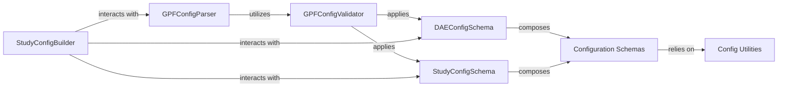

## Details

This component is the central nervous system for all configuration-related operations within the DAE platform. It is responsible for the robust loading, parsing, validation, and management of all configuration files, ensuring that the system operates according to defined and validated parameters. It supports various formats (YAML, TOML), handles variable interpolation, and enforces adherence to predefined schemas for different system aspects, including global DAE settings, genomic study parameters, and specific resource definitions.

### GPFConfigParser
The primary entry point for reading and parsing configuration files. It handles the low-level details of file loading, variable interpolation, and merging configurations from multiple sources. It acts as the orchestrator for initial configuration processing.

**Related Classes/Methods**:

- <a href="https://github.com/iossifovlab/gpf/dae/dae/configuration/gpf_config_parser.py#L82-L340" target="_blank" rel="noopener noreferrer">`dae.configuration.gpf_config_parser.GPFConfigParser` (82:340)</a>

### GPFConfigValidator
A specialized Cerberus validator that extends standard validation with GPF-specific rules and data coercions (e.g., absolute path resolution, type conversions). It ensures the integrity, correctness, and semantic validity of configuration data against predefined schemas.

**Related Classes/Methods**:

- <a href="https://github.com/iossifovlab/gpf/dae/dae/configuration/gpf_config_parser.py#L36-L79" target="_blank" rel="noopener noreferrer">`dae.configuration.gpf_config_parser.GPFConfigValidator` (36:79)</a>

### DAEConfigSchema
Defines the comprehensive schema for the main DAE platform's global configuration. This includes critical settings for genotype storage, phenotype storage, study directories, and annotation defaults. It acts as the blueprint for the overall system configuration.

**Related Classes/Methods**:

- <a href="https://github.com/iossifovlab/gpf/dae/dae/configuration/schemas/dae_conf.py#L1-L1" target="_blank" rel="noopener noreferrer">`dae.configuration.schemas.dae_conf.DAEConfigSchema` (1:1)</a>

### StudyConfigSchema
Defines the schema for individual genomic study configurations. This encompasses details like phenotype data, genotype browser settings, family and person filters, and various counting and enrichment parameters specific to a research study.

**Related Classes/Methods**:

- <a href="https://github.com/iossifovlab/gpf/dae/dae/configuration/schemas/study_config.py#L1-L1" target="_blank" rel="noopener noreferrer">`dae.configuration.schemas.study_config.StudyConfigSchema` (1:1)</a>

### Configuration Schemas
A collection of modules (e.g., `gene_profile.py`, `gene_weights_db.py`, `person_sets.py`, `phenotype_data.py`) that collectively define the various sub-schemas and data structures used throughout the GPF configuration system. These are composed to form the complete `DAEConfigSchema` and `StudyConfigSchema`.

**Related Classes/Methods**:

- <a href="https://github.com/iossifovlab/gpf/dae/dae/configuration/schemas/gene_profile.py#L1-L1" target="_blank" rel="noopener noreferrer">`dae.configuration.schemas.gene_profile` (1:1)</a>
- <a href="https://github.com/iossifovlab/gpf/dae/dae/configuration/schemas/gene_weights_db.py#L1-L1" target="_blank" rel="noopener noreferrer">`dae.configuration.schemas.gene_weights_db` (1:1)</a>
- <a href="https://github.com/iossifovlab/gpf/dae/dae/configuration/schemas/person_sets.py#L1-L1" target="_blank" rel="noopener noreferrer">`dae.configuration.schemas.person_sets` (1:1)</a>
- <a href="https://github.com/iossifovlab/gpf/dae/dae/configuration/schemas/phenotype_data.py#L1-L1" target="_blank" rel="noopener noreferrer">`dae.configuration.schemas.phenotype_data` (1:1)</a>

### StudyConfigBuilder
Responsible for programmatically constructing or modifying study configurations. This component might be used for generating default settings, adapting configurations to specific use cases, or merging partial configurations.

**Related Classes/Methods**:

- <a href="https://github.com/iossifovlab/gpf/dae/dae/configuration/study_config_builder.py#L14-L42" target="_blank" rel="noopener noreferrer">`dae.configuration.study_config_builder.StudyConfigBuilder` (14:42)</a>

### Config Utilities
Provides essential helper functions for configuration management, such as path validation (`validate_existing_path`, `validate_path`), which are utilized within the schema definitions to enforce specific data integrity rules.

**Related Classes/Methods**:

- <a href="https://github.com/iossifovlab/gpf/dae/dae/configuration/utils.py#L8-L12" target="_blank" rel="noopener noreferrer">`dae.configuration.utils.validate_existing_path` (8:12)</a>
- <a href="https://github.com/iossifovlab/gpf/dae/dae/configuration/utils.py#L3-L5" target="_blank" rel="noopener noreferrer">`dae.configuration.utils.validate_path` (3:5)</a>

### [FAQ](https://github.com/CodeBoarding/GeneratedOnBoardings/tree/main?tab=readme-ov-file#faq)