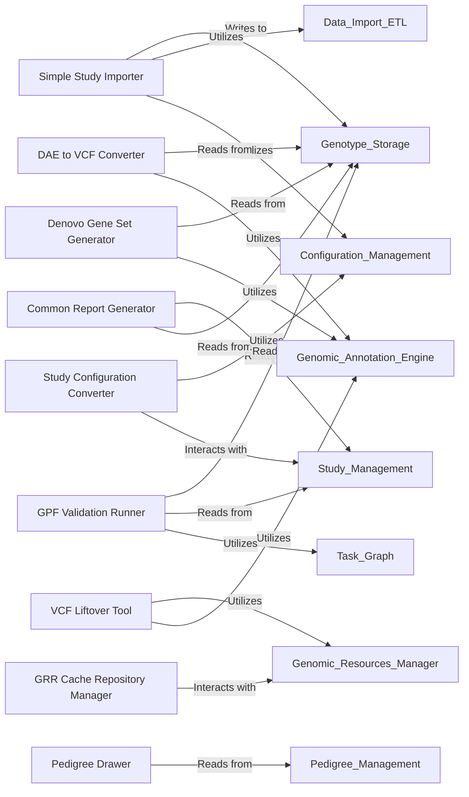

## Details

The `DAE Command-Line Tools` component serves as a suite of standalone utilities for direct interaction with the GPF system, primarily for administrative tasks, data management, and batch processing. While `getClassHierarchy` did not reveal a deep internal class hierarchy, this is typical for a collection of command-line scripts that often act as wrappers around core GPF functionalities. Each tool within this component is designed to perform a specific, well-defined operation, leveraging other abstract components of the GPF architecture.

### Simple Study Importer
This tool is responsible for the initial ingestion of raw or pre-processed genomic and phenotypic study data into the GPF system. It orchestrates the parsing, validation, and loading of data into the appropriate storage mechanisms.

**Related Classes/Methods**:

- <a href="https://github.com/iossifovlab/gpf/dae/dae/tools/simple_study_import.py#L1-L1000" target="_blank" rel="noopener noreferrer">`dae/tools/simple_study_import.py` (1:1000)</a>

### DAE to VCF Converter
This utility facilitates data interoperability by converting internal GPF data formats into the widely recognized Variant Call Format (VCF), enabling seamless integration with external bioinformatics tools.

**Related Classes/Methods**:

- <a href="https://github.com/iossifovlab/gpf/dae/dae/tools/dae2vcf.py#L1-L1000" target="_blank" rel="noopener noreferrer">`dae/tools/dae2vcf.py` (1:1000)</a>

### VCF Liftover Tool
This tool performs genomic coordinate liftover operations on VCF files, translating variant positions between different reference genome assemblies (e.g., hg19 to hg38). It is crucial for data harmonization across studies using different reference builds.

**Related Classes/Methods**:

- <a href="https://github.com/iossifovlab/gpf/dae/dae/tools/vcf_liftover.py#L1-L1000" target="_blank" rel="noopener noreferrer">`dae/tools/vcf_liftover.py` (1:1000)</a>

### Pedigree Drawer
This utility generates visual representations of family pedigrees from input data, providing a clear graphical overview of family structures and relationships, which is essential for genetic analysis.

**Related Classes/Methods**:

- <a href="https://github.com/iossifovlab/gpf/dae/dae/tools/draw_pedigree.py#L1-L1000" target="_blank" rel="noopener noreferrer">`dae/tools/draw_pedigree.py` (1:1000)</a>

### Common Report Generator
This tool produces standardized summary reports for GPF studies, including key metrics such as variant counts, family information, and basic statistical summaries, aiding in quick data overview and quality control.

**Related Classes/Methods**:

- <a href="https://github.com/iossifovlab/gpf/dae/dae/tools/generate_common_report.py#L1-L1000" target="_blank" rel="noopener noreferrer">`dae/tools/generate_common_report.py` (1:1000)</a>

### Denovo Gene Set Generator
This component identifies and compiles sets of genes based on the presence of de novo mutations within studies. These gene sets are valuable for downstream enrichment analyses and understanding disease mechanisms.

**Related Classes/Methods**:

- <a href="https://github.com/iossifovlab/gpf/dae/dae/tools/generate_denovo_gene_sets.py#L1-L1000" target="_blank" rel="noopener noreferrer">`dae/tools/generate_denovo_gene_sets.py` (1:1000)</a>

### Study Configuration Converter
This administrative tool is used to convert or update study configuration files, ensuring compatibility with evolving GPF versions or different configuration formats. It's vital for system maintenance and upgrades.

**Related Classes/Methods**:

- <a href="https://github.com/iossifovlab/gpf/dae/dae/tools/gpf_convert_study_config.py#L1-L1000" target="_blank" rel="noopener noreferrer">`dae/tools/gpf_convert_study_config.py` (1:1000)</a>

### GPF Validation Runner
This tool executes a comprehensive suite of validation checks on GPF studies and their associated data. It ensures data integrity, adherence to schemas, and compliance with predefined quality rules.

**Related Classes/Methods**:

- <a href="https://github.com/iossifovlab/gpf/dae/dae/tools/gpf_validation_runner.py#L1-L1000" target="_blank" rel="noopener noreferrer">`dae/tools/gpf_validation_runner.py` (1:1000)</a>

### GRR Cache Repository Manager
This utility manages the local cache for the Genomic Resources Repository (GRR), allowing users to pre-fetch, update, or clear genomic resource files, optimizing performance for annotation and analysis tasks.

**Related Classes/Methods**:

- <a href="https://github.com/iossifovlab/gpf/dae/dae/tools/grr_cache_repo.py#L1-L1000" target="_blank" rel="noopener noreferrer">`dae/tools/grr_cache_repo.py` (1:1000)</a>

### [FAQ](https://github.com/CodeBoarding/GeneratedOnBoardings/tree/main?tab=readme-ov-file#faq)