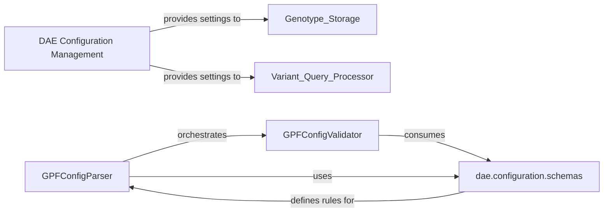

## Details

The `DAE Configuration Management` component is a critical subsystem within the GPF platform, responsible for the robust handling of all system-wide configurations. Its primary purpose is to ensure that every component of the GPF platform operates with accurate, validated, and consistent settings, encompassing aspects from database connections and file paths to security parameters and study-specific configurations. This component is fundamental to the platform's stability, flexibility, and maintainability.

### DAE Configuration Management [[Expand]](./DAE_Configuration_Management.md)
This is the top-level conceptual component that encapsulates all functionalities related to configuration handling within the GPF platform. It orchestrates the loading, parsing, interpolation, merging, and validation of configuration files, ensuring that all downstream components receive correctly structured and validated operational parameters.

**Related Classes/Methods**: _None_

### GPFConfigParser
This is the core class responsible for the practical aspects of configuration management. It handles the loading of configuration files (e.g., YAML, TOML), parsing their content, performing variable interpolation (e.g., environment variables, directory paths), and merging multiple configuration sources. It acts as the central orchestrator for preparing configurations for use.

**Related Classes/Methods**:

- <a href="https://github.com/iossifovlab/gpf/dae/dae/configuration/gpf_config_parser.py#L82-L340" target="_blank" rel="noopener noreferrer">`dae.configuration.gpf_config_parser.GPFConfigParser` (82:340)</a>

### GPFConfigValidator
A specialized validator that extends `cerberus.Validator` to enforce GPF-specific configuration rules and data types. This component is crucial for ensuring the integrity and correctness of loaded configurations, including path normalization, type checking, and global dependency checks. It prevents the system from operating with malformed or invalid settings.

**Related Classes/Methods**:

- <a href="https://github.com/iossifovlab/gpf/dae/dae/configuration/gpf_config_parser.py#L36-L79" target="_blank" rel="noopener noreferrer">`dae.configuration.gpf_config_parser.GPFConfigValidator` (36:79)</a>

### dae.configuration.schemas
This refers to the collection of Python modules (e.g., `study_config.py`, `dae_conf.py`, `person_sets.py`) that define the expected structure and validation rules for various configuration types within the GPF system. These schemas are consumed by `GPFConfigValidator` to perform the actual validation checks.

**Related Classes/Methods**:

- <a href="https://github.com/iossifovlab/gpf/dae/dae/configuration/schemas/dae_conf.py#L1-L1" target="_blank" rel="noopener noreferrer">`dae.configuration.schemas.dae_conf` (1:1)</a>
- <a href="https://github.com/iossifovlab/gpf/dae/dae/configuration/schemas/study_config.py#L1-L1" target="_blank" rel="noopener noreferrer">`dae.configuration.schemas.study_config` (1:1)</a>

### [FAQ](https://github.com/CodeBoarding/GeneratedOnBoardings/tree/main?tab=readme-ov-file#faq)