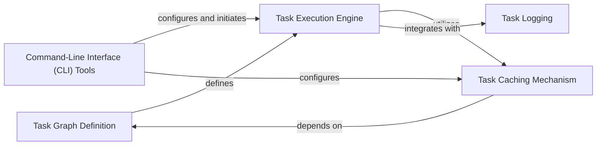

## Details

This component provides a robust framework for defining, executing, and managing complex, multi-step data processing tasks as Directed Acyclic Graphs (DAGs). It is crucial for orchestrating data pipelines, such as data import, annotation, and analysis workflows, ensuring efficient and scalable execution of computationally intensive operations.

### Task Graph Definition
Defines the fundamental data structures for representing computational workflows as Directed Acyclic Graphs (DAGs). It includes `Task` objects (nodes) and the `TaskGraph` itself, which manages task dependencies and provides methods for graph manipulation (e.g., pruning).

**Related Classes/Methods**:

- <a href="https://github.com/iossifovlab/gpf/dae/dae/task_graph/graph.py#L1-L1" target="_blank" rel="noopener noreferrer">`graph` (1:1)</a>

### Task Execution Engine
Responsible for orchestrating the execution of tasks defined in a `TaskGraph`. It provides an abstract interface (`TaskGraphExecutor`) and concrete implementations (e.g., `SequentialExecutor`, `DaskExecutor` for distributed processing). It manages the order of execution based on dependencies and integrates with the task caching mechanism.

**Related Classes/Methods**:

- <a href="https://github.com/iossifovlab/gpf/dae/dae/task_graph/executor.py#L1-L1" target="_blank" rel="noopener noreferrer">`executor` (1:1)</a>

### Task Caching Mechanism
Implements strategies for caching the results of executed tasks. This prevents redundant computations by checking if a task's output is already available and up-to-date based on its inputs and dependencies. It supports different caching behaviors, including no caching and file-based caching.

**Related Classes/Methods**:

- <a href="https://github.com/iossifovlab/gpf/dae/dae/task_graph/cache.py#L1-L1" target="_blank" rel="noopener noreferrer">`cache` (1:1)</a>

### Command-Line Interface (CLI) Tools
Provides the user-facing interface for interacting with the task graph management system. It parses command-line arguments to configure and initiate task graph execution, status checks, or listing of tasks. It acts as an orchestrator, selecting and configuring the appropriate executor and cache based on user input.

**Related Classes/Methods**:

- <a href="https://github.com/iossifovlab/gpf/dae/dae/task_graph/cli_tools.py#L1-L1" target="_blank" rel="noopener noreferrer">`cli_tools` (1:1)</a>

### Task Logging
Manages the logging infrastructure for individual tasks within the graph. It ensures that task-specific logs are captured and stored, which is critical for debugging, monitoring, and auditing long-running data processing workflows. It supports writing logs to various file systems via `fsspec`.

**Related Classes/Methods**:

- <a href="https://github.com/iossifovlab/gpf/dae/dae/task_graph/logging.py#L1-L1" target="_blank" rel="noopener noreferrer">`logging` (1:1)</a>

### [FAQ](https://github.com/CodeBoarding/GeneratedOnBoardings/tree/main?tab=readme-ov-file#faq)