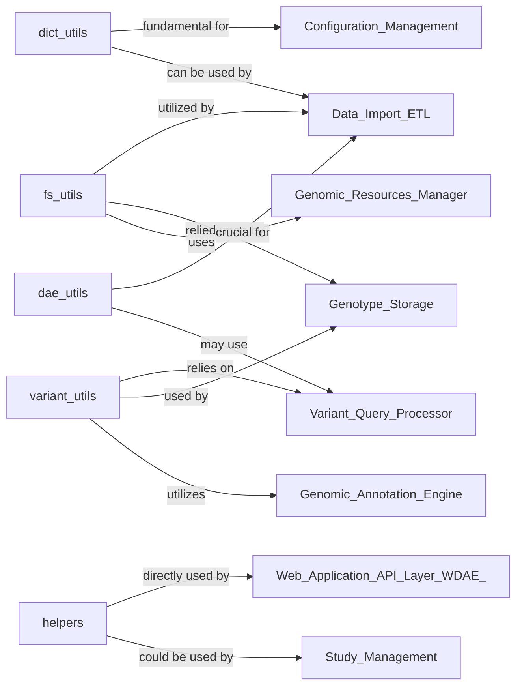

## Details

The DAE Utilities subsystem serves as a foundational collection of general-purpose utility functions and helper classes, centralizing reusable functionalities across the DAE and WDAE projects.

### fs_utils
Provides essential functionalities for interacting with the file system, including checking file existence, joining paths, retrieving file modification times, and copying files or directories. This component is critical for any operation involving persistent data storage and retrieval.

**Related Classes/Methods**:

- <a href="https://github.com/iossifovlab/gpf/dae/dae/utils/fs_utils.py#L1-L1000" target="_blank" rel="noopener noreferrer">`dae.utils.fs_utils` (1:1000)</a>

### dict_utils
Offers specialized functions for manipulating dictionaries, specifically `recursive_dict_update` and `recursive_dict_update_inplace`. These are designed to merge or update nested dictionaries, a common requirement in configuration management and complex data processing.

**Related Classes/Methods**:

- <a href="https://github.com/iossifovlab/gpf/dae/dae/utils/dict_utils.py#L1-L1000" target="_blank" rel="noopener noreferrer">`dae.utils.dict_utils` (1:1000)</a>

### variant_utils
Provides core functions for handling genomic variant data. This includes converting between different representations of genotypes, determining genotype types, and trimming common prefixes/suffixes from alleles. It ensures consistency and standardization of variant data.

**Related Classes/Methods**:

- <a href="https://github.com/iossifovlab/gpf/dae/dae/utils/variant_utils.py#L1-L1000" target="_blank" rel="noopener noreferrer">`dae.utils.variant_utils` (1:1000)</a>

### helpers
A collection of miscellaneous helper functions broadly applicable across the project. Examples include `study_id_from_path`, `str2bool`, `isnan`, `camelize_string`, `to_response_json`, and `convert_size`. These functions provide general utility and convenience.

**Related Classes/Methods**:

- <a href="https://github.com/iossifovlab/gpf/dae/dae/utils/helpers.py#L1-L1000" target="_blank" rel="noopener noreferrer">`dae.utils.helpers` (1:1000)</a>

### dae_utils
Contains utilities specific to the DAE project's internal data formats and conventions. This includes functions like `dae2vcf_variant` and `cshl2vcf_variant` for converting DAE/CSHL-style variant representations to the standard VCF format, `split_iterable` for chunking iterables, and `join_line` for formatting lines into strings.

**Related Classes/Methods**:

- <a href="https://github.com/iossifovlab/gpf/dae/dae/utils/dae_utils.py#L1-L1000" target="_blank" rel="noopener noreferrer">`dae.utils.dae_utils` (1:1000)</a>

### [FAQ](https://github.com/CodeBoarding/GeneratedOnBoardings/tree/main?tab=readme-ov-file#faq)