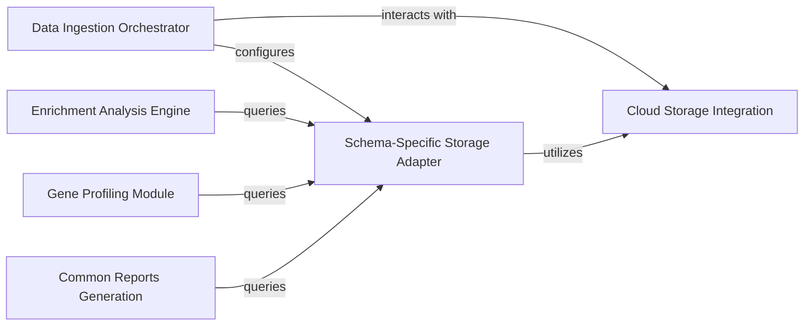

## Details

The `Data Ingestion & Bioinformatics Tools` subsystem is crucial for the platform's functionality, handling the entire lifecycle of genomic and phenotype data from raw input to advanced analysis. This aligns with the "ETL Pipelines," "Data Storage Adapters," "Core Domain Logic," and "External Tool Integrations/Annotators" architectural patterns.

### Data Ingestion Orchestrator [[Expand]](./Data_Ingestion_Orchestrator.md)
This component is the central control point for the data ingestion process. It parses and validates import configurations, manages the loading of pedigree information, and identifies the appropriate variant loaders (e.g., VCF, Denovo, CNV, DAE) to prepare raw genomic and phenotype data for storage. It ensures that data is correctly structured and routed for subsequent processing.

**Related Classes/Methods**:

- <a href="https://github.com/iossifovlab/gpf/dae/dae/import_tools/import_tools.py#L1-L1000" target="_blank" rel="noopener noreferrer">`dae.import_tools.import_tools` (1:1000)</a>
- <a href="https://github.com/iossifovlab/gpf/dae/dae/import_tools/import_config.py#L1-L1000" target="_blank" rel="noopener noreferrer">`dae.import_tools.import_config` (1:1000)</a>
- <a href="https://github.com/iossifovlab/gpf/dae/dae/import_tools/cli.py#L1-L1000" target="_blank" rel="noopener noreferrer">`dae.import_tools.cli` (1:1000)</a>

### Schema-Specific Storage Adapter
This component is responsible for adapting and storing imported genomic data according to the platform's internal Schema2. It defines the logical layout and physical structure for storing variants and associated metadata, ensuring data consistency, integrity, and optimized retrieval for analytical queries.

**Related Classes/Methods**:

- <a href="https://github.com/iossifovlab/gpf/dae/dae/schema2_storage/schema2_import_storage.py#L1-L1000" target="_blank" rel="noopener noreferrer">`dae.schema2_storage.schema2_import_storage` (1:1000)</a>
- <a href="https://github.com/iossifovlab/gpf/dae/dae/schema2_storage/schema2_layout.py#L1-L1000" target="_blank" rel="noopener noreferrer">`dae.schema2_storage.schema2_layout` (1:1000)</a>

### Cloud Storage Integration [[Expand]](./Cloud_Storage_Integration.md)
This component provides the necessary interfaces and logic for interacting with cloud-based storage solutions, specifically Google Cloud Platform (GCP). It enables the platform to seamlessly read raw input files from and write processed data to cloud storage, facilitating scalable and distributed data pipelines.

**Related Classes/Methods**:

- <a href="https://github.com/iossifovlab/gpf/gcp_storage/gcp_storage/gcp_import_storage.py#L1-L1000" target="_blank" rel="noopener noreferrer">`gcp_storage.gcp_import_storage` (1:1000)</a>
- <a href="https://github.com/iossifovlab/gpf/gcp_storage/gcp_storage/gcp_genotype_storage.py#L1-L1000" target="_blank" rel="noopener noreferrer">`gcp_storage.gcp_genotype_storage` (1:1000)</a>
- <a href="https://github.com/iossifovlab/gpf/gcp_storage/gcp_storage/bigquery_variants.py#L1-L1000" target="_blank" rel="noopener noreferrer">`gcp_storage.bigquery_variants` (1:1000)</a>

### Enrichment Analysis Engine [[Expand]](./Enrichment_Analysis_Engine.md)
This component provides a suite of functionalities for performing statistical enrichment analysis on genomic datasets. It includes mechanisms for constructing appropriate background models, calculating event frequencies, and serializing the results, enabling researchers to identify over-represented biological pathways or gene sets.

**Related Classes/Methods**:

- <a href="https://github.com/iossifovlab/gpf/dae/dae/enrichment_tool/enrichment_builder.py#L1-L1000" target="_blank" rel="noopener noreferrer">`dae.enrichment_tool.enrichment_builder` (1:1000)</a>
- <a href="https://github.com/iossifovlab/gpf/dae/dae/enrichment_tool/enrichment_helper.py#L1-L1000" target="_blank" rel="noopener noreferrer">`dae.enrichment_tool.enrichment_helper` (1:1000)</a>
- <a href="https://github.com/iossifovlab/gpf/dae/dae/enrichment_tool/enrichment_serializer.py#L1-L1000" target="_blank" rel="noopener noreferrer">`dae.enrichment_tool.enrichment_serializer` (1:1000)</a>

### Gene Profiling Module [[Expand]](./Gene_Profiling_Module.md)
This component focuses on generating, managing, and analyzing gene-centric profiles. It includes tools for converting gene profile data into database formats (e.g., DuckDB), exporting profiles, and performing statistical computations related to gene expression or other quantitative gene attributes.

**Related Classes/Methods**:

- <a href="https://github.com/iossifovlab/gpf/dae/dae/gene_profile/generate_gene_profile.py#L1-L1000" target="_blank" rel="noopener noreferrer">`dae.gene_profile.generate_gene_profile` (1:1000)</a>
- <a href="https://github.com/iossifovlab/gpf/dae/dae/gene_profile/db.py#L1-L1000" target="_blank" rel="noopener noreferrer">`dae.gene_profile.db` (1:1000)</a>
- <a href="https://github.com/iossifovlab/gpf/dae/dae/gene_profile/exporter.py#L1-L1000" target="_blank" rel="noopener noreferrer">`dae.gene_profile.exporter` (1:1000)</a>

### Common Reports Generation [[Expand]](./Common_Reports_Generation.md)
This component is responsible for producing standardized and frequently requested reports from the integrated genomic and phenotype data. It includes functionalities for generating denovo reports, family-specific reports, and various population counters, offering quick summaries and quality control insights into the loaded studies.

**Related Classes/Methods**:

- <a href="https://github.com/iossifovlab/gpf/dae/dae/common_reports/common_report.py#L1-L1000" target="_blank" rel="noopener noreferrer">`dae.common_reports.common_report` (1:1000)</a>
- <a href="https://github.com/iossifovlab/gpf/dae/dae/common_reports/denovo_report.py#L1-L1000" target="_blank" rel="noopener noreferrer">`dae.common_reports.denovo_report` (1:1000)</a>
- <a href="https://github.com/iossifovlab/gpf/dae/dae/common_reports/family_report.py#L1-L1000" target="_blank" rel="noopener noreferrer">`dae.common_reports.family_report` (1:1000)</a>

### [FAQ](https://github.com/CodeBoarding/GeneratedOnBoardings/tree/main?tab=readme-ov-file#faq)