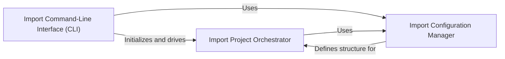

## Details

The `Data Ingestion Orchestrator` subsystem is a critical part of the project, responsible for managing the entire data import pipeline. It ensures that raw genomic and phenotype data is correctly parsed, validated, and prepared for storage and subsequent processing.

### Import Project Orchestrator
This is the central control point for the data ingestion process. It encapsulates the entire import configuration, manages the loading of pedigree information, identifies and configures appropriate variant loaders (e.g., VCF, Denovo, CNV, DAE), and orchestrates the generation of the task graph for data processing and storage. It ensures data is correctly structured and routed for subsequent processing. This component is fundamental as it acts as the brain of the operation, coordinating all necessary steps for a successful data import.

**Related Classes/Methods**:

- `ImportProject` (0:0)

### Import Configuration Manager
This component is responsible for defining, parsing, and validating the structure of all data ingestion configurations. It provides the necessary schemas to interpret input parameters for variant files, pedigree information, processing settings, annotation pipelines, and destination storage. This ensures that the import process receives well-formed and consistent instructions, which is crucial for the reliability and predictability of the data pipeline. It serves as the blueprint and validator for the import process.

**Related Classes/Methods**:

- `import_config_schema` (0:0)
- `embedded_input_schema` (0:0)

### Import Command-Line Interface (CLI)
This component serves as the primary user interface for initiating and managing data ingestion tasks. It parses command-line arguments, loads the import configuration using the `Import Configuration Manager`, initializes the `Import Project Orchestrator`, and triggers the execution of the generated task graph. This provides a direct operational entry point for users, making the entire data ingestion process accessible and runnable. It is the gateway for users to interact with the system.

**Related Classes/Methods**:

- `main` (0:0)
- `run_with_project` (0:0)

### [FAQ](https://github.com/CodeBoarding/GeneratedOnBoardings/tree/main?tab=readme-ov-file#faq)