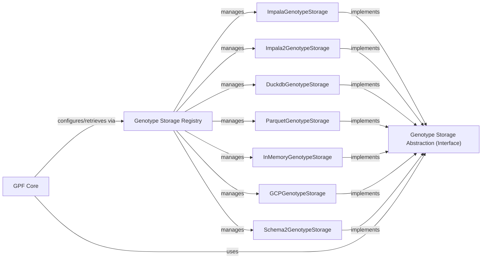

## Details

The Data Storage & Access Layer is a critical component in the GPF (Genomic Data Platform) architecture, designed to abstract and standardize interactions with various genotype and phenotype data storage backends. This layer ensures that the GPF Core remains independent of the specific underlying database or file format, promoting flexibility and extensibility.

### Genotype Storage Abstraction (Interface) [[Expand]](./Genotype_Storage_Abstraction_Interface_.md)
This component defines the abstract interface (GenotypeStorage) that all concrete genotype storage implementations must adhere to. It specifies the common methods and properties for interacting with genotype data, such as reading variants, accessing families, and retrieving genomic information, without dictating the underlying storage mechanism. This is crucial for maintaining a decoupled architecture.

**Related Classes/Methods**:

- <a href="https://github.com/iossifovlab/gpf/dae/dae/genotype_storage/genotype_storage.py#L13-L80" target="_blank" rel="noopener noreferrer">`GenotypeStorage` (13:80)</a>

### Genotype Storage Registry [[Expand]](./Genotype_Storage_Registry.md)
This component (GenotypeStorageRegistry) acts as a central repository for registering and retrieving different concrete GenotypeStorage implementations. It allows the system to dynamically discover and load appropriate storage backends based on configuration or runtime requirements. This supports the plugin architecture, making it easy to add new storage types without modifying the core system.

**Related Classes/Methods**:

- <a href="https://github.com/iossifovlab/gpf/dae/dae/genotype_storage/genotype_storage_registry.py#L78-L172" target="_blank" rel="noopener noreferrer">`GenotypeStorageRegistry` (78:172)</a>

### ImpalaGenotypeStorage [[Expand]](./ImpalaGenotypeStorage.md)
Provides the logic for connecting to and interacting with Impala data storage technology, implementing the GenotypeStorage interface.

**Related Classes/Methods**:

- <a href="https://github.com/iossifovlab/gpf/impala_storage/impala_storage/schema1/impala_genotype_storage.py#L28-L479" target="_blank" rel="noopener noreferrer">`ImpalaGenotypeStorage` (28:479)</a>

### Impala2GenotypeStorage [[Expand]](./Impala2GenotypeStorage.md)
Provides the logic for connecting to and interacting with Impala2 data storage technology, implementing the GenotypeStorage interface.

**Related Classes/Methods**:

- <a href="https://github.com/iossifovlab/gpf/impala2_storage/impala2_storage/schema2/impala2_genotype_storage.py#L33-L319" target="_blank" rel="noopener noreferrer">`Impala2GenotypeStorage` (33:319)</a>

### DuckdbGenotypeStorage [[Expand]](./DuckdbGenotypeStorage.md)
Provides the logic for connecting to and interacting with DuckDB data storage technology, implementing the GenotypeStorage interface.

**Related Classes/Methods**:

- <a href="https://github.com/iossifovlab/gpf/dae/dae/duckdb_storage/duckdb_genotype_storage.py#L0-L0" target="_blank" rel="noopener noreferrer">`DuckdbGenotypeStorage` (0:0)</a>

### ParquetGenotypeStorage [[Expand]](./ParquetGenotypeStorage.md)
Provides the logic for connecting to and interacting with Parquet file storage technology, implementing the GenotypeStorage interface.

**Related Classes/Methods**:

- `ParquetGenotypeStorage` (0:0)

### InMemoryGenotypeStorage
Provides the logic for interacting with in-memory data storage, implementing the GenotypeStorage interface.

**Related Classes/Methods**:

- `InMemoryGenotypeStorage` (0:0)

### GCPGenotypeStorage
Provides the logic for connecting to and interacting with Google Cloud Platform storage, implementing the GenotypeStorage interface.

**Related Classes/Methods**:

- `GCPGenotypeStorage` (0:0)

### Schema2GenotypeStorage [[Expand]](./Schema2GenotypeStorage.md)
Provides the logic for connecting to and interacting with schema2 data storage, implementing the GenotypeStorage interface.

**Related Classes/Methods**:

- `Schema2GenotypeStorage` (0:0)

### GPF Core [[Expand]](./GPF_Core.md)
The core component of the Genomic Data Platform responsible for data access and querying.

**Related Classes/Methods**: _None_

### [FAQ](https://github.com/CodeBoarding/GeneratedOnBoardings/tree/main?tab=readme-ov-file#faq)