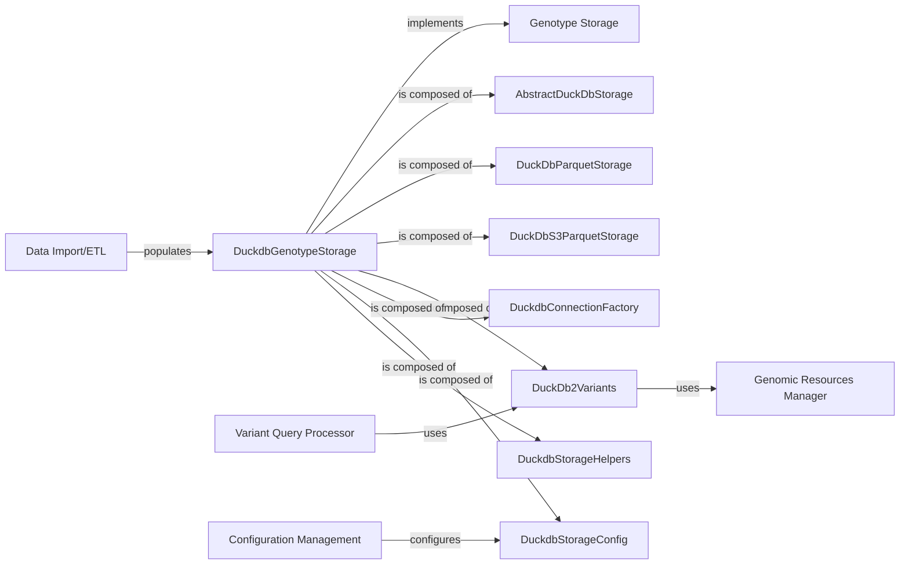

## Details

Analysis of the DuckdbGenotypeStorage component within the Bioinformatics Data Platform, detailing its structure, purpose, and interactions with other key components.

### DuckdbGenotypeStorage [[Expand]](./DuckdbGenotypeStorage.md)
A crucial part of the Bioinformatics Data Platform, serving as a concrete implementation of the `GenotypeStorage` interface specifically tailored for DuckDB. It adheres to the "Data Storage Adapters" pattern, allowing the system to interact with DuckDB as a backend for storing and retrieving genomic variant data.

**Related Classes/Methods**: _None_

### AbstractDuckDbStorage
Serves as the abstract base class, defining the common interface and foundational logic for DuckDB-based genotype storage. It likely handles the general connection management and interaction with DuckDB.

**Related Classes/Methods**:

- <a href="https://github.com/iossifovlab/gpf/dae/dae/duckdb_storage/duckdb_genotype_storage.py#L37-L95" target="_blank" rel="noopener noreferrer">`dae.duckdb_storage.duckdb_genotype_storage.AbstractDuckDbStorage` (37:95)</a>

### DuckDbParquetStorage
A concrete implementation that manages genotype data stored in local Parquet files using DuckDB.

**Related Classes/Methods**:

- <a href="https://github.com/iossifovlab/gpf/dae/dae/duckdb_storage/duckdb_genotype_storage.py#L98-L128" target="_blank" rel="noopener noreferrer">`dae.duckdb_storage.duckdb_genotype_storage.DuckDbParquetStorage` (98:128)</a>

### DuckDbS3ParquetStorage
A concrete implementation, extending `DuckDbParquetStorage` to handle Parquet files stored on Amazon S3.

**Related Classes/Methods**:

- <a href="https://github.com/iossifovlab/gpf/dae/dae/duckdb_storage/duckdb_genotype_storage.py#L142-L176" target="_blank" rel="noopener noreferrer">`dae.duckdb_storage.duckdb_genotype_storage.DuckDbS3ParquetStorage` (142:176)</a>

### DuckDb2Variants
Provides the DuckDB-specific backend for querying genomic variants. It translates high-level variant queries into DuckDB-compatible operations, acting as the bridge between the `Variant Query Processor` and the raw data stored in DuckDB.

**Related Classes/Methods**:

- <a href="https://github.com/iossifovlab/gpf/dae/dae/duckdb_storage/duckdb2_variants.py#L111-L538" target="_blank" rel="noopener noreferrer">`dae.duckdb_storage.duckdb2_variants.DuckDb2Variants` (111:538)</a>

### DuckdbConnectionFactory
Responsible for establishing and managing connections to DuckDB.

**Related Classes/Methods**:

- <a href="https://github.com/iossifovlab/gpf/dae/dae/duckdb_storage/duckdb_connection_factory.py#L1-L1" target="_blank" rel="noopener noreferrer">`dae.duckdb_storage.duckdb_connection_factory` (1:1)</a>

### DuckdbStorageConfig
Defines the configuration schemas for various DuckDB storage types.

**Related Classes/Methods**:

- <a href="https://github.com/iossifovlab/gpf/dae/dae/duckdb_storage/duckdb_storage_config.py#L41-L47" target="_blank" rel="noopener noreferrer">`dae.duckdb_storage.duckdb_storage_config.DuckDbConf` (41:47)</a>
- <a href="https://github.com/iossifovlab/gpf/dae/dae/duckdb_storage/duckdb_storage_config.py#L50-L54" target="_blank" rel="noopener noreferrer">`dae.duckdb_storage.duckdb_storage_config.DuckDbParquetConf` (50:54)</a>
- <a href="https://github.com/iossifovlab/gpf/dae/dae/duckdb_storage/duckdb_storage_config.py#L57-L63" target="_blank" rel="noopener noreferrer">`dae.duckdb_storage.duckdb_storage_config.DuckDbS3Conf` (57:63)</a>
- <a href="https://github.com/iossifovlab/gpf/dae/dae/duckdb_storage/duckdb_storage_config.py#L66-L70" target="_blank" rel="noopener noreferrer">`dae.duckdb_storage.duckdb_storage_config.DuckDbS3ParquetConf` (66:70)</a>

### DuckdbStorageHelpers
Contains utility functions and helper methods used across the DuckDB storage implementations, promoting code reusability and maintainability.

**Related Classes/Methods**:

- <a href="https://github.com/iossifovlab/gpf/dae/dae/duckdb_storage/duckdb_storage_helpers.py#L1-L1" target="_blank" rel="noopener noreferrer">`dae.duckdb_storage.duckdb_storage_helpers` (1:1)</a>

### Genotype Storage
An abstract interface for genotype storage.

**Related Classes/Methods**: _None_

### Variant Query Processor
Processes high-level variant queries.

**Related Classes/Methods**: _None_

### Genomic Resources Manager
Manages access to reference genomes, gene models, and other annotations.

**Related Classes/Methods**: _None_

### Configuration Management [[Expand]](./Configuration_Management.md)
Manages configuration for various components.

**Related Classes/Methods**: _None_

### Data Import/ETL
Responsible for loading raw genomic data.

**Related Classes/Methods**: _None_

### [FAQ](https://github.com/CodeBoarding/GeneratedOnBoardings/tree/main?tab=readme-ov-file#faq)