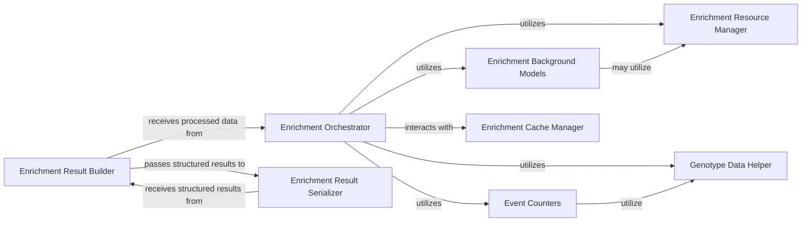

## Details

The Enrichment Analysis Engine is a critical subsystem within the bioinformatics data platform, designed to perform statistical enrichment analysis on genomic datasets. It adheres to the project's architectural principles by providing a modular, scalable, and extensible framework for identifying statistically significant biological pathways or gene sets.

### Enrichment Orchestrator
This is the central coordinating component of the enrichment analysis engine. It manages the overall workflow, including configuration, selection and utilization of appropriate background models, execution of event counting, and initiation of the core enrichment tests. It acts as the primary interface for triggering and managing an enrichment analysis.

**Related Classes/Methods**:

- <a href="https://github.com/iossifovlab/gpf/dae/dae/enrichment_tool/enrichment_helper.py#L1-L1" target="_blank" rel="noopener noreferrer">`dae.enrichment_tool.enrichment_helper` (1:1)</a>

### Enrichment Result Builder
Responsible for constructing the final, structured results of the enrichment analysis. It receives raw data and calculated statistics from the Orchestrator and other components, then aggregates and formats this information into a coherent result set, preparing it for presentation or serialization.

**Related Classes/Methods**:

- <a href="https://github.com/iossifovlab/gpf/dae/dae/enrichment_tool/enrichment_builder.py#L1-L1" target="_blank" rel="noopener noreferrer">`dae.enrichment_tool.enrichment_builder` (1:1)</a>

### Enrichment Result Serializer
This component is dedicated to transforming the structured enrichment results into various output formats, such as JSON for API responses or detailed reports. It ensures that the analysis results, including details about people groups, common filters, and gender-specific outcomes, are consistently and correctly presented.

**Related Classes/Methods**:

- <a href="https://github.com/iossifovlab/gpf/dae/dae/enrichment_tool/enrichment_serializer.py#L1-L1" target="_blank" rel="noopener noreferrer">`dae.enrichment_tool.enrichment_serializer` (1:1)</a>

### Enrichment Background Models
A collection of specialized components that provide the statistical baseline for enrichment calculations. These models represent different methodologies or datasets (e.g., gene weights, coding length, de novo mutation rates) against which observed genetic events are compared to determine statistical significance. They are crucial for the scientific validity of the analysis.

**Related Classes/Methods**:

- <a href="https://github.com/iossifovlab/gpf/dae/dae/enrichment_tool/base_enrichment_background.py#L1-L1" target="_blank" rel="noopener noreferrer">`dae.enrichment_tool.base_enrichment_background` (1:1)</a>
- <a href="https://github.com/iossifovlab/gpf/dae/dae/enrichment_tool/build_coding_length_enrichment_background.py#L1-L1" target="_blank" rel="noopener noreferrer">`dae.enrichment_tool.build_coding_length_enrichment_background` (1:1)</a>
- <a href="https://github.com/iossifovlab/gpf/dae/dae/enrichment_tool/build_ur_synonymous_enrichment_background.py#L1-L1" target="_blank" rel="noopener noreferrer">`dae.enrichment_tool.build_ur_synonymous_enrichment_background` (1:1)</a>
- <a href="https://github.com/iossifovlab/gpf/dae/dae/enrichment_tool/gene_weights_background.py#L1-L1" target="_blank" rel="noopener noreferrer">`dae.enrichment_tool.gene_weights_background` (1:1)</a>
- <a href="https://github.com/iossifovlab/gpf/dae/dae/enrichment_tool/samocha_background.py#L1-L1" target="_blank" rel="noopener noreferrer">`dae.enrichment_tool.samocha_background` (1:1)</a>

### Event Counters
These components are responsible for accurately counting specific genetic events (e.g., de novo mutations, inherited variants) within defined cohorts or gene sets. The counts generated by these components serve as the observed frequencies used in the enrichment calculations.

**Related Classes/Methods**:

- <a href="https://github.com/iossifovlab/gpf/dae/dae/enrichment_tool/event_counters.py#L1-L1" target="_blank" rel="noopener noreferrer">`dae.enrichment_tool.event_counters` (1:1)</a>

### Enrichment Cache Manager
This component manages the caching of previously computed enrichment analysis results. Its primary purpose is to optimize performance by storing and retrieving results, thereby reducing redundant and computationally expensive calculations for frequently requested or identical analyses.

**Related Classes/Methods**:

- <a href="https://github.com/iossifovlab/gpf/dae/dae/enrichment_tool/enrichment_cache_builder.py#L1-L1" target="_blank" rel="noopener noreferrer">`dae.enrichment_tool.enrichment_cache_builder` (1:1)</a>

### Genotype Data Helper
Provides utility functions specifically designed for processing, filtering, and manipulating genotype-related data. This component ensures that the complex genomic input data is correctly prepared and formatted for use by other components within the enrichment analysis pipeline, such as event counters.

**Related Classes/Methods**:

- <a href="https://github.com/iossifovlab/gpf/dae/dae/enrichment_tool/genotype_helper.py#L1-L1" target="_blank" rel="noopener noreferrer">`dae.enrichment_tool.genotype_helper` (1:1)</a>

### Enrichment Resource Manager
Manages the access and configuration of various external and internal resources required for enrichment analysis, such as gene sets, annotation files, or specific configuration parameters. It abstracts the underlying data sources, providing a consistent interface for resource retrieval.

**Related Classes/Methods**:

- <a href="https://github.com/iossifovlab/gpf/dae/dae/enrichment_tool/resource_implementations/enrichment_resource_impl.py#L1-L1" target="_blank" rel="noopener noreferrer">`dae.enrichment_tool.resource_implementations.enrichment_resource_impl` (1:1)</a>

### [FAQ](https://github.com/CodeBoarding/GeneratedOnBoardings/tree/main?tab=readme-ov-file#faq)