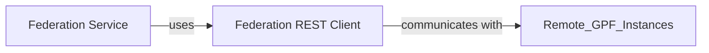

## Details

The `Federation REST Client` is fundamental because it serves as the essential bridge for inter-instance communication within the federated GPF ecosystem. Without this component, the `Federation Service` would be unable to access or integrate data from distributed GPF deployments, thereby failing to achieve its core objective of providing a unified view of dispersed genomic and phenotypic data. Its robust implementation is critical for the reliability, scalability, and seamless operation of the entire federated data platform.

### Federation REST Client [[Expand]](./Federation_REST_Client.md)
The `Federation REST Client` is the foundational communication layer for the GPF Federation Service. Its primary role is to establish and manage HTTP connections with external GPF instances, facilitating the exchange of genomic and phenotypic data across distributed deployments. It abstracts the complexities of network communication, allowing other components of the Federation Service to interact with remote data sources as if they were local.

**Related Classes/Methods**:

- <a href="https://github.com/iossifovlab/gpf/federation/federation/rest_api_client.py#L1-L1" target="_blank" rel="noopener noreferrer">`gpf/federation/federation/rest_api_client.py` (1:1)</a>

### Federation Service
The overarching service that utilizes the Federation REST Client to interact with remote GPF instances and integrate distributed genomic and phenotypic data.

**Related Classes/Methods**: _None_

### [FAQ](https://github.com/CodeBoarding/GeneratedOnBoardings/tree/main?tab=readme-ov-file#faq)