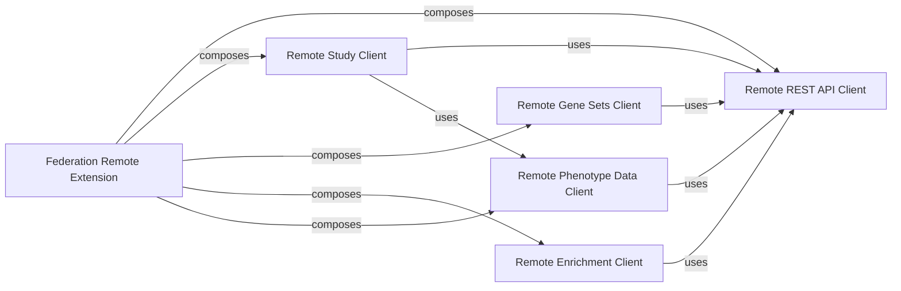

## Details

These components collectively form the backbone of the `Federation Remote Extension` subsystem, enabling seamless interaction with distributed bioinformatics data and analytical capabilities. They are fundamental because they directly address the core requirements of a federated bioinformatics platform: communication, data access (for various data types like studies, gene sets, and phenotypes), and distributed analytical capabilities.

### Federation Remote Extension [[Expand]](./Federation_Remote_Extension.md)
This module within the `federation` package orchestrates and extends various remote functionalities. It manages how local GPF services (like studies, gene sets, or enrichment analyses) can be accessed and utilized from remote federated instances, providing a unified view of distributed data.

**Related Classes/Methods**:

- <a href="https://github.com/iossifovlab/gpf/federation/federation/remote_extension.py#L0-L0" target="_blank" rel="noopener noreferrer">`federation/remote_extension.py` (0:0)</a>

### Remote REST API Client
This is the foundational communication layer for all remote interactions within the federation. It handles the low-level details of making HTTP requests to remote GPF instances, managing authentication, and processing responses. It is the backbone upon which all other remote clients are built.

**Related Classes/Methods**:

- <a href="https://github.com/iossifovlab/gpf/federation/federation/rest_api_client.py#L21-L650" target="_blank" rel="noopener noreferrer">`federation.rest_api_client.RESTClient` (21:650)</a>

### Remote Study Client
Provides an interface to access and query remote genomic studies, including variant data, pedigree information, and study metadata. It abstracts the remote study structure, allowing them to be treated similarly to local studies within the GPF system.

**Related Classes/Methods**:

- <a href="https://github.com/iossifovlab/gpf/federation/federation/remote_study.py#L20-L215" target="_blank" rel="noopener noreferrer">`federation.remote_study.RemoteGenotypeData` (20:215)</a>
- <a href="https://github.com/iossifovlab/gpf/federation/federation/remote_study_wrapper.py#L20-L146" target="_blank" rel="noopener noreferrer">`federation.remote_study_wrapper.RemoteWDAEStudy` (20:146)</a>

### Remote Gene Sets Client
Enables the retrieval and management of gene set collections hosted on remote federated instances. This allows analyses requiring gene sets to leverage distributed resources.

**Related Classes/Methods**:

- <a href="https://github.com/iossifovlab/gpf/federation/federation/gene_sets_db.py#L17-L99" target="_blank" rel="noopener noreferrer">`federation.gene_sets_db.RemoteGeneSetCollection` (17:99)</a>

### Remote Enrichment Client
Facilitates the execution of enrichment analyses on remote federated data. This component allows the local system to leverage distributed computational resources for gene set enrichment, extending the analytical capabilities across federated instances.

**Related Classes/Methods**:

- <a href="https://github.com/iossifovlab/gpf/federation/federation/remote_enrichment_builder.py#L0-L0" target="_blank" rel="noopener noreferrer">`federation.remote_enrichment_builder.RemoteEnrichment_Builder` (0:0)</a>

### Remote Phenotype Data Client
Manages the access and querying of phenotypic data associated with remote studies. This is crucial for integrating clinical and phenotypic information from distributed sources with genomic data.

**Related Classes/Methods**:

- <a href="https://github.com/iossifovlab/gpf/federation/federation/remote_phenotype_data.py#L21-L243" target="_blank" rel="noopener noreferrer">`federation.remote_phenotype_data.RemotePhenotypeData` (21:243)</a>
- <a href="https://github.com/iossifovlab/gpf/federation/federation/remote_pheno_tool_adapter.py#L11-L33" target="_blank" rel="noopener noreferrer">`federation.remote_pheno_tool_adapter.RemotePhenoToolAdapter` (11:33)</a>

### [FAQ](https://github.com/CodeBoarding/GeneratedOnBoardings/tree/main?tab=readme-ov-file#faq)