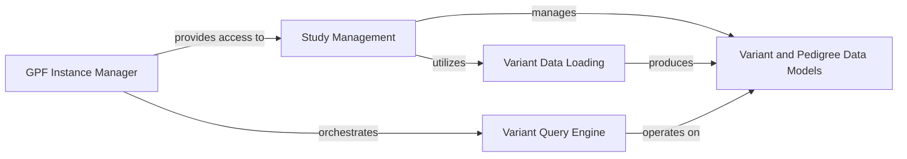

## Details

The `GPF Core Data Platform` serves as the foundational layer of the GPF system, orchestrating the management, access, and querying of genomic studies, variant data, and pedigrees. It acts as the primary data hub, integrating various data types and providing essential capabilities for downstream analysis. This component's structure is built around a set of interconnected sub-components, each with distinct responsibilities, ensuring data consistency, efficient access, and robust query mechanisms.

### GPF Instance Manager [[Expand]](./GPF_Instance_Manager.md)
This is the central singleton component that initializes and manages the entire GPF instance. It acts as the primary entry point for accessing all configured genomic resources, studies, and core services. It orchestrates the interactions between various parts of the platform, ensuring a unified and consistent operational environment.

**Related Classes/Methods**:

- <a href="https://github.com/iossifovlab/gpf/dae/dae/gpf_instance/gpf_instance.py#L1-L1" target="_blank" rel="noopener noreferrer">`dae/dae/gpf_instance/gpf_instance.py` (1:1)</a>

### Study Management [[Expand]](./Study_Management.md)
This component is responsible for managing the lifecycle and access to individual genomic studies. It handles the configuration, loading, and retrieval of study-specific metadata and data, abstracting the underlying storage mechanisms. It's crucial for organizing and providing access to the diverse "genomic studies" within the platform.

**Related Classes/Methods**:

- <a href="https://github.com/iossifovlab/gpf/dae/dae/studies/study.py#L1-L1" target="_blank" rel="noopener noreferrer">`dae/dae/studies/study.py` (1:1)</a>
- <a href="https://github.com/iossifovlab/gpf/dae/dae/studies/variants_db.py#L1-L1" target="_blank" rel="noopener noreferrer">`dae/dae/studies/variants_db.py` (1:1)</a>

### Variant and Pedigree Data Models [[Expand]](./Variant_and_Pedigree_Data_Models.md)
This component defines the core data structures and canonical representations for genomic variants (e.g., SNVs, indels, CNVs) and family pedigrees. These models ensure data consistency, integrity, and provide the foundational schema upon which all data processing, storage, and querying operations are built.

**Related Classes/Methods**:

- <a href="https://github.com/iossifovlab/gpf/dae/dae/variants/core.py#L1-L1" target="_blank" rel="noopener noreferrer">`dae/dae/variants/core.py` (1:1)</a>
- <a href="https://github.com/iossifovlab/gpf/dae/dae/variants/variant.py#L1-L1" target="_blank" rel="noopener noreferrer">`dae/dae/variants/variant.py` (1:1)</a>
- <a href="https://github.com/iossifovlab/gpf/dae/dae/pedigrees/family.py#L1-L1" target="_blank" rel="noopener noreferrer">`dae/dae/pedigrees/family.py` (1:1)</a>
- <a href="https://github.com/iossifovlab/gpf/dae/dae/pedigrees/pedigrees.py#L1-L1" target="_blank" rel="noopener noreferrer">`dae/dae/pedigrees/pedigrees.py` (1:1)</a>

### Variant Data Loading [[Expand]](./Variant_Data_Loading.md)
This component handles the ingestion of raw genomic variant data from various external file formats (e.g., VCF, DAE, CNV files) into the platform's internal data models and storage. It includes specialized loaders for different input types, ensuring efficient and accurate data parsing, validation, and transformation.

**Related Classes/Methods**:

- <a href="https://github.com/iossifovlab/gpf/dae/dae/variants_loaders/raw/loader.py#L1-L1" target="_blank" rel="noopener noreferrer">`dae/dae/variants_loaders/raw/loader.py` (1:1)</a>
- <a href="https://github.com/iossifovlab/gpf/dae/dae/variants_loaders/vcf/loader.py#L1-L1" target="_blank" rel="noopener noreferrer">`dae/dae/variants_loaders/vcf/loader.py` (1:1)</a>
- <a href="https://github.com/iossifovlab/gpf/dae/dae/variants_loaders/cnv/loader.py#L1-L1" target="_blank" rel="noopener noreferrer">`dae/dae/variants_loaders/cnv/loader.py` (1:1)</a>
- <a href="https://github.com/iossifovlab/gpf/dae/dae/variants_loaders/dae/loader.py#L1-L1" target="_blank" rel="noopener noreferrer">`dae/dae/variants_loaders/dae/loader.py` (1:1)</a>

### Variant Query Engine [[Expand]](./Variant_Query_Engine.md)
This component provides the core capabilities for querying and filtering genomic variant data across different studies and underlying genotype storage backends. It supports complex query criteria based on genetic attributes, phenotypic information, and family relationships, enabling users to retrieve specific subsets of data for analysis.

**Related Classes/Methods**:

- <a href="https://github.com/iossifovlab/gpf/dae/dae/query_variants/base_query_variants.py#L1-L1" target="_blank" rel="noopener noreferrer">`dae/dae/query_variants/base_query_variants.py` (1:1)</a>
- <a href="https://github.com/iossifovlab/gpf/dae/dae/query_variants/query_runners.py#L1-L1" target="_blank" rel="noopener noreferrer">`dae/dae/query_variants/query_runners.py` (1:1)</a>
- <a href="https://github.com/iossifovlab/gpf/dae/dae/query_variants/sql/schema2/sql_query_builder.py#L1-L1" target="_blank" rel="noopener noreferrer">`dae/dae/query_variants/sql/schema2/sql_query_builder.py` (1:1)</a>

### [FAQ](https://github.com/CodeBoarding/GeneratedOnBoardings/tree/main?tab=readme-ov-file#faq)