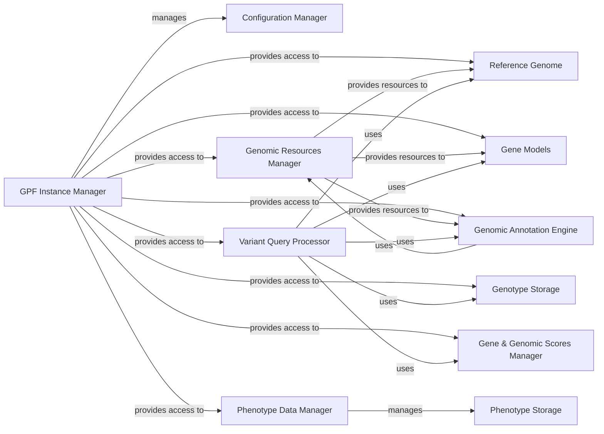

## Details

One paragraph explaining the functionality which is represented by this graph. What the main flow is and what is its purpose.

### GPF Instance Manager [[Expand]](./GPF_Instance_Manager.md)
The core orchestrator of the GPF platform, responsible for loading configurations, initializing, and providing access to all other major components like genomic resources, genotype data, annotation pipelines, and phenotype data. It ensures a consistent and unified operational environment.

**Related Classes/Methods**:

- <a href="https://github.com/iossifovlab/gpf/dae/dae/gpf_instance/gpf_instance.py#L57-L661" target="_blank" rel="noopener noreferrer">`dae.gpf_instance.gpf_instance.GPFInstance` (57:661)</a>

### Configuration Manager
Handles the loading, parsing, and validation of the GPF instance's configuration, defining how various components are set up and interact.

**Related Classes/Methods**:

- <a href="https://github.com/iossifovlab/gpf/dae/dae/configuration/gpf_config_parser.py#L82-L340" target="_blank" rel="noopener noreferrer">`dae.configuration.gpf_config_parser.GPFConfigParser` (82:340)</a>

### Genomic Resources Manager
Manages and provides access to a repository of genomic resources, including reference genomes, gene models, and various annotation files, which are crucial for genomic data processing and interpretation.

**Related Classes/Methods**:

- <a href="https://github.com/iossifovlab/gpf/dae/dae/genomic_resources/repository.py#L926-L971" target="_blank" rel="noopener noreferrer">`dae.genomic_resources.repository.GenomicResourceRepo` (926:971)</a>

### Reference Genome
Provides access to the reference genome sequence, which is the foundational coordinate system for all genomic data within the platform.

**Related Classes/Methods**:

- <a href="https://github.com/iossifovlab/gpf/dae/dae/genomic_resources/reference_genome.py#L23-L268" target="_blank" rel="noopener noreferrer">`dae.genomic_resources.reference_genome.ReferenceGenome` (23:268)</a>

### Gene Models
Manages and provides access to gene definitions, including exon-intron structures and transcript information, essential for gene-centric analyses and variant functional annotation.

**Related Classes/Methods**:

- <a href="https://github.com/iossifovlab/gpf/dae/dae/genomic_resources/gene_models/gene_models.py#L420-L573" target="_blank" rel="noopener noreferrer">`dae.genomic_resources.gene_models.gene_models.GeneModels` (420:573)</a>

### Genotype Storage
Abstract component representing the underlying storage systems for raw genotype and variant data, enabling efficient data persistence and retrieval.

**Related Classes/Methods**:

- <a href="https://github.com/iossifovlab/gpf/dae/dae/genotype_storage/genotype_storage.py#L13-L80" target="_blank" rel="noopener noreferrer">`dae.genotype_storage.genotype_storage.GenotypeStorage` (13:80)</a>

### Variant Query Processor
Processes complex queries on genetic variants across multiple studies, enabling users to retrieve specific subsets of data based on various criteria.

**Related Classes/Methods**:

- <a href="https://github.com/iossifovlab/gpf/dae/dae/studies/variants_db.py#L237-L591" target="_blank" rel="noopener noreferrer">`dae.studies.variants_db.VariantsDb` (237:591)</a>

### Genomic Annotation Engine
Applies various annotations to genomic variants, enriching raw data with functional, clinical, and population-specific information from diverse sources.

**Related Classes/Methods**:

- <a href="https://github.com/iossifovlab/gpf/dae/dae/annotation/annotation_pipeline.py#L96-L237" target="_blank" rel="noopener noreferrer">`dae.annotation.annotation_pipeline.AnnotationPipeline` (96:237)</a>

### Phenotype Data Manager
Manages the storage, retrieval, and integration of phenotype (clinical and observable trait) data, which is often analyzed in conjunction with genomic data.

**Related Classes/Methods**:

- <a href="https://github.com/iossifovlab/gpf/dae/dae/pheno/registry.py#L15-L225" target="_blank" rel="noopener noreferrer">`dae.pheno.registry.PhenoRegistry` (15:225)</a>

### Gene & Genomic Scores Manager
Provides access to pre-computed gene scores (e.g., constraint scores) and genomic scores (e.g., conservation scores), as well as gene sets (e.g., de novo gene sets), which are used for various downstream analyses and interpretations.

**Related Classes/Methods**:

- <a href="https://github.com/iossifovlab/gpf/dae/dae/gene_sets/gene_sets_db.py#L275-L342" target="_blank" rel="noopener noreferrer">`dae.gene_sets.gene_sets_db.GeneSetsDb` (275:342)</a>
- <a href="https://github.com/iossifovlab/gpf/dae/dae/gene_sets/denovo_gene_sets_db.py#L16-L165" target="_blank" rel="noopener noreferrer">`dae.gene_sets.denovo_gene_sets_db.DenovoGeneSetsDb` (16:165)</a>
- <a href="https://github.com/iossifovlab/gpf/dae/dae/genomic_scores/scores.py#L176-L260" target="_blank" rel="noopener noreferrer">`dae.genomic_scores.scores.GenomicScoresRegistry` (176:260)</a>

### Phenotype Storage
Underlying storage for phenotype data.

**Related Classes/Methods**:

- <a href="https://github.com/iossifovlab/gpf/dae/dae/pheno/storage.py#L11-L59" target="_blank" rel="noopener noreferrer">`dae.pheno.storage.PhenotypeStorage` (11:59)</a>

### [FAQ](https://github.com/CodeBoarding/GeneratedOnBoardings/tree/main?tab=readme-ov-file#faq)