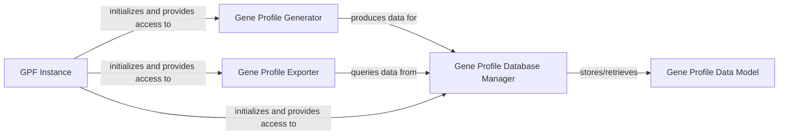

## Details

The `Gene Profiling Module` is a critical subsystem within the DAE project, primarily responsible for the generation, storage, retrieval, and export of gene-centric profiles. It embodies key aspects of the project's "ETL Pipelines", "Data Storage Adapters", and "Core Domain Logic" architectural patterns, facilitating the transformation of raw genomic data into structured, analyzable gene profiles.

### Gene Profile Generator
This component orchestrates the creation of gene profiles from raw genomic data. It performs the "Extract" and "Transform" phases of the ETL pipeline, collecting variant counts, performing statistical calculations, and preparing the data for persistence. It is fundamental for converting raw data into a usable gene profile format.

**Related Classes/Methods**:

- <a href="https://github.com/iossifovlab/gpf/dae/dae/gene_profile/generate_gene_profile.py#L1-L1" target="_blank" rel="noopener noreferrer">`dae.gene_profile.generate_gene_profile` (1:1)</a>

### Gene Profile Database Manager
This component is responsible for the "Load" phase of the ETL pipeline, handling the creation, population, and management of gene profile data within the DuckDB database. It provides an abstract interface for storing, retrieving, and querying gene profiles, acting as a "Data Storage Adapter" for gene profile data.

**Related Classes/Methods**:

- <a href="https://github.com/iossifovlab/gpf/dae/dae/gene_profile/db.py#L1-L1" target="_blank" rel="noopener noreferrer">`dae.gene_profile.db` (1:1)</a>

### Gene Profile Data Model
This component defines the structure and encapsulates the statistical data for a single gene profile. It acts as a data model, holding aggregated counts and other relevant statistics for a gene, used during both the generation and retrieval phases. It's a core part of the "Core Domain Logic" for data modeling and analysis.

**Related Classes/Methods**:

- <a href="https://github.com/iossifovlab/gpf/dae/dae/gene_profile/statistic.py#L1-L1" target="_blank" rel="noopener noreferrer">`dae.gene_profile.statistic` (1:1)</a>

### Gene Profile Exporter
This component provides functionality for exporting gene profile data in various formats, typically for external analysis or reporting. It interacts with the `Gene Profile Database Manager` to retrieve the necessary data. This component supports the "Client-Server Architecture" by providing an interface for data extraction.

**Related Classes/Methods**:

- <a href="https://github.com/iossifovlab/gpf/dae/dae/gene_profile/exporter.py#L1-L1" target="_blank" rel="noopener noreferrer">`dae.gene_profile.exporter` (1:1)</a>

### GPF Instance
While not exclusively part of the `Gene Profiling Module`, the `GPFInstance` serves as the central orchestrator and dependency injector for the entire GPF system. It is responsible for initializing and providing access to various core components, including those within the Gene Profiling Module. It acts as a central registry for the application's services, embodying aspects of the "Modular Monolith" and "Plugin Architecture."

**Related Classes/Methods**:

- <a href="https://github.com/iossifovlab/gpf/dae/dae/gpf_instance/gpf_instance.py#L1-L1" target="_blank" rel="noopener noreferrer">`dae.gpf_instance.gpf_instance` (1:1)</a>

### [FAQ](https://github.com/CodeBoarding/GeneratedOnBoardings/tree/main?tab=readme-ov-file#faq)