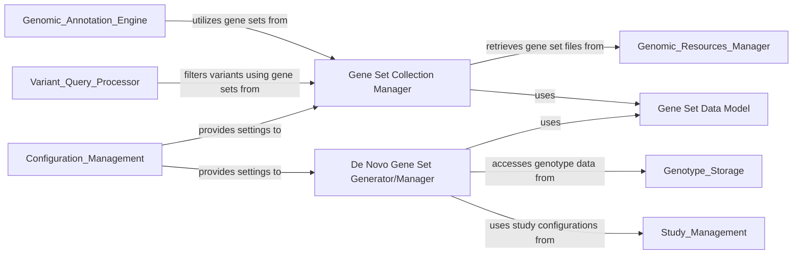

## Details

The Gene Sets Management component is a critical part of the bioinformatics data platform, responsible for handling and providing access to various collections of genes. These gene sets are fundamental for downstream analyses such as functional enrichment and variant filtering. The component is designed with a clear separation of concerns, distinguishing between static, predefined gene sets and dynamically generated "de novo" gene sets.

### Gene Set Collection Manager
This component is the primary interface for managing and retrieving predefined, static gene set collections. It handles the loading, storage, and access mechanisms for curated gene sets, ensuring they are readily available for various analytical tasks across the platform. It acts as a central repository for standardized gene sets.

**Related Classes/Methods**:

- <a href="https://github.com/iossifovlab/gpf/dae/dae/gene_sets/gene_sets_db.py#L0-L0" target="_blank" rel="noopener noreferrer">`dae.gene_sets.gene_sets_db` (0:0)</a>
- <a href="https://github.com/iossifovlab/gpf/dae/dae/gene_sets/implementations/gene_sets_impl.py#L0-L0" target="_blank" rel="noopener noreferrer">`dae.gene_sets.implementations.gene_sets_impl` (0:0)</a>

### De Novo Gene Set Generator/Manager
This component specializes in the creation, persistence, and retrieval of "de novo" gene sets. Unlike predefined sets, de novo sets are dynamically generated based on specific criteria, such as variant data from a particular study or custom user definitions. It provides the functionality to derive new gene sets relevant to specific research questions.

**Related Classes/Methods**:

- <a href="https://github.com/iossifovlab/gpf/dae/dae/gene_sets/denovo_gene_sets_db.py#L0-L0" target="_blank" rel="noopener noreferrer">`dae.gene_sets.denovo_gene_sets_db` (0:0)</a>
- <a href="https://github.com/iossifovlab/gpf/dae/dae/gene_sets/denovo_gene_set_collection.py#L0-L0" target="_blank" rel="noopener noreferrer">`dae.gene_sets.denovo_gene_set_collection` (0:0)</a>
- <a href="https://github.com/iossifovlab/gpf/dae/dae/gene_sets/denovo_gene_set_helpers.py#L0-L0" target="_blank" rel="noopener noreferrer">`dae.gene_sets.denovo_gene_set_helpers` (0:0)</a>
- <a href="https://github.com/iossifovlab/gpf/dae/dae/gene_sets/denovo_gene_sets_config.py#L0-L0" target="_blank" rel="noopener noreferrer">`dae.gene_sets.denovo_gene_sets_config` (0:0)</a>

### Gene Set Data Model
This foundational component defines the core data structures and common functionalities for representing individual genes and gene sets. It ensures consistency in how gene-related information is structured and processed across both predefined and de novo gene set types, providing a unified representation.

**Related Classes/Methods**:

- <a href="https://github.com/iossifovlab/gpf/dae/dae/gene_sets/gene_term.py#L0-L0" target="_blank" rel="noopener noreferrer">`dae.gene_sets.gene_term` (0:0)</a>

### [FAQ](https://github.com/CodeBoarding/GeneratedOnBoardings/tree/main?tab=readme-ov-file#faq)