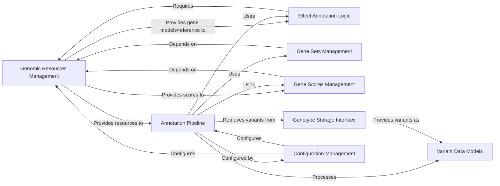

## Details

The `Genomic Resources & Annotation Engine` subsystem is a critical part of the DAE platform, responsible for managing diverse genomic datasets and applying comprehensive annotations to genetic variants. Its architecture is modular, emphasizing clear separation of concerns, extensibility, and efficient data handling, aligning with the project's overall Bioinformatics Data Platform / Genomic Data Warehouse patterns.

### Genomic Resources Management [[Expand]](./Genomic_Resources_Management.md)
This component acts as the central repository and access layer for all foundational genomic data. It manages the loading, caching, and retrieval of essential resources such as reference genomes, gene models, and various genomic scores. It provides the necessary context and data for the annotation process.

**Related Classes/Methods**:

- <a href="https://github.com/iossifovlab/gpf/dae/dae/genomic_resources/repository.py#L0-L0" target="_blank" rel="noopener noreferrer">`dae/genomic_resources/repository.py` (0:0)</a>
- <a href="https://github.com/iossifovlab/gpf/dae/dae/genomic_resources/reference_genome.py#L0-L0" target="_blank" rel="noopener noreferrer">`dae/genomic_resources/reference_genome.py` (0:0)</a>
- <a href="https://github.com/iossifovlab/gpf/dae/dae/genomic_resources/gene_models/gene_models.py#L0-L0" target="_blank" rel="noopener noreferrer">`dae/genomic_resources/gene_models/gene_models.py` (0:0)</a>
- <a href="https://github.com/iossifovlab/gpf/dae/dae/genomic_resources/genomic_scores.py#L0-L0" target="_blank" rel="noopener noreferrer">`dae/genomic_resources/genomic_scores.py` (0:0)</a>

### Annotation Pipeline [[Expand]](./Annotation_Pipeline.md)
This is the core "Annotation Engine" responsible for applying a sequence of annotators to genetic variants. It provides a flexible and configurable framework to orchestrate various annotation steps, allowing for complex and customizable annotation workflows.

**Related Classes/Methods**:

- <a href="https://github.com/iossifovlab/gpf/dae/dae/annotation/annotation_pipeline.py#L0-L0" target="_blank" rel="noopener noreferrer">`dae/annotation/annotation_pipeline.py` (0:0)</a>
- <a href="https://github.com/iossifovlab/gpf/dae/dae/annotation/annotator_base.py#L0-L0" target="_blank" rel="noopener noreferrer">`dae/annotation/annotator_base.py` (0:0)</a>
- <a href="https://github.com/iossifovlab/gpf/dae/dae/annotation/annotation_factory.py#L0-L0" target="_blank" rel="noopener noreferrer">`dae/annotation/annotation_factory.py` (0:0)</a>
- <a href="https://github.com/iossifovlab/gpf/dae/dae/annotation/annotation_config.py#L0-L0" target="_blank" rel="noopener noreferrer">`dae/annotation/annotation_config.py` (0:0)</a>

### Effect Annotation Logic [[Expand]](./Effect_Annotation_Logic.md)
This specialized component provides the detailed algorithms and logic for predicting the functional consequences of genetic variants on genes and proteins. It determines effects such as missense, nonsense, frameshift, and splice site alterations, based on gene models and reference genomes.

**Related Classes/Methods**:

- <a href="https://github.com/iossifovlab/gpf/dae/dae/effect_annotation/annotator.py#L0-L0" target="_blank" rel="noopener noreferrer">`dae/effect_annotation/annotator.py` (0:0)</a>
- <a href="https://github.com/iossifovlab/gpf/dae/dae/effect_annotation/effect_checkers/coding.py#L0-L0" target="_blank" rel="noopener noreferrer">`dae/effect_annotation/effect_checkers/coding.py` (0:0)</a>
- <a href="https://github.com/iossifovlab/gpf/dae/dae/effect_annotation/effect_checkers/splice_site.py#L0-L0" target="_blank" rel="noopener noreferrer">`dae/effect_annotation/effect_checkers/splice_site.py` (0:0)</a>

### Gene Sets Management [[Expand]](./Gene_Sets_Management.md)
This component manages and provides access to predefined collections of genes (gene sets). These sets are used for functional enrichment analysis or to filter variants based on their association with specific biological pathways or disease categories, often integrated into the annotation pipeline.

**Related Classes/Methods**:

- <a href="https://github.com/iossifovlab/gpf/dae/dae/gene_sets/gene_sets_db.py#L0-L0" target="_blank" rel="noopener noreferrer">`dae/gene_sets/gene_sets_db.py` (0:0)</a>
- <a href="https://github.com/iossifovlab/gpf/dae/dae/gene_sets/denovo_gene_sets_db.py#L0-L0" target="_blank" rel="noopener noreferrer">`dae/gene_sets/denovo_gene_sets_db.py` (0:0)</a>

### Gene Scores Management [[Expand]](./Gene_Scores_Management.md)
This component focuses on managing and providing access to various gene-level scores (e.g., constraint scores, conservation scores). These scores are crucial for prioritizing genes and variants based on their predicted pathogenicity or functional importance, often applied during the annotation process.

**Related Classes/Methods**:

- <a href="https://github.com/iossifovlab/gpf/dae/dae/gene_scores/gene_scores.py#L0-L0" target="_blank" rel="noopener noreferrer">`dae/gene_scores/gene_scores.py` (0:0)</a>
- <a href="https://github.com/iossifovlab/gpf/dae/dae/genomic_resources/genomic_scores.py#L0-L0" target="_blank" rel="noopener noreferrer">`dae/genomic_resources/genomic_scores.py` (0:0)</a>

### Variant Data Models [[Expand]](./Variant_Data_Models.md)
This component defines the fundamental data structures for representing genetic variants, including their genomic coordinates, alleles, and associated family information. It ensures a consistent and standardized representation of variant data throughout the system.

**Related Classes/Methods**:

- <a href="https://github.com/iossifovlab/gpf/dae/dae/variants/variant.py#L0-L0" target="_blank" rel="noopener noreferrer">`dae/variants/variant.py` (0:0)</a>
- <a href="https://github.com/iossifovlab/gpf/dae/dae/variants/family_variant.py#L0-L0" target="_blank" rel="noopener noreferrer">`dae/variants/family_variant.py` (0:0)</a>
- <a href="https://github.com/iossifovlab/gpf/dae/dae/variants/core.py#L0-L0" target="_blank" rel="noopener noreferrer">`dae/variants/core.py` (0:0)</a>

### Genotype Storage Interface
This component defines the abstract interface for interacting with various underlying genotype storage backends (e.g., Impala, DuckDB, Parquet). It allows the annotation pipeline to retrieve raw variant data for processing without needing to know the specifics of the storage implementation.

**Related Classes/Methods**:

- <a href="https://github.com/iossifovlab/gpf/dae/dae/genotype_storage/genotype_storage.py#L0-L0" target="_blank" rel="noopener noreferrer">`dae/genotype_storage/genotype_storage.py` (0:0)</a>
- <a href="https://github.com/iossifovlab/gpf/dae/dae/genotype_storage/genotype_storage_registry.py#L0-L0" target="_blank" rel="noopener noreferrer">`dae/genotype_storage/genotype_storage_registry.py` (0:0)</a>

### Configuration Management [[Expand]](./Configuration_Management.md)
This component handles the parsing, validation, and management of configuration files for the entire DAE platform, including specific configurations for genomic resources and annotation pipelines. It ensures that the system operates according to defined parameters.

**Related Classes/Methods**:

- <a href="https://github.com/iossifovlab/gpf/dae/dae/configuration/gpf_config_parser.py#L0-L0" target="_blank" rel="noopener noreferrer">`dae/configuration/gpf_config_parser.py` (0:0)</a>
- <a href="https://github.com/iossifovlab/gpf/dae/dae/configuration/schemas/dae_conf.py#L0-L0" target="_blank" rel="noopener noreferrer">`dae/configuration/schemas/dae_conf.py` (0:0)</a>
- <a href="https://github.com/iossifovlab/gpf/dae/dae/configuration/schemas/study_config.py#L0-L0" target="_blank" rel="noopener noreferrer">`dae/configuration/schemas/study_config.py` (0:0)</a>

### [FAQ](https://github.com/CodeBoarding/GeneratedOnBoardings/tree/main?tab=readme-ov-file#faq)