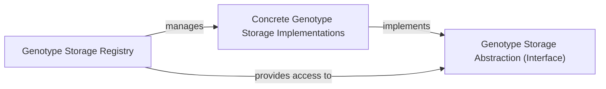

## Details

The `Genotype Storage Abstraction (Interface)` subsystem is a cornerstone of the project's "Plugin Architecture" and "Data Storage Adapters" patterns, enabling flexible and extensible management of diverse genomic data sources. It achieves this through a clear separation of concerns, defining a common interface for data interaction and a central registry for managing various storage backends.

### Genotype Storage Abstraction (Interface) [[Expand]](./Genotype_Storage_Abstraction_Interface_.md)
This component defines the abstract interface (`GenotypeStorage`) that all concrete genotype storage implementations must adhere to. It specifies common methods like `start`, `shutdown`, and `build_backend` for interacting with genotype data, ensuring a decoupled and extensible architecture. This is the cornerstone of the "Plugin Architecture" for data storage, allowing new storage backends to be integrated seamlessly without altering the core system.

**Related Classes/Methods**:

- <a href="https://github.com/iossifovlab/gpf/dae/dae/genotype_storage/genotype_storage.py#L13-L80" target="_blank" rel="noopener noreferrer">`dae.genotype_storage.genotype_storage.GenotypeStorage` (13:80)</a>

### Genotype Storage Registry [[Expand]](./Genotype_Storage_Registry.md)
This component acts as a central registry responsible for managing, registering, and providing access to various configured `GenotypeStorage` instances. It allows the system to dynamically select and use the appropriate storage backend based on configuration, supporting the "Plugin Architecture" by enabling seamless integration and lookup of different storage solutions. It handles the lifecycle of storage instances, including their registration and shutdown.

**Related Classes/Methods**:

- <a href="https://github.com/iossifovlab/gpf/dae/dae/genotype_storage/genotype_storage_registry.py#L78-L172" target="_blank" rel="noopener noreferrer">`dae.genotype_storage.genotype_storage_registry.GenotypeStorageRegistry` (78:172)</a>

### Concrete Genotype Storage Implementations
This conceptual component represents the collection of all concrete classes (e.g., `GcpGenotypeStorage`, `ImpalaGenotypeStorage`, `ParquetGenotypeStorage`, `InmemoryGenotypeStorage`) that implement the `GenotypeStorage` interface. Each class provides the specific logic for interacting with a particular underlying storage technology (e.g., Google Cloud BigQuery, Apache Impala, Parquet files, in-memory data), acting as a "Data Storage Adapter" for the platform. These are the actual "plugins" that provide the data access capabilities.

**Related Classes/Methods**:

- <a href="https://github.com/iossifovlab/gpf/gcp_storage/gcp_storage/gcp_genotype_storage.py#L19-L316" target="_blank" rel="noopener noreferrer">`GcpGenotypeStorage` (19:316)</a>
- <a href="https://github.com/iossifovlab/gpf/impala_storage/impala_storage/schema1/impala_genotype_storage.py#L28-L479" target="_blank" rel="noopener noreferrer">`ImpalaGenotypeStorage` (28:479)</a>
- `ParquetGenotypeStorage` (0:0)
- <a href="https://github.com/iossifovlab/gpf/dae/dae/inmemory_storage/inmemory_genotype_storage.py#L28-L151" target="_blank" rel="noopener noreferrer">`InmemoryGenotypeStorage` (28:151)</a>

### [FAQ](https://github.com/CodeBoarding/GeneratedOnBoardings/tree/main?tab=readme-ov-file#faq)