```mermaid
graph LR
    Genotype_Storage_Registry["Genotype Storage Registry"]
    Genotype_Storage_Interface["Genotype Storage Interface"]
    Genotype_Storage_Factory_Resolver["Genotype Storage Factory Resolver"]
    Genotype_Storage_Configuration["Genotype Storage Configuration"]
    Genotype_Storage_Implementations["Genotype Storage Implementations"]
    Genotype_Storage_Configuration -- "configures" --> Genotype_Storage_Registry
    Genotype_Storage_Registry -- "uses" --> Genotype_Storage_Factory_Resolver
    Genotype_Storage_Factory_Resolver -- "produces" --> Genotype_Storage_Interface
    Genotype_Storage_Registry -- "manages" --> Genotype_Storage_Interface
    Genotype_Storage_Interface -- "is implemented by" --> Genotype_Storage_Implementations
    click Genotype_Storage_Registry href "https://github.com/CodeBoarding/GeneratedOnBoardings/blob/main/gpf/Genotype_Storage_Registry.md" "Details"
```

## Details

The Genotype Storage Registry is a pivotal component within the Bioinformatics Data Platform, embodying the "Plugin Architecture" and "Data Storage Adapters" patterns. It serves as the central hub for managing and providing access to various genotype data storage backends, abstracting the underlying storage mechanisms from the rest of the system.

### Genotype Storage Registry [[Expand]](./Genotype_Storage_Registry.md)
This is the core component responsible for registering, managing, and retrieving concrete GenotypeStorage implementations. It acts as a singleton, ensuring a single point of access for all registered storage backends. It allows the system to dynamically discover and load appropriate storage backends based on configuration or runtime requirements, supporting the plugin architecture. It maintains a collection of registered GenotypeStorage instances and manages a "default" storage.

**Related Classes/Methods**:

- <a href="https://github.com/iossifovlab/gpf/dae/dae/genotype_storage/genotype_storage_registry.py#L78-L172" target="_blank" rel="noopener noreferrer">`gpf.dae.dae.genotype_storage.genotype_storage_registry.GenotypeStorageRegistry` (78:172)</a>

### Genotype Storage Interface
This component defines the abstract interface or base class that all concrete genotype storage implementations must adhere to. It establishes a common contract for interacting with genotype data, ensuring that the Genotype Storage Registry and other parts of the system can interact with different storage backends uniformly. This interface includes methods for accessing genotype data, managing studies, and handling various genomic operations.

**Related Classes/Methods**:

- <a href="https://github.com/iossifovlab/gpf/dae/dae/genotype_storage/genotype_storage.py#L13-L80" target="_blank" rel="noopener noreferrer">`gpf.dae.dae.genotype_storage.genotype_storage.GenotypeStorage` (13:80)</a>

### Genotype Storage Factory Resolver
This function is responsible for resolving and returning the appropriate factory function for a given storage_type. It leverages an internal registry (_REGISTERED_GENOTYPE_STORAGE_FACTORIES) which is populated by a plugin loading mechanism (_load_genotype_storage_factory_plugins). This function is essential for the extensibility of the system, allowing new storage types to be integrated without modifying the core registry logic, adhering to the "Plugin Architecture" pattern.

**Related Classes/Methods**:

- <a href="https://github.com/iossifovlab/gpf/dae/dae/genotype_storage/genotype_storage_registry.py#L14-L28" target="_blank" rel="noopener noreferrer">`gpf.dae.dae.genotype_storage.genotype_storage_registry.get_genotype_storage_factory` (14:28)</a>

### Genotype Storage Configuration
While not a single explicit class, this component represents the external source (e.g., a configuration file, database, or environment variables) that provides the definitions and settings for various genotype storage backends. It specifies which storage types are available, their specific parameters, and which one should be designated as the default. The Genotype Storage Registry consumes this configuration to initialize and manage the available genotype storages.

**Related Classes/Methods**: _None_

### Genotype Storage Implementations
Concrete classes that provide the actual logic for interacting with specific data backends, implementing the Genotype Storage Interface.

**Related Classes/Methods**: _None_

### [FAQ](https://github.com/CodeBoarding/GeneratedOnBoardings/tree/main?tab=readme-ov-file#faq)