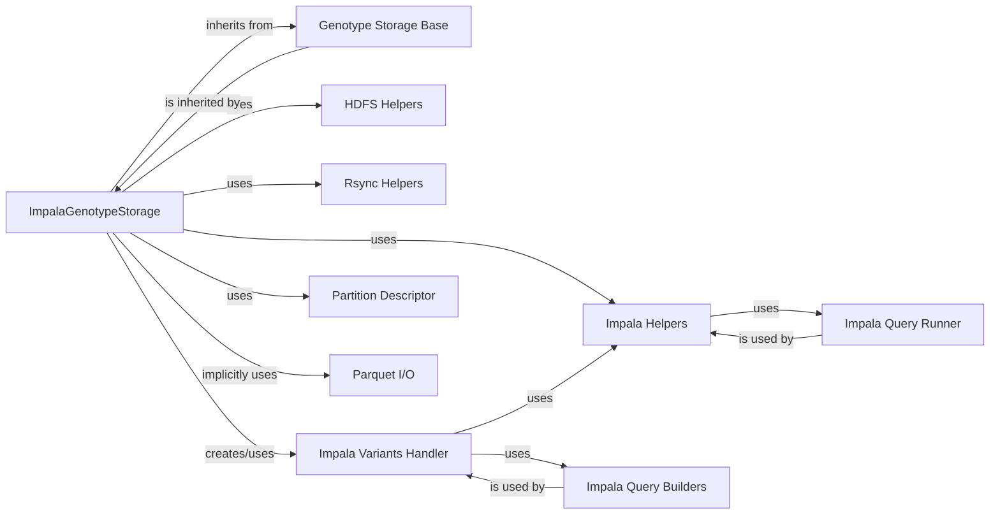

## Details

Overview of the `ImpalaGenotypeStorage` subsystem, detailing its structure, flow, and purpose, along with its central components and their relationships within the Bioinformatics Data Platform.

### ImpalaGenotypeStorage [[Expand]](./ImpalaGenotypeStorage.md)
The main entry point for interacting with Impala storage. It manages connections, orchestrates data uploads to HDFS, imports data into Impala, and provides the interface for building query backends. It implements the `GenotypeStorage` interface.

**Related Classes/Methods**:

- <a href="https://github.com/iossifovlab/gpf/impala_storage/impala_storage/schema1/impala_genotype_storage.py#L28-L479" target="_blank" rel="noopener noreferrer">`impala_storage.impala_storage.schema1.impala_genotype_storage.ImpalaGenotypeStorage` (28:479)</a>

### Genotype Storage Base
An abstract base class that defines the standard interface and contract for all genotype storage backends in the system. This ensures that different storage technologies (Impala, DuckDB, etc.) can be swapped out or integrated consistently.

**Related Classes/Methods**:

- <a href="https://github.com/iossifovlab/gpf/dae/dae/genotype_storage/genotype_storage.py#L1-L1" target="_blank" rel="noopener noreferrer">`dae.dae.genotype_storage.genotype_storage.GenotypeStorageBase` (1:1)</a>

### Impala Helpers
A utility component providing direct, low-level functions to interact with the Impala database. This includes DDL operations (dropping tables) and DML operations (importing data).

**Related Classes/Methods**:

- <a href="https://github.com/iossifovlab/gpf/impala_storage/impala_storage/helpers/impala_helpers.py#L1-L1" target="_blank" rel="noopener noreferrer">`impala_storage.impala_storage.helpers.impala_helpers` (1:1)</a>

### HDFS Helpers
Provides a set of functions for programmatic interaction with the Hadoop Distributed File System (HDFS), including file and directory management (creation, deletion, upload).

**Related Classes/Methods**:

- <a href="https://github.com/iossifovlab/gpf/impala_storage/impala_storage/helpers/hdfs_helpers.py#L1-L1" target="_blank" rel="noopener noreferrer">`impala_storage.impala_storage.helpers.hdfs_helpers` (1:1)</a>

### Rsync Helpers
A utility for synchronizing and transferring files to remote HDFS locations using the rsync protocol, offering an alternative to native HDFS commands for data upload.

**Related Classes/Methods**:

- <a href="https://github.com/iossifovlab/gpf/impala_storage/impala_storage/helpers/rsync_helpers.py#L1-L1" target="_blank" rel="noopener noreferrer">`impala_storage.impala_storage.helpers.rsync_helpers` (1:1)</a>

### Impala Variants Handler
This component is specifically designed to handle the querying and retrieval of variant data from Impala. It translates abstract genotype queries into concrete Impala SQL queries.

**Related Classes/Methods**:

- <a href="https://github.com/iossifovlab/gpf/impala_storage/impala_storage/schema1/impala_variants.py#L39-L570" target="_blank" rel="noopener noreferrer">`impala_storage.impala_storage.schema1.impala_variants.ImpalaVariants` (39:570)</a>

### Partition Descriptor
Responsible for parsing and managing the schema and configuration related to Parquet file partitioning. This is vital for optimizing data storage and query performance in Impala.

**Related Classes/Methods**:

- <a href="https://github.com/iossifovlab/gpf/dae/dae/parquet/partition_descriptor.py#L29-L637" target="_blank" rel="noopener noreferrer">`dae.dae.parquet.partition_descriptor.PartitionDescriptor` (29:637)</a>

### Impala Query Runner
A low-level component that encapsulates the actual execution of SQL queries against the Impala database, abstracting the connection and execution details.

**Related Classes/Methods**:

- <a href="https://github.com/iossifovlab/gpf/impala_storage/impala_storage/helpers/impala_query_runner.py#L1-L1" target="_blank" rel="noopener noreferrer">`impala_storage.impala_storage.helpers.impala_query_runner` (1:1)</a>

### Impala Query Builders
A set of specialized components (e.g., `BaseQueryBuilder`, `FamilyVariantsQueryBuilder`, `SummaryVariantsQueryBuilder`) that construct Impala-specific SQL queries for different types of genomic data retrieval.

**Related Classes/Methods**:

- <a href="https://github.com/iossifovlab/gpf/impala_storage/impala_storage/schema1/base_query_builder.py#L22-L619" target="_blank" rel="noopener noreferrer">`impala_storage.impala_storage.schema1.base_query_builder.BaseQueryBuilder` (22:619)</a>
- <a href="https://github.com/iossifovlab/gpf/impala_storage/impala_storage/schema1/family_variants_query_builder.py#L17-L237" target="_blank" rel="noopener noreferrer">`impala_storage.impala_storage.schema1.family_variants_query_builder.FamilyVariantsQueryBuilder` (17:237)</a>
- <a href="https://github.com/iossifovlab/gpf/impala_storage/impala_storage/schema1/summary_variants_query_builder.py#L19-L193" target="_blank" rel="noopener noreferrer">`impala_storage.impala_storage.schema1.summary_variants_query_builder.SummaryVariantsQueryBuilder` (19:193)</a>

### Parquet I/O
Handles the reading and writing of Parquet files, which is the columnar storage format used for genomic data in Impala. It ensures data is correctly serialized and deserialized.

**Related Classes/Methods**:

- <a href="https://github.com/iossifovlab/gpf/impala_storage/impala_storage/schema1/parquet_io.py#L1-L1" target="_blank" rel="noopener noreferrer">`impala_storage.impala_storage.schema1.parquet_io` (1:1)</a>

### [FAQ](https://github.com/CodeBoarding/GeneratedOnBoardings/tree/main?tab=readme-ov-file#faq)