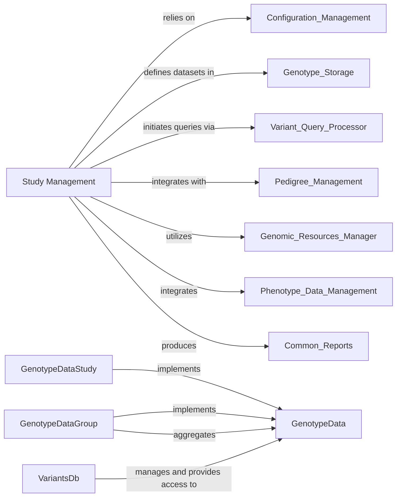

## Details

The `Study Management` component is central to the platform, providing the foundational structures and mechanisms for handling genomic studies. It acts as the primary interface for accessing and organizing diverse genomic datasets. It provides the core abstraction for genomic studies, enabling the platform to handle diverse datasets uniformly. It acts as the central hub for accessing, organizing, and querying genomic information, making it indispensable for any downstream analysis or application.

### Study Management [[Expand]](./Study_Management.md)
The `Study Management` component is central to the platform, providing the foundational structures and mechanisms for handling genomic studies. It acts as the primary interface for accessing and organizing diverse genomic datasets. It provides the core abstraction for genomic studies, enabling the platform to handle diverse datasets uniformly. It acts as the central hub for accessing, organizing, and querying genomic information, making it indispensable for any downstream analysis or application.

**Related Classes/Methods**: _None_

### GenotypeData
This is the abstract base class representing a generic genomic study. It defines the common interface and properties expected from any study, such as access to families, variants, and metadata. It serves as the blueprint for concrete study implementations.

**Related Classes/Methods**: _None_

### GenotypeDataStudy
A concrete implementation of `GenotypeData` representing a single, independent genomic study. It handles the loading and management of data specific to one study, often backed by a particular genotype storage.

**Related Classes/Methods**: _None_

### GenotypeDataGroup
A specialized `GenotypeData` implementation that aggregates multiple `GenotypeData` instances (either `GenotypeDataStudy` or other `GenotypeDataGroup` instances) into a single logical unit. It allows for querying across a collection of studies as if they were one.

**Related Classes/Methods**: _None_

### VariantsDb
This is the central registry and manager for all available genomic studies within the platform. It's responsible for discovering, loading, configuring, and providing access to `GenotypeData` instances. It acts as a facade for retrieving studies and initiating variant queries.

**Related Classes/Methods**: _None_

### [FAQ](https://github.com/CodeBoarding/GeneratedOnBoardings/tree/main?tab=readme-ov-file#faq)