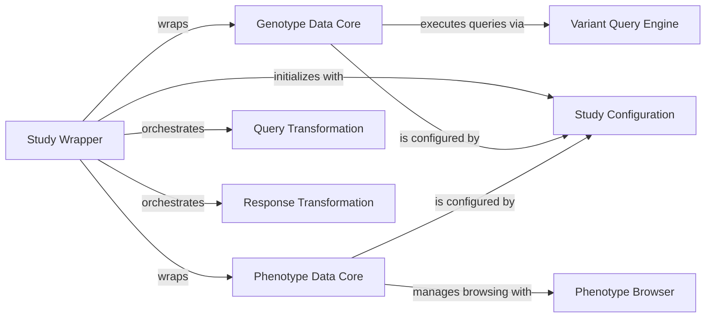

## Details

The `Study Wrapper` subsystem is a critical abstraction layer within the WDAE module, designed to provide a consistent interface for interacting with diverse genomic study data. It centralizes data access, query processing, and response formatting, ensuring that WDAE API endpoints and other components can seamlessly work with both genotype and phenotype information, regardless of their underlying storage or format.

### Study Wrapper [[Expand]](./Study_Wrapper.md)
The primary abstraction layer (`WDAEAbstractStudy`) that unifies access to genotype and phenotype data. It provides a consistent interface for WDAE API endpoints, orchestrating data retrieval and transformation processes.

**Related Classes/Methods**:

- `WDAEAbstractStudy` (1:1)

### Genotype Data Core
Manages the core logic and access mechanisms for raw genomic variant data (`GenotypeData`). It defines abstract methods for querying variants (family and summary), handling person set collections, and generating reports.

**Related Classes/Methods**:

- `GenotypeData` (1:1)

### Phenotype Data Core
Handles the core logic and access mechanisms for phenotypic information (`PhenotypeData`), including measures, instruments, and individual-level data. It provides an interface for querying and browsing phenotypic data.

**Related Classes/Methods**:

- <a href="https://github.com/iossifovlab/gpf/dae/dae/configuration/schemas/phenotype_data.py#L1-L1" target="_blank" rel="noopener noreferrer">`PhenotypeData` (1:1)</a>

### Query Transformation
Defines the interface (`QueryTransformerProtocol`) for components responsible for adapting incoming API queries into a standardized format suitable for the underlying `Genotype Data Core` or `Phenotype Data Core`.

**Related Classes/Methods**:

- `QueryTransformerProtocol` (1:1)
- `QueryTransformerProtocol` (1:1)

### Response Transformation
Defines the interface (`ResponseTransformerProtocol`) for components that format raw data retrieved from the `Genotype Data Core` or `Phenotype Data Core` into a consistent structure for WDAE API responses or data downloads.

**Related Classes/Methods**:

- `ResponseTransformerProtocol` (1:1)
- `ResponseTransformerProtocol` (1:1)

### Variant Query Engine [[Expand]](./Variant_Query_Engine.md)
Represents the internal mechanism within `Genotype Data Core` responsible for constructing, optimizing, and executing complex queries against the genomic variant data. It aggregates results from potentially multiple underlying data sources.

**Related Classes/Methods**:

- `create_query_runners` (1:1)
- `QueryResult` (1:1)

### Phenotype Browser
A specialized component (`PhenoBrowser`) used by `Phenotype Data Core` to facilitate browsing, searching, and visualizing phenotypic measures and their associated metadata, often backed by an optimized database.

**Related Classes/Methods**:

- `PhenoBrowser` (1:1)

### Study Configuration
Manages the loading and processing of study-specific configuration settings, including details for genotype and phenotype browsers, data sources, and general study metadata.

**Related Classes/Methods**:

- `make_config` (1:1)
- `make_config` (1:1)
- `make_config` (1:1)

### [FAQ](https://github.com/CodeBoarding/GeneratedOnBoardings/tree/main?tab=readme-ov-file#faq)