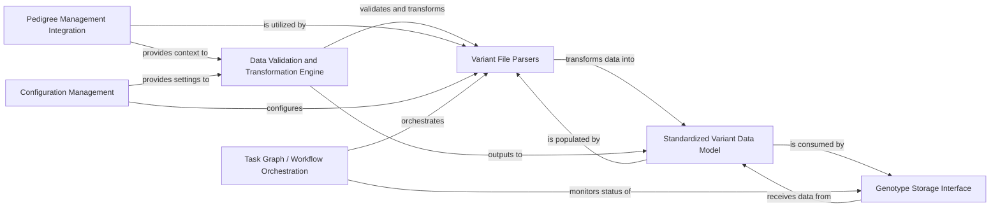

## Details

This component is responsible for the robust and efficient ingestion of diverse raw genomic variant data formats (e.g., VCF, DAE, CNV, Parquet) into the platform's internal data models. It encompasses specialized loaders designed to parse, validate, and transform these external file formats into a standardized representation suitable for the `Genotype Storage` and subsequent analysis. Its modular design allows for easy extension to support new variant data formats.

### Variant File Parsers
These are specialized sub-components responsible for parsing specific raw genomic variant file formats (e.g., VCF, DAE, CNV, Parquet). They handle the low-level reading of files, extracting relevant data fields, and performing initial data type conversions.

**Related Classes/Methods**:

- <a href="https://github.com/iossifovlab/gpf/dae/dae/variants_loaders/vcf/loader.py#L1-L1" target="_blank" rel="noopener noreferrer">`dae/dae/variants_loaders/vcf/loader.py` (1:1)</a>
- <a href="https://github.com/iossifovlab/gpf/dae/dae/variants_loaders/dae/loader.py#L1-L1" target="_blank" rel="noopener noreferrer">`dae/dae/variants_loaders/dae/loader.py` (1:1)</a>
- <a href="https://github.com/iossifovlab/gpf/dae/dae/variants_loaders/cnv/loader.py#L1-L1" target="_blank" rel="noopener noreferrer">`dae/dae/variants_loaders/cnv/loader.py` (1:1)</a>
- <a href="https://github.com/iossifovlab/gpf/dae/dae/variants_loaders/parquet/loader.py#L1-L1" target="_blank" rel="noopener noreferrer">`dae/dae/variants_loaders/parquet/loader.py` (1:1)</a>
- <a href="https://github.com/iossifovlab/gpf/dae/dae/variants_loaders/raw/loader.py#L1-L1" target="_blank" rel="noopener noreferrer">`dae/dae/variants_loaders/raw/loader.py` (1:1)</a>
- <a href="https://github.com/iossifovlab/gpf/dae/dae/variants_loaders/cnv/flexible_cnv_loader.py#L1-L1" target="_blank" rel="noopener noreferrer">`dae/dae/variants_loaders/cnv/flexible_cnv_loader.py` (1:1)</a>
- <a href="https://github.com/iossifovlab/gpf/dae/dae/variants_loaders/raw/flexible_variant_loader.py#L1-L1" target="_blank" rel="noopener noreferrer">`dae/dae/variants_loaders/raw/flexible_variant_loader.py` (1:1)</a>

### Standardized Variant Data Model
This component defines the internal, unified data structures and schemas used to represent genomic variant data after it has been parsed from various external formats. It ensures consistency and facilitates downstream processing and storage. While not explicitly a "loader" file, it's a crucial output and internal representation.

**Related Classes/Methods**: _None_

### Data Validation and Transformation Engine
This component is responsible for validating the parsed variant data against predefined rules and schemas, ensuring data quality and integrity. It also performs necessary transformations (e.g., normalization, annotation lookups) to prepare the data for the `Standardized Variant Data Model`.

**Related Classes/Methods**: _None_

### Genotype Storage Interface
This component provides an abstraction layer for interacting with various underlying genotype storage backends (e.g., Impala, BigQuery, DuckDB). The `Variant Data Loading` component uses this interface to persist the standardized variant data.

**Related Classes/Methods**: _None_

### Pedigree Management Integration
This component handles the integration of pedigree information, which is often crucial for interpreting genomic variants (e.g., for family-based studies). The variant loaders might need to reference or validate against existing pedigree data during the loading process.

**Related Classes/Methods**: _None_

### Configuration Management [[Expand]](./Configuration_Management.md)
This component provides a centralized mechanism for managing configurations related to data loading, such as file paths, schema definitions, and loader-specific parameters.

**Related Classes/Methods**: _None_

### Task Graph / Workflow Orchestration
This component orchestrates the overall data loading process, potentially managing a series of steps (e.g., parsing, validation, storage). It ensures that loading tasks are executed in the correct order and handles dependencies.

**Related Classes/Methods**: _None_

### [FAQ](https://github.com/CodeBoarding/GeneratedOnBoardings/tree/main?tab=readme-ov-file#faq)