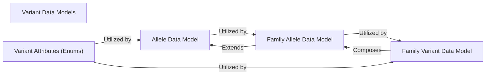

## Details

One paragraph explaining the functionality which is represented by this graph. What the main flow is and what is its purpose.

### Variant Data Models [[Expand]](./Variant_Data_Models.md)
This component defines the fundamental data structures for representing genetic variants, including their genomic coordinates, alleles, and associated family information. It provides a consistent and standardized representation of variant data throughout the system, acting as the core domain model for genetic information. It handles the basic properties of alleles (e.g., type, position, reference/alternative sequences) and extends these to represent individual variants and family-specific variants, incorporating genotype and inheritance information.

**Related Classes/Methods**: _None_

### Allele Data Model
Represents a single genetic allele, defining its genomic location (chromosome, position, end position), reference sequence, alternative sequence, and type (e.g., substitution, insertion, deletion, CNV). It's the most granular unit of genetic variation.

**Related Classes/Methods**:

- <a href="https://github.com/iossifovlab/gpf/dae/dae/variants/core.py#L12-L213" target="_blank" rel="noopener noreferrer">`dae.variants.core.Allele` (12:213)</a>

### Family Allele Data Model
Extends the `Allele Data Model` to include family-specific information, such as the genotype of the allele within a family member, best state, and inheritance patterns. It represents how a specific allele manifests within an individual in a family context.

**Related Classes/Methods**:

- <a href="https://github.com/iossifovlab/gpf/dae/dae/variants/family_variant.py#L87-L565" target="_blank" rel="noopener noreferrer">`dae.variants.family_variant.FamilyAllele` (87:565)</a>

### Family Variant Data Model
Represents a genetic variant within the context of a specific family, including the genotypes of all family members for that variant, inheritance patterns, and other family-specific attributes. It combines the summary variant information with pedigree data.

**Related Classes/Methods**:

- <a href="https://github.com/iossifovlab/gpf/dae/dae/variants/family_variant.py#L568-L871" target="_blank" rel="noopener noreferrer">`dae.variants.family_variant.FamilyVariant` (568:871)</a>

### Variant Attributes (Enums)
A collection of enumerations defining various attributes related to variants, such as genotype types, sex, roles within a family, status, and transmission types. These provide standardized values for variant annotation and filtering.

**Related Classes/Methods**:

- <a href="https://github.com/iossifovlab/gpf/dae/dae/variants/attributes.py#L1-L1" target="_blank" rel="noopener noreferrer">`dae.variants.attributes.GenotypeType` (1:1)</a>
- <a href="https://github.com/iossifovlab/gpf/dae/dae/variants/attributes.py#L155-L233" target="_blank" rel="noopener noreferrer">`dae.variants.attributes.Sex` (155:233)</a>
- <a href="https://github.com/iossifovlab/gpf/dae/dae/variants/attributes.py#L72-L152" target="_blank" rel="noopener noreferrer">`dae.variants.attributes.Role` (72:152)</a>
- <a href="https://github.com/iossifovlab/gpf/dae/dae/variants/attributes.py#L236-L311" target="_blank" rel="noopener noreferrer">`dae.variants.attributes.Status` (236:311)</a>
- <a href="https://github.com/iossifovlab/gpf/dae/dae/variants/attributes.py#L403-L407" target="_blank" rel="noopener noreferrer">`dae.variants.attributes.TransmissionType` (403:407)</a>

### [FAQ](https://github.com/CodeBoarding/GeneratedOnBoardings/tree/main?tab=readme-ov-file#faq)